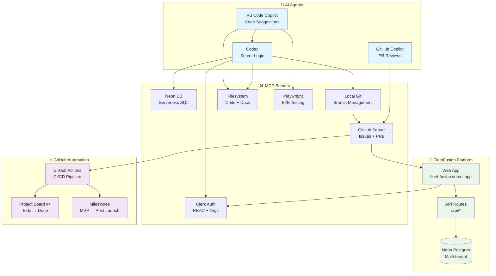

---

### 3. `agents-topology.md`

```mermaid
graph TD
  subgraph FLEET[🚛 FleetFusion Platform]
    webapp[Web App<br/>fleet-fusion.vercel.app]
    api[API Routes<br/>/api/*]
    db[(Neon Postgres<br/>Multi-tenant)]
  end

  subgraph MCP[🛠 MCP Servers]
    clerk[Clerk Auth<br/>RBAC + Orgs]
    neon[Neon DB<br/>Serverless SQL]
    githubSrv[GitHub Server<br/>Issues + PRs]
    git[Local Git<br/>Branch Management]
    fs[Filesystem<br/>Code + Docs]
    playwright[Playwright<br/>E2E Testing]
  end

  subgraph AGENTS[🤖 AI Agents]
    codex[Codex<br/>Server Logic]
    copilot[VS Code Copilot<br/>Code Suggestions]
    ghAI[GitHub Copilot<br/>PR Reviews]
  end

  subgraph AUTOMATION[⚡ GitHub Automation]
    workflows[GitHub Actions<br/>CI/CD Pipeline]
    project[Project Board #4<br/>Todo → Done]
    milestones[Milestones<br/>MVP → Post-Launch]
  end

  %% Task delegation
  codex --> clerk
  codex --> neon
  codex --> fs
  codex --> git

  copilot --> fs
  copilot --> playwright
  copilot --> codex

  ghAI --> githubSrv

  %% Automation flows
  githubSrv --> workflows
  workflows --> project
  workflows --> milestones

  %% Platform connections
  webapp --> api
  api --> db
  webapp --> clerk

  %% Deployment
  git --> githubSrv
  githubSrv --> webapp

  %% Labels and styling
  classDef agent fill:#e1f5fe
  classDef automation fill:#f3e5f5
  classDef fleet fill:#e8f5e8

  class codex,copilot,ghAI agent
  class workflows,project,milestones automation
  class webapp,api,db fleet
```
