# FleetFusion ▸ AI‑Assisted DevOps Schema

## 1️⃣ Environment Snapshot

| Tool       | Version                 | Remarks                                |
| ---------- | ----------------------- | -------------------------------------- |
| Next.js    | 15                      | App Router · RSC first                 |
| React      | 19                      | Zero‑bundle hydration                  |
| TypeScript | 5.x                     | strict + noUncheckedIndexedAccess      |
| Clerk      | RBAC                    | Multi‑tenant · org + role claims       |
| Postgres   | Neon                    | Serverless, row‑level security enabled |
| CI/CD      | GitHub Actions → Vercel | Preview → Prod promotes via tag        |

## 2️⃣ Agents & Scopes

| Agent               | Allowed Scope                   | Commit Branch Prefix         | Merge Strategy             |
| ------------------- | ------------------------------- | ---------------------------- | -------------------------- |
| Codex               | Server functions, infra scripts | feature/codex/_, fix/codex/_ | PR (squash) + human review |
| Copilot             | Local code suggestions          | Author‑controlled            | N/A                        |
| GitHub Copilot Chat | PR comment reviews              | Comments only                | N/A                        |

### Ground Rules

1. ❌ Never commit directly to main.
2. ✅ Follow Conventional Commits (feat:, fix:, docs:, test:, refactor:, config:).
3. 🏷 Auto‑label PRs by branch prefix (see PR automation).
4. 🧪 Must pass CI (ci/test, ci/lint, ci/typecheck) before merge.
5. 🗂 Codex must call existing, typed utils where possible.
6. 🔍 Copilot suggestions require author review before commit.

## 3️⃣ FleetFusion Milestones & Release Strategy

| Milestone                      | Due Date      | Focus                                    | Labels                      |
| ------------------------------ | ------------- | ---------------------------------------- | --------------------------- |
| MVP Launch                     | June 16, 2025 | Core multi-tenant RBAC, fleet management | Priority-High               |
| Q3 2025 Release                | July 1, 2025  | Major features, compliance, analytics    | Feature, Priority-Medium    |
| Testing & Automation Hardening | July 15, 2025 | Full test coverage, E2E scripts          | Testing, Code-Quality       |
| Post-Launch Enhancements       | Aug 30, 2025  | Customer feedback, UX improvements       | Documentation, Priority-Low |

## 4️⃣ Label Strategy

### Priority Labels

- Priority-High: Blocking issues (missing .env, no tests)
- Priority-Medium: Feature completion and bug fixes
- Priority-Low: Code quality improvements

### Type Labels

- Bug, Feature, Documentation, Code-Quality, Testing, Configuration

### Workflow Labels

- Has-PR, Blocked, Technical-Debt

### Assignment Labels

- Codex, Copilot

## 5️⃣ Branch Naming Convention

| Prefix    | Purpose           | Label         |
| --------- | ----------------- | ------------- |
| feature/  | New functionality | Feature       |
| fix/      | Bug fixes         | Bug           |
| docs/     | Documentation     | Documentation |
| test/     | Test improvements | Testing       |
| refactor/ | Code quality      | Code-Quality  |
| config/   | Environment setup | Configuration |

## 6️⃣ Project Board Flow

```mermaid
graph LR
  subgraph "FleetFusion Project #4"
    A[📋 Todo] -->|Start Work| B[🔄 In Progress]
    B -->|Create PR| C[👀 Review]
    C -->|Merge| D[✅ Done]
  end

  subgraph "Auto-Movement Triggers"
    E[New Issue] --> A
    F[Add Feature/Bug Label] --> B
    G[Has-PR Label] --> C
    H[Close Issue/PR] --> D
  end
```

## 7️⃣ Secrets Matrix

- GITHUB_TOKEN (automatic)
- VERCEL_TOKEN
- CLERK_SECRET_KEY
- NEON_API_KEY

## 8️⃣ Deployment Flow (GitHub Flow)

```mermaid
graph TD
  A[feature/* branch] -->|PR created| B[GitHub Actions CI]
  B -->|✅ Tests pass| C[Vercel Preview Deploy]
  C -->|✅ Review approved| D[Squash merge to main]
  D -->|Auto-deploy| E[Production: fleet-fusion.vercel.app]

  F[main branch] -->|Tag release| G[Production Release]
  G --> H[Close milestone]
```

