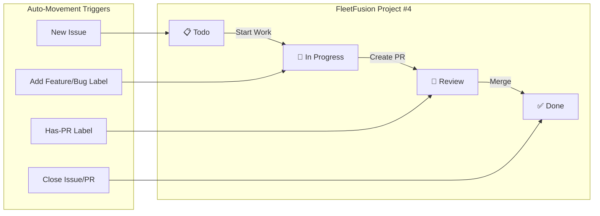
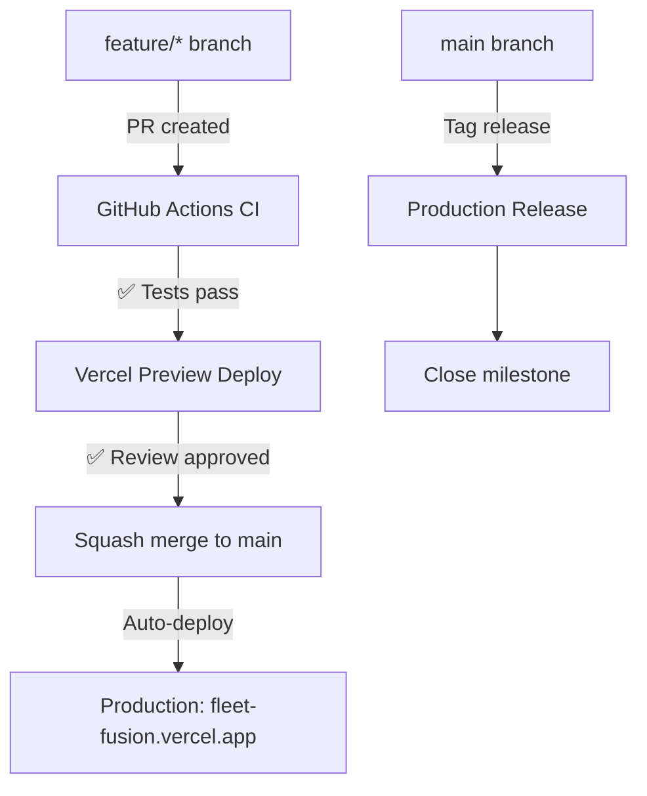

# FleetFusion ▸ **AI‑Assisted DevOps Schema**

<!-- Dendron Note: agents -->

## 1️⃣ Environment Snapshot
| Tool | Version | Remarks |
|------|---------|---------|
| Next.js | 15 | App Router · RSC first |
| React | 19 | Zero‑bundle hydration |
| TypeScript | 5.x | `strict` + `noUncheckedIndexedAccess` |
| Clerk | RBAC | Multi‑tenant · org + role claims |
| Postgres | Neon (serverless) | Row‑level security enabled |
| CI/CD | GitHub Actions → Vercel | Preview → Prod promotes via tag |

## 2️⃣ Agents & Scopes
| Agent | Allowed Scope | Commit Branch | Merge Strategy |
|-------|--------------|--------------|----------------|
| **Codex** | Server functions, infra scripts | `feature/codex/*`, `fix/codex/*` | PR (squash) + human review |
| **Copilot** | Local code suggestions | Author‑controlled | N/A |
| **GitHub Copilot Chat** | PR comment reviews | Comments only | N/A |

### Ground Rules
1. **❌ Never commit directly to `main`.**
2. **✅ Follow Conventional Commits** (`feat:`, `fix:`, `docs:`, `test:`, `refactor:`, `config:`).
3. **🏷  Auto‑label** PRs by branch prefix (see PR automation).
4. **🧪 Must pass CI** (`ci/test`, `ci/lint`, `ci/typecheck`) before merge.
5. **🗂  Codex** must call existing, typed utils where possible.
6. **🔍 Copilot** suggestions require author review before commit.

## 3️⃣ FleetFusion Milestones & Release Strategy

### 🎯 Current Sprint: MVP Launch (Due: June 16, 2025)
**Priority-High** issues blocking core functionality:
- Multi-tenant architecture
- RBAC implementation 
- Driver/vehicle/load management
- Organization onboarding

### 📈 Upcoming Releases
| Milestone | Due Date | Focus | Labels |
|-----------|----------|-------|--------|
| **Q3 2025 Release** | July 1, 2025 | Major features, compliance, analytics | `Feature`, `Priority-Medium` |
| **Testing & Automation Hardening** | July 15, 2025 | Full test coverage, E2E scripts | `Testing`, `Code-Quality` |
| **Post-Launch Enhancements** | August 30, 2025 | Customer feedback, UX improvements | `Documentation`, `Priority-Low` |

## 4️⃣ Label Strategy
```yaml
Priority Labels:
  Priority-High: "Blocking issues (missing .env, no tests)"
  Priority-Medium: "Feature completion and bug fixes"
  Priority-Low: "Code quality improvements"

Type Labels:
  Bug: "Something isn't working"
  Feature: "New feature or request"
  Documentation: "Improvements or additions to documentation"
  Code-Quality: "Type safety and maintainability"
  Testing: "Test coverage and infrastructure"
  Configuration: "Setup and environment issues"

Workflow Labels:
  Has-PR: "Pending pull request"
  Blocked: "This will not be worked on"
  Technical-Debt: "Code quality and refactoring needs"

Assignment Labels:
  Codex: "Assigned to Codex"
  Copilot: "Assigned to Copilot"
```

## 5️⃣ Branch Naming Convention
```
feature/     → New functionality (Feature label)
fix/         → Bug fixes (Bug label)  
docs/        → Documentation (Documentation label)
test/        → Test improvements (Testing label)
refactor/    → Code quality (Code-Quality label)
config/      → Environment setup (Configuration label)

Examples:
- feature/vehicle-tracking
- fix/login-redirect-bug
- docs/api-endpoints
- test/e2e-driver-dashboard
```

## 6️⃣ Project Board Flow



## 7️⃣ Secrets Matrix

```bash
# Required in GitHub Secrets
GITHUB_TOKEN=automatic        # Default GitHub token
VERCEL_TOKEN=***             # Vercel deployment
CLERK_SECRET_KEY=***         # Clerk authentication  
NEON_API_KEY=***            # Database access
```

## 8️⃣ Deployment Flow (GitHub Flow)



> **Fleet management starts here. Every commit moves us closer to launch.**