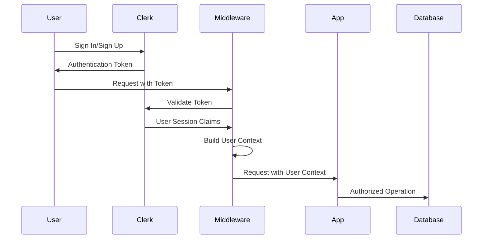
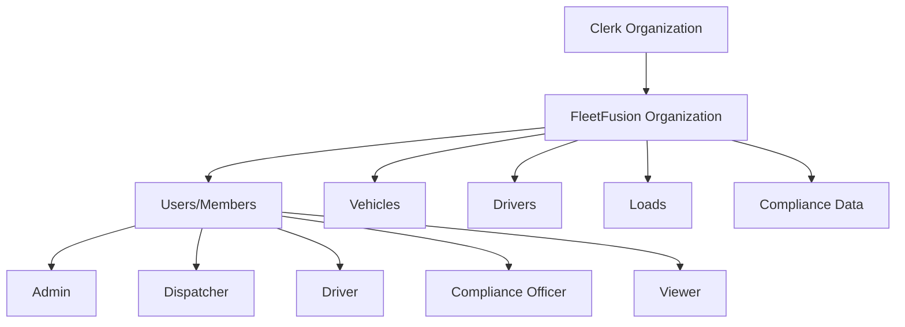

# Authentication & User Management

## Overview

FleetFusion uses [Clerk.js](https://clerk.com) for authentication and user management, providing secure, scalable authentication with multi-tenant organization support. The system implements role-based access control (RBAC) with attribute-based permissions for fine-grained authorization.

## Architecture

### Authentication Flow



### Multi-Tenant Organization Structure



## Clerk.js Configuration

### User Authentication Options
- **Email address**: Enabled. Users can add email addresses to their accounts
- **Require email during sign-up**: Enabled. Users must provide and maintain an email address
- **Username**: Enabled. Users can set a username
- **First and last name**: Enabled. Users can set their first and last name
- **Require first and last name**: Disabled. Not required at sign-up

### Environment Configuration

#### Local Development
```
NEXT_PUBLIC_APP_URL=http://localhost:3000
NEXT_PUBLIC_CLERK_FRONTEND_API=driving-gelding-14.clerk.accounts.dev
NEXT_PUBLIC_CLERK_WEBHOOK_ENDPOINT=https://liberal-gull-quietly.ngrok-free.app/api/clerk/webhook-handler
```

#### Production
```
NEXT_PUBLIC_APP_URL=http://fleet-fusion.vercel.app
NEXT_PUBLIC_CLERK_FRONTEND_API=driving-gelding-14.clerk.accounts.dev
NEXT_PUBLIC_CLERK_WEBHOOK_ENDPOINT=https://fleet-fusion.vercel.app/api/clerk/webhook-handler
```

### Environment Variables

```bash
# Clerk Authentication
NEXT_PUBLIC_CLERK_PUBLISHABLE_KEY=pk_test_your_publishable_key
CLERK_SECRET_KEY=sk_test_your_secret_key
CLERK_WEBHOOK_SECRET=whsec_your_webhook_secret

# Clerk URLs
NEXT_PUBLIC_CLERK_SIGN_IN_URL=/sign-in
NEXT_PUBLIC_CLERK_SIGN_UP_URL=/sign-up
NEXT_PUBLIC_CLERK_AFTER_SIGN_IN_URL=/dashboard
NEXT_PUBLIC_CLERK_AFTER_SIGN_UP_URL=/onboarding
```

### Organization Setup

FleetFusion organizations are created automatically when users sign up:

```typescript
// Organization creation via Clerk webhook
const organization = await prisma.organization.create({
  data: {
    clerkId: clerkOrgId,
    name: organizationName,
    slug: generateSlug(organizationName),
    subscriptionTier: 'free',
    subscriptionStatus: 'trial',
    maxUsers: 5,
    settings: {
      timezone: 'America/Denver',
      dateFormat: 'MM/dd/yyyy',
      distanceUnit: 'miles',
      fuelUnit: 'gallons'
    }
  }
});
```

## User Roles & Permissions

### Role Hierarchy

```typescript
enum SystemRole {
  ADMIN = 'admin',                    // Full system access
  MANAGER = 'manager',                // Management functions
  USER = 'user',                      // Standard user access
  DISPATCHER = 'dispatcher',          // Dispatch operations
  DRIVER = 'driver',                  // Driver-specific access
  COMPLIANCE_OFFICER = 'compliance',  // Compliance management
  ACCOUNTANT = 'accountant',          // Financial/reporting access
  VIEWER = 'viewer'                   // Read-only access
}
```

### Permission Matrix

| Role | Loads | Vehicles | Drivers | Compliance | Analytics | Admin |
|------|-------|----------|---------|------------|-----------|--------|
| **Admin** | Full | Full | Full | Full | Full | Full |
| **Manager** | Full | Full | Full | Read | Full | Config |
| **Dispatcher** | Full | Read | Read | Read | Limited | None |
| **Driver** | Own | Own | Own | Own | None | None |
| **Compliance** | Read | Read | Read | Full | Compliance | None |
| **Accountant** | Read | Read | Read | Read | Financial | None |
| **Viewer** | Read | Read | Read | Read | Read | None |

### Permission Actions

```typescript
enum PermissionAction {
  CREATE = 'create',
  READ = 'read',
  UPDATE = 'update',
  DELETE = 'delete',
  ASSIGN = 'assign',
  APPROVE = 'approve',
  EXPORT = 'export'
}

enum ResourceType {
  LOADS = 'loads',
  VEHICLES = 'vehicles',
  DRIVERS = 'drivers',
  USERS = 'users',
  COMPLIANCE = 'compliance',
  ANALYTICS = 'analytics',
  ORGANIZATION = 'organization',
  BILLING = 'billing'
}
```

## Middleware Implementation

### Route Protection

FleetFusion middleware handles authentication and authorization for all protected routes:

```typescript
// middleware.ts
import { clerkMiddleware, createRouteMatcher } from "@clerk/nextjs/server";

const publicRoutes = createRouteMatcher([
  '/',
  '/sign-in(.*)',
  '/sign-up(.*)',
  '/api/clerk/webhook-handler'
]);

export default clerkMiddleware(async (auth, req) => {
  // Skip public routes
  if (publicRoutes(req)) return;

  // Require authentication
  const { userId, orgId } = await auth();
  if (!userId) {
    return redirectToSignIn({ returnBackUrl: req.url });
  }

  // Build user context with permissions
  const userContext = await buildUserContext(userId, sessionClaims, orgId);
  
  // Check route permissions
  const hasAccess = await checkRoutePermissions(req.nextUrl.pathname, userContext);
  if (!hasAccess) {
    return NextResponse.redirect(new URL('/unauthorized', req.url));
  }
});
```

### User Context Building

```typescript
interface UserContext {
  userId: string;
  organizationId: string;
  role: SystemRole;
  permissions: Permission[];
  isActive: boolean;
  name: string;
  email: string;
  firstName: string;
  lastName: string;
  onboardingComplete: boolean;
  organizationMetadata: ClerkOrganizationMetadata;
}

function buildUserContext(userId: string, sessionClaims: any, orgId: string): UserContext {
  const userRole = sessionClaims?.abac?.role || SystemRoles.VIEWER;
  const userPermissions = getPermissionsForRole(userRole);
  
  return {
    userId,
    organizationId: orgId,
    role: userRole,
    permissions: userPermissions,
    isActive: sessionClaims?.metadata?.isActive !== false,
    name: sessionClaims?.firstName || '',
    email: sessionClaims?.primaryEmail || '',
    firstName: sessionClaims?.firstName || '',
    lastName: sessionClaims?.lastName || '',
    onboardingComplete: sessionClaims?.publicMetadata?.onboardingComplete || false,
    organizationMetadata: sessionClaims?.org_public_metadata || {}
  };
}
```

## User Management Operations

### User Creation & Onboarding

```typescript
// Automatic user creation via Clerk webhook
export async function handleUserCreated(clerkUser: UserJSON) {
  const user = await prisma.user.create({
    data: {
      clerkId: clerkUser.id,
      email: clerkUser.email_addresses[0]?.email_address,
      firstName: clerkUser.first_name,
      lastName: clerkUser.last_name,
      role: 'viewer', // Default role
      isActive: true,
      onboardingComplete: false,
      onboardingSteps: {
        profile: false,
        organization: false,
        preferences: false,
        tour: false
      }
    }
  });
  
  return user;
}
```

### Organization Membership

```typescript
// Add user to organization
export async function addUserToOrganization(
  userId: string,
  organizationId: string,
  role: SystemRole
) {
  // Create organization membership
  await prisma.organizationMembership.create({
    data: {
      userId,
      organizationId,
      role
    }
  });
  
  // Update user role
  await prisma.user.update({
    where: { id: userId },
    data: { 
      role,
      organizationId 
    }
  });
  
  // Update Clerk metadata
  await clerkClient.users.updateUser(userId, {
    publicMetadata: { 
      role,
      organizationId 
    }
  });
}
```

### Role Assignment

```typescript
export async function updateUserRole(
  userId: string,
  newRole: SystemRole,
  updatedBy: string
) {
  // Validate permissions
  const updater = await getCurrentUser();
  if (!hasPermission(updater, 'update', 'users')) {
    throw new Error('Insufficient permissions');
  }
  
  // Update database
  const user = await prisma.user.update({
    where: { id: userId },
    data: { 
      role: newRole,
      updatedAt: new Date()
    }
  });
  
  // Update Clerk metadata
  await clerkClient.users.updateUser(user.clerkId, {
    publicMetadata: { 
      role: newRole,
      permissions: getPermissionsForRole(newRole)
    }
  });
  
  // Create audit log
  await createAuditLog({
    userId: updatedBy,
    entityType: 'user',
    entityId: userId,
    action: 'role_updated',
    changes: { role: { from: user.role, to: newRole } }
  });
  
  return user;
}
```

## Permission Checking

### Component-Level Protection

```typescript
import { useAuth } from '@clerk/nextjs';
import { hasPermission } from '@/lib/auth/permissions';

export function ProtectedComponent() {
  const { user } = useAuth();
  
  if (!hasPermission(user, 'read', 'loads')) {
    return <div>Access Denied</div>;
  }
  
  return (
    <div>
      {hasPermission(user, 'create', 'loads') && (
        <button>Create Load</button>
      )}
      {/* Load list */}
    </div>
  );
}
```

### Server Action Protection

```typescript
export async function createLoadAction(data: CreateLoadInput) {
  const { userId, user } = await auth();
  
  if (!hasPermission(user, 'create', 'loads')) {
    return { success: false, error: 'Insufficient permissions' };
  }
  
  // Continue with load creation
}
```

### Route-Level Protection

```typescript
// Route protection utility
export class RouteProtection {
  static checkAccess(pathname: string, userContext: UserContext): boolean {
    const routePermissions = getRoutePermissions(pathname);
    return routePermissions.every(permission => 
      hasPermission(userContext, permission.action, permission.resource)
    );
  }
}
```

## Session Management

### Session Caching

```typescript
// Session cache for performance optimization
const sessionCache = new Map<string, CachedSession>();
const SESSION_CACHE_TTL = 30 * 1000; // 30 seconds

interface CachedSession {
  userContext: UserContext;
  timestamp: number;
  ttl: number;
}

function getCachedUserContext(sessionId: string): UserContext | null {
  const cached = sessionCache.get(sessionId);
  if (cached && Date.now() - cached.timestamp < cached.ttl) {
    return cached.userContext;
  }
  if (cached) sessionCache.delete(sessionId);
  return null;
}
```

### Session Invalidation

```typescript
export async function invalidateUserSession(userId: string) {
  // Remove from cache
  sessionCache.forEach((value, key) => {
    if (value.userContext.userId === userId) {
      sessionCache.delete(key);
    }
  });
  
  // Revoke Clerk sessions
  await clerkClient.users.getUserOauthAccessToken(userId, 'oauth_provider');
}
```

## Webhook Integration

### Purpose
The webhook handler serves as the **synchronization bridge** between Clerk's authentication system and the Neon PostgreSQL database, ensuring data consistency across the multi-tenant ABAC system.

### Subscribed Events
- `email.created`
- `organization.created`, `organization.deleted`, `organization.updated`
- `organizationDomain.created`, `organizationDomain.deleted`, `organizationDomain.updated`
- `organizationInvitation.accepted`, `organizationInvitation.created`, `organizationInvitation.revoked`
- `organizationMembership.created`, `organizationMembership.deleted`, `organizationMembership.updated`
- `permission.created`, `permission.deleted`, `permission.updated`
- `role.created`, `role.deleted`, `role.updated`
- `session.created`, `session.ended`, `session.pending`, `session.removed`, `session.revoked`
- `user.created`, `user.deleted`, `user.updated`

### Key Responsibilities

#### User Lifecycle Management
- **user.created**: Create user record in database with initial metadata
- **user.updated**: Sync profile changes (name, email, metadata updates)
- **user.deleted**: Soft delete or deactivate user records

#### Organization Management
- **organization.created**: Create organization records during onboarding
- **organization.updated**: Sync organization metadata changes
- **organization.deleted**: Handle organization cleanup

#### Membership & Role Management
- **organizationMembership.created**: Track user-organization relationships
- **organizationMembership.updated**: Handle role changes within organizations
- **organizationMembership.deleted**: Remove user access when they leave

### Webhook Verification
```typescript
import { Webhook } from 'svix'

async function verifyWebhook(request: NextRequest): Promise<WebhookPayload | null> {
  const body = await request.text()
  const svix_id = request.headers.get('svix-id')
  const svix_timestamp = request.headers.get('svix-timestamp') 
  const svix_signature = request.headers.get('svix-signature')
  
  const wh = new Webhook(process.env.CLERK_WEBHOOK_SECRET!)
  return wh.verify(body, {
    'svix-id': svix_id!,
    'svix-timestamp': svix_timestamp!,
    'svix-signature': svix_signature!,
  }) as WebhookPayload
}
```

### Event Handling Pattern
```typescript
switch (type) {
  case 'user.created':
  case 'user.updated': 
  case 'user.deleted':
  case 'organization.created':
  case 'organization.updated':
  case 'organization.deleted':
  case 'organizationMembership.created':
  case 'organizationMembership.updated':
  case 'organizationMembership.deleted':
  case 'session.created':
  case 'session.ended':
  case 'email.created':
    // Handle each event type
    break;
}
```

### Onboarding Metadata Sync
```typescript
case 'user.updated': {
  const metadata = data.public_metadata as ClerkUserMetadata
  
  await DatabaseQueries.upsertUser({
    clerkId: data.id,
    organizationId: metadata.organizationId,
    role: metadata.role || UserRole.USER,
    permissions: metadata.permissions || [],
    isActive: metadata.isActive !== false,
    onboardingCompleted: metadata.onboardingComplete || false
  })
}
```

## Server Actions Architecture

### Action Location and Structure
All server actions are located in `lib/actions/*.ts` with proper organization:

```typescript
'use server'

// Example action structure
export async function createUser(data: FormData | object) {
  // Authentication and authorization checks
  // Database operations
  // Error handling
}
```

### Common Server Actions
- **User/Account**: `createUser`, `updateUser`, `deleteUser`
- **Organization**: `createOrganization`, `inviteMember`, `removeMember`
- **Vehicle/Asset**: `addVehicle`, `updateVehicle`, `deleteVehicle`
- **Onboarding**: `completeOnboarding`

### Data Fetchers Organization
Server-side data fetchers are organized in `lib/fetchers/*.ts` by domain:

```typescript
// Example: lib/fetchers/vehicles.ts
export async function getVehiclesByOrg(orgId: string): Promise<Vehicle[]> {
  return db.vehicle.findMany({ where: { orgId } })
}
```

### Best Practices
- All fetchers are async and properly typed
- Colocated by domain in fetchers directory
- Used only in Server Components and server actions
- Never imported directly into client components

## Security Best Practices

### Password Policies

Clerk.js handles password policies automatically:
- Minimum 8 characters
- Must include uppercase, lowercase, number
- Common password detection
- Breach detection via HaveIBeenPwned

### Multi-Factor Authentication

```typescript
// Enable MFA for admin users
await clerkClient.users.updateUser(userId, {
  privateMetadata: {
    mfaRequired: true
  }
});
```

### Session Security

- JWT tokens with short expiration
- Automatic session refresh
- Device tracking and management
- Suspicious activity detection

## User Interface Components

### Clerk.js Components

```typescript
import { UserButton, OrganizationSwitcher } from '@clerk/nextjs';

export function AppHeader() {
  return (
    <header>
      <OrganizationSwitcher 
        afterSelectOrganizationUrl="/dashboard"
        afterCreateOrganizationUrl="/onboarding"
      />
      <UserButton 
        afterSignOutUrl="/"
        appearance={{
          elements: {
            avatarBox: "w-8 h-8"
          }
        }}
      />
    </header>
  );
}
```

### Custom Auth Components

```typescript
import { useAuth, useUser } from '@clerk/nextjs';

export function UserProfile() {
  const { user } = useUser();
  const { signOut } = useAuth();
  
  return (
    <div>
      <h2>Welcome, {user?.firstName}</h2>
      <p>Role: {user?.publicMetadata?.role}</p>
      <button onClick={() => signOut()}>
        Sign Out
      </button>
    </div>
  );
}
```

## Testing Authentication

### Unit Tests

```typescript
import { hasPermission } from '@/lib/auth/permissions';

describe('Permission System', () => {
  it('should grant admin full access', () => {
    const adminUser = {
      role: 'admin',
      permissions: getPermissionsForRole('admin')
    };
    
    expect(hasPermission(adminUser, 'create', 'loads')).toBe(true);
    expect(hasPermission(adminUser, 'delete', 'users')).toBe(true);
  });
  
  it('should restrict driver access', () => {
    const driverUser = {
      role: 'driver',
      permissions: getPermissionsForRole('driver')
    };
    
    expect(hasPermission(driverUser, 'read', 'loads')).toBe(true);
    expect(hasPermission(driverUser, 'delete', 'loads')).toBe(false);
  });
});
```

### Integration Tests

```typescript
import { render, screen } from '@testing-library/react';
import { ClerkProvider } from '@clerk/nextjs';

const mockUser = {
  id: 'user_123',
  publicMetadata: { role: 'dispatcher' }
};

test('renders dashboard based on user role', async () => {
  render(
    <ClerkProvider publishableKey="test">
      <Dashboard />
    </ClerkProvider>
  );
  
  expect(screen.getByText('Dispatch Dashboard')).toBeInTheDocument();
});
```

## Troubleshooting

### Common Issues

1. **Session Not Found**
   - Check Clerk environment variables
   - Verify webhook endpoint configuration
   - Clear browser cookies and localStorage

2. **Permission Denied**
   - Verify user role in Clerk dashboard
   - Check organization membership
   - Review route protection configuration

3. **Webhook Failures**
   - Verify webhook secret configuration
   - Check network connectivity
   - Review webhook event logs in Clerk dashboard

### Debug Tools

```typescript
// Debug user context
export function debugUserContext(req: NextRequest) {
  console.log('Session claims:', req.auth.sessionClaims);
  console.log('Organization ID:', req.auth.orgId);
  console.log('User ID:', req.auth.userId);
}

// Permission debugging
export function debugPermissions(user: UserContext, action: string, resource: string) {
  console.log(`Checking ${action}:${resource} for user ${user.userId}`);
  console.log('User role:', user.role);
  console.log('User permissions:', user.permissions);
  console.log('Has permission:', hasPermission(user, action, resource));
}
```

### Authentication Flow Mapping

```mermaid
flowchart TD
  subgraph Public Routes
    A1[/sign-in/] --> H1[Clerk SignIn Page]
    A2[/sign-up/] --> H2[Clerk SignUp Page]
    A3[/forgot-password/] --> H3[Clerk Password Reset]
    A4[/accept-invitation/] --> H4[Accept Invitation Page]
  end

  subgraph App Routes
    B1[/] --> C1[Middleware: Auth Check]
    B2[/onboarding/] --> C2[Onboarding Page]
    B3[/dashboard/] --> C3[Dashboard - protected]
    B4[/settings/] --> C4[Settings - protected]
    B5[/sign-out/] --> H5[Clerk SignOut Handler]
  end

  H1 -->|Success| C1
  H2 -->|Success| C2
  H3 -->|Success| H1
  H4 -->|Accept| C2
  C2 -->|Onboarding Complete| C3

  C1 -.->|Not Authenticated| H1
  C3 -.->|Sign Out| H5
  C4 -.->|Sign Out| H5
```

### Route & Handler Breakdown

| Route                        | Handler/Component                                  | Redirects/Logic                                      |
|------------------------------|----------------------------------------------------|------------------------------------------------------|
| `/sign-in`                   | Clerk SignIn (App Router or Clerk UI)              | On success → `/` or `/dashboard`                     |
| `/sign-up`                   | Clerk SignUp (App Router or Clerk UI)              | On success → `/onboarding`                           |
| `/forgot-password`           | Clerk Password Reset                               | On success → `/sign-in`                              |
| `/accept-invitation`         | `AcceptInvitationPage` | On success → `/onboarding` or `/dashboard`           |
| `/onboarding`                | Onboarding flow (protected, server/client)         | On complete → `/dashboard`                           |
| `/dashboard`, `/settings`    | Protected pages (middleware enforced)              | If not authenticated → `/sign-in`                    |
| `/sign-out`                  | Clerk SignOut handler                              | On success → `/sign-in`                              |

**Middleware Enforcement:**  
- `middleware.ts` enforces authentication and redirects unauthenticated users to `/sign-in`
- Onboarding is protected so users can't revisit after completion
- Organization context is validated for all tenant routes

### Key Authentication Concepts

#### User.id vs Org.id for Access Control
- **user.id**: Used for role-based access control (RBAC)
- **org.id**: Used for tenant-based access control (multi-tenancy)

#### Authentication Flow
```
sign-up => onboarding => app/(tenant)/[orgId]/dashboard/[userId]/page.tsx
sign-in => app/(tenant)/[orgId]/dashboard/[userId]/page.tsx
```
