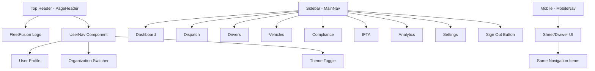

# Dashboard Guide

This guide covers the implementation, architecture, and best practices for FleetFusion's dashboard components and data visualization.

## Overview

FleetFusion's dashboard system provides real-time insights into fleet operations, performance metrics, and business analytics. Built with Next.js 15 Server Components and React 19, the dashboard prioritizes server-side rendering for optimal performance and SEO.

## Dashboard Architecture

### Fleet Management Dashboard

**Location**: `app/(tenant)/[orgId]/dashboard/[userId]/page.tsx`
**Layout**: `app/(tenant)/[orgId]/dashboard/layout.tsx`

The Fleet Management Dashboard serves as the primary operational interface for fleet managers and organizational management.

#### Purpose & Audience
- **Purpose**: Real-time overview of fleet operations, key metrics, quick actions, alerts, and schedules
- **Audience**: Organization Management and users with dashboard access permissions

#### Navigation Structure



### Key Components

#### A. Page Header
```typescript
// components/dashboard/page-header.tsx
interface PageHeaderProps {
  title: string;
  subtitle?: string;
  actions?: React.ReactNode;
}

export function PageHeader({ title, subtitle, actions }: PageHeaderProps) {
  return (
    <div className="flex items-center justify-between">
      <div>
        <h1 className="text-3xl font-bold tracking-tight">{title}</h1>
        {subtitle && (
          <p className="text-muted-foreground">{subtitle}</p>
        )}
      </div>
      {actions && <div className="flex items-center gap-2">{actions}</div>}
    </div>
  );
}
```

#### B. Quick Actions Component
```typescript
// components/dashboard/quick-actions.tsx
'use client';

import { Button } from '@/components/ui/button';
import { hasPermission } from '@/lib/auth/permissions';
import { useRouter } from 'next/navigation';
import { 
  Truck, 
  UserPlus, 
  Package, 
  MapPin, 
  FileText, 
  Calculator 
} from 'lucide-react';

interface QuickAction {
  id: string;
  title: string;
  description: string;
  icon: React.ComponentType<{ className?: string }>;
  href: string;
  permission: string;
  variant?: 'default' | 'outline';
}

const QUICK_ACTIONS: QuickAction[] = [
  {
    id: 'new-load',
    title: 'Create New Load',
    description: 'Schedule a new shipment',
    icon: Package,
    href: '/dispatch/new',
    permission: 'dispatch:create',
    variant: 'default',
  },
  {
    id: 'add-vehicle',
    title: 'Add Vehicle',
    description: 'Register new vehicle',
    icon: Truck,
    href: '/vehicles/new',
    permission: 'vehicles:create',
    variant: 'outline',
  },
  {
    id: 'add-driver',
    title: 'Add Driver',
    description: 'Onboard new driver',
    icon: UserPlus,
    href: '/drivers/new',
    permission: 'drivers:create',
    variant: 'outline',
  },
  {
    id: 'track-shipment',
    title: 'Track Shipment',
    description: 'Monitor load progress',
    icon: MapPin,
    href: '/dispatch/tracking',
    permission: 'dispatch:read',
    variant: 'outline',
  },
  {
    id: 'generate-report',
    title: 'Generate Report',
    description: 'Create analytics report',
    icon: FileText,
    href: '/analytics/reports',
    permission: 'analytics:read',
    variant: 'outline',
  },
  {
    id: 'ifta-report',
    title: 'IFTA Report',
    description: 'Fuel tax reporting',
    icon: Calculator,
    href: '/ifta/reports',
    permission: 'ifta:read',
    variant: 'outline',
  },
];

interface QuickActionsProps {
  userPermissions: string[];
  organizationId: string;
}

export function QuickActions({ userPermissions, organizationId }: QuickActionsProps) {
  const router = useRouter();

  const allowedActions = QUICK_ACTIONS.filter(action =>
    hasPermission(userPermissions, action.permission)
  );

  const handleActionClick = (href: string) => {
    router.push(`/${organizationId}${href}`);
  };

  return (
    <div className="grid grid-cols-1 md:grid-cols-2 lg:grid-cols-3 gap-4">
      {allowedActions.map((action) => {
        const Icon = action.icon;
        return (
          <Button
            key={action.id}
            variant={action.variant}
            className="h-auto p-6 flex flex-col items-start gap-2"
            onClick={() => handleActionClick(action.href)}
          >
            <Icon className="h-6 w-6" />
            <div className="text-left">
              <div className="font-semibold">{action.title}</div>
              <div className="text-sm text-muted-foreground">
                {action.description}
              </div>
            </div>
          </Button>
        );
      })}
    </div>
  );
}
```

#### C. Dashboard Metrics Component
```typescript
// components/dashboard/dashboard-metrics.tsx
import { Card, CardContent, CardHeader, CardTitle } from '@/components/ui/card';
import { ArrowUpIcon, ArrowDownIcon, MinusIcon } from 'lucide-react';

interface MetricCardProps {
  title: string;
  value: string | number;
  change?: {
    value: number;
    type: 'increase' | 'decrease' | 'neutral';
    timeframe: string;
  };
  icon?: React.ComponentType<{ className?: string }>;
}

function MetricCard({ title, value, change, icon: Icon }: MetricCardProps) {
  const changeIcon = {
    increase: ArrowUpIcon,
    decrease: ArrowDownIcon,
    neutral: MinusIcon,
  };

  const changeColor = {
    increase: 'text-green-600',
    decrease: 'text-red-600',
    neutral: 'text-gray-600',
  };

  const ChangeIcon = change ? changeIcon[change.type] : null;

  return (
    <Card>
      <CardHeader className="flex flex-row items-center justify-between space-y-0 pb-2">
        <CardTitle className="text-sm font-medium">{title}</CardTitle>
        {Icon && <Icon className="h-4 w-4 text-muted-foreground" />}
      </CardHeader>
      <CardContent>
        <div className="text-2xl font-bold">{value}</div>
        {change && (
          <div className={`flex items-center text-xs ${changeColor[change.type]}`}>
            {ChangeIcon && <ChangeIcon className="h-3 w-3 mr-1" />}
            <span>{Math.abs(change.value)}% from {change.timeframe}</span>
          </div>
        )}
      </CardContent>
    </Card>
  );
}

interface DashboardMetricsProps {
  metrics: {
    activeVehicles: number;
    activeDrivers: number;
    activeLoads: number;
    revenue: number;
    onTimeDeliveryRate: number;
    averageDeliveryTime: number;
    fuelEfficiency: number;
    openViolations: number;
  };
  changes?: Record<string, { value: number; type: 'increase' | 'decrease' | 'neutral' }>;
}

export function DashboardMetrics({ metrics, changes }: DashboardMetricsProps) {
  return (
    <div className="grid grid-cols-1 md:grid-cols-2 lg:grid-cols-4 gap-4">
      <MetricCard
        title="Active Vehicles"
        value={metrics.activeVehicles}
        change={changes?.activeVehicles ? { ...changes.activeVehicles, timeframe: 'last month' } : undefined}
      />
      <MetricCard
        title="Active Drivers"
        value={metrics.activeDrivers}
        change={changes?.activeDrivers ? { ...changes.activeDrivers, timeframe: 'last month' } : undefined}
      />
      <MetricCard
        title="Active Loads"
        value={metrics.activeLoads}
        change={changes?.activeLoads ? { ...changes.activeLoads, timeframe: 'last week' } : undefined}
      />
      <MetricCard
        title="Revenue"
        value={`$${metrics.revenue.toLocaleString()}`}
        change={changes?.revenue ? { ...changes.revenue, timeframe: 'last month' } : undefined}
      />
      <MetricCard
        title="On-Time Delivery"
        value={`${metrics.onTimeDeliveryRate}%`}
        change={changes?.onTimeDeliveryRate ? { ...changes.onTimeDeliveryRate, timeframe: 'last month' } : undefined}
      />
      <MetricCard
        title="Avg Delivery Time"
        value={`${metrics.averageDeliveryTime}h`}
        change={changes?.averageDeliveryTime ? { ...changes.averageDeliveryTime, timeframe: 'last month' } : undefined}
      />
      <MetricCard
        title="Fuel Efficiency"
        value={`${metrics.fuelEfficiency} MPG`}
        change={changes?.fuelEfficiency ? { ...changes.fuelEfficiency, timeframe: 'last month' } : undefined}
      />
      <MetricCard
        title="Open Violations"
        value={metrics.openViolations}
        change={changes?.openViolations ? { ...changes.openViolations, timeframe: 'last week' } : undefined}
      />
    </div>
  );
}
```

#### D. Dashboard Grid Components
```typescript
// components/dashboard/recent-activity.tsx
import { Card, CardContent, CardHeader, CardTitle } from '@/components/ui/card';
import { Badge } from '@/components/ui/badge';

interface Activity {
  id: string;
  type: 'load' | 'driver' | 'vehicle' | 'compliance';
  title: string;
  description: string;
  timestamp: Date;
  status: 'info' | 'warning' | 'success' | 'error';
}

interface RecentActivityProps {
  activities: Activity[];
}

export function RecentActivity({ activities }: RecentActivityProps) {
  const statusColors = {
    info: 'bg-blue-100 text-blue-800',
    warning: 'bg-yellow-100 text-yellow-800',
    success: 'bg-green-100 text-green-800',
    error: 'bg-red-100 text-red-800',
  };

  return (
    <Card>
      <CardHeader>
        <CardTitle>Recent Activity</CardTitle>
      </CardHeader>
      <CardContent className="space-y-4">
        {activities.length === 0 ? (
          <p className="text-muted-foreground text-center py-4">
            No recent activity
          </p>
        ) : (
          activities.slice(0, 5).map((activity) => (
            <div key={activity.id} className="flex items-start space-x-3">
              <Badge className={statusColors[activity.status]}>
                {activity.type}
              </Badge>
              <div className="flex-1 min-w-0">
                <p className="text-sm font-medium">{activity.title}</p>
                <p className="text-xs text-muted-foreground">
                  {activity.description}
                </p>
                <p className="text-xs text-muted-foreground">
                  {activity.timestamp.toLocaleDateString()}
                </p>
              </div>
            </div>
          ))
        )}
      </CardContent>
    </Card>
  );
}
```

## Data Fetching Strategy

### Dashboard Data Fetchers
```typescript
// lib/fetchers/dashboardFetchers.ts
import { prisma } from '@/lib/database/prisma';
import { unstable_cache } from 'next/cache';

export interface DashboardSummary {
  metrics: {
    activeVehicles: number;
    activeDrivers: number;
    activeLoads: number;
    revenue: number;
    onTimeDeliveryRate: number;
    averageDeliveryTime: number;
    fuelEfficiency: number;
    openViolations: number;
  };
  recentActivity: Array<{
    id: string;
    type: 'load' | 'driver' | 'vehicle' | 'compliance';
    title: string;
    description: string;
    timestamp: Date;
    status: 'info' | 'warning' | 'success' | 'error';
  }>;
  complianceAlerts: Array<{
    id: string;
    type: 'document_expiry' | 'violation' | 'maintenance_due';
    title: string;
    description: string;
    severity: 'low' | 'medium' | 'high';
    dueDate?: Date;
  }>;
  upcomingMaintenance: Array<{
    id: string;
    vehicleId: string;
    vehicleName: string;
    maintenanceType: string;
    dueDate: Date;
    mileage?: number;
  }>;
}

export const getDashboardSummary = unstable_cache(
  async (organizationId: string): Promise<DashboardSummary> => {
    // Parallel data fetching for performance
    const [
      activeVehicles,
      activeDrivers,
      activeLoads,
      recentLoads,
      complianceDocuments,
      maintenanceSchedule,
    ] = await Promise.all([
      // Active vehicles count
      prisma.vehicle.count({
        where: {
          organizationId,
          status: 'active',
        },
      }),
      
      // Active drivers count
      prisma.driver.count({
        where: {
          organizationId,
          status: 'active',
        },
      }),
      
      // Active loads count
      prisma.load.count({
        where: {
          organizationId,
          status: {
            in: ['assigned', 'in_transit'],
          },
        },
      }),
      
      // Recent loads for activity
      prisma.load.findMany({
        where: { organizationId },
        orderBy: { updatedAt: 'desc' },
        take: 10,
        include: {
          driver: { select: { name: true } },
          vehicle: { select: { unit_number: true } },
        },
      }),
      
      // Compliance documents expiring soon
      prisma.complianceDocument.findMany({
        where: {
          organizationId,
          expirationDate: {
            lte: new Date(Date.now() + 30 * 24 * 60 * 60 * 1000), // 30 days
          },
          status: 'active',
        },
        include: {
          driver: { select: { name: true } },
          vehicle: { select: { unit_number: true } },
        },
      }),
      
      // Upcoming maintenance
      prisma.maintenanceSchedule.findMany({
        where: {
          organizationId,
          scheduledDate: {
            lte: new Date(Date.now() + 14 * 24 * 60 * 60 * 1000), // 14 days
          },
          status: 'scheduled',
        },
        include: {
          vehicle: { select: { unit_number: true, make: true, model: true } },
        },
      }),
    ]);

    // Calculate additional metrics
    const revenue = await calculateMonthlyRevenue(organizationId);
    const onTimeDeliveryRate = await calculateOnTimeDeliveryRate(organizationId);
    const averageDeliveryTime = await calculateAverageDeliveryTime(organizationId);
    const fuelEfficiency = await calculateFuelEfficiency(organizationId);
    const openViolations = await countOpenViolations(organizationId);

    return {
      metrics: {
        activeVehicles,
        activeDrivers,
        activeLoads,
        revenue,
        onTimeDeliveryRate,
        averageDeliveryTime,
        fuelEfficiency,
        openViolations,
      },
      recentActivity: transformRecentActivity(recentLoads),
      complianceAlerts: transformComplianceAlerts(complianceDocuments),
      upcomingMaintenance: transformMaintenanceSchedule(maintenanceSchedule),
    };
  },
  ['dashboard-summary'],
  {
    revalidate: 300, // 5 minutes
    tags: ['dashboard', 'metrics'],
  }
);

// Helper functions for calculations
async function calculateMonthlyRevenue(organizationId: string): Promise<number> {
  const startOfMonth = new Date();
  startOfMonth.setDate(1);
  startOfMonth.setHours(0, 0, 0, 0);

  const result = await prisma.load.aggregate({
    where: {
      organizationId,
      status: 'delivered',
      actualDeliveryDate: {
        gte: startOfMonth,
      },
    },
    _sum: {
      rate: true,
    },
  });

  return result._sum.rate || 0;
}

async function calculateOnTimeDeliveryRate(organizationId: string): Promise<number> {
  const thirtyDaysAgo = new Date(Date.now() - 30 * 24 * 60 * 60 * 1000);

  const [totalDeliveries, onTimeDeliveries] = await Promise.all([
    prisma.load.count({
      where: {
        organizationId,
        status: 'delivered',
        actualDeliveryDate: {
          gte: thirtyDaysAgo,
        },
      },
    }),
    prisma.load.count({
      where: {
        organizationId,
        status: 'delivered',
        actualDeliveryDate: {
          gte: thirtyDaysAgo,
          lte: prisma.load.fields.scheduledDeliveryDate,
        },
      },
    }),
  ]);

  return totalDeliveries > 0 ? Math.round((onTimeDeliveries / totalDeliveries) * 100) : 0;
}

// Additional calculation functions...
```

## Performance Optimization

### Caching Strategy
- **Dashboard Summary**: 5-minute cache with tag-based revalidation
- **Metrics**: Optimistic updates with background refresh
- **Real-time Data**: WebSocket connections for critical updates

### Loading States
```typescript
// components/dashboard/dashboard-skeleton.tsx
export function DashboardSkeleton() {
  return (
    <div className="space-y-6">
      {/* Header skeleton */}
      <div className="space-y-2">
        <div className="h-8 w-48 bg-gray-200 rounded animate-pulse" />
        <div className="h-4 w-96 bg-gray-200 rounded animate-pulse" />
      </div>
      
      {/* Quick actions skeleton */}
      <div className="grid grid-cols-1 md:grid-cols-2 lg:grid-cols-3 gap-4">
        {Array.from({ length: 6 }).map((_, i) => (
          <div key={i} className="h-24 bg-gray-200 rounded animate-pulse" />
        ))}
      </div>
      
      {/* Metrics skeleton */}
      <div className="grid grid-cols-1 md:grid-cols-2 lg:grid-cols-4 gap-4">
        {Array.from({ length: 8 }).map((_, i) => (
          <div key={i} className="h-32 bg-gray-200 rounded animate-pulse" />
        ))}
      </div>
    </div>
  );
}
```

## Security & Permissions

### Permission-Based Rendering
All dashboard components implement permission-based rendering using the RBAC system:

```typescript
// Example usage in dashboard page
export default async function DashboardPage({
  params: { orgId, userId },
}: {
  params: { orgId: string; userId: string };
}) {
  const { user, permissions } = await getCurrentUser();
  
  // Verify user has dashboard access
  if (!hasPermission(permissions, 'dashboard:read')) {
    redirect('/unauthorized');
  }
  
  const dashboardData = await getDashboardSummary(orgId);
  
  return (
    <div className="space-y-6">
      <PageHeader
        title="Dashboard"
        subtitle="Welcome back! Here's what's happening with your fleet."
      />
      
      <QuickActions
        userPermissions={permissions}
        organizationId={orgId}
      />
      
      <DashboardMetrics metrics={dashboardData.metrics} />
      
      <div className="grid grid-cols-1 lg:grid-cols-3 gap-6">
        <div className="lg:col-span-2">
          <RecentActivity activities={dashboardData.recentActivity} />
        </div>
        <div className="space-y-6">
          <ComplianceAlerts alerts={dashboardData.complianceAlerts} />
          <UpcomingMaintenance maintenance={dashboardData.upcomingMaintenance} />
        </div>
      </div>
    </div>
  );
}
```

## Best Practices

### Component Design
1. **Server Components First**: Use Server Components for data fetching by default
2. **Client Interactivity**: Only use 'use client' for interactive components
3. **Suspense Boundaries**: Implement proper loading states for all async components
4. **Error Boundaries**: Handle errors gracefully with fallback UIs

### Data Management
1. **Parallel Fetching**: Use Promise.all for independent data fetching
2. **Caching**: Implement appropriate caching strategies for different data types
3. **Revalidation**: Use tag-based revalidation for real-time updates
4. **Pagination**: Implement pagination for large datasets

### User Experience
1. **Progressive Enhancement**: Ensure basic functionality works without JavaScript
2. **Responsive Design**: Mobile-first approach with proper breakpoints
3. **Accessibility**: Implement proper ARIA labels and keyboard navigation
4. **Performance**: Optimize for Core Web Vitals and user experience metrics

This dashboard system provides a scalable, secure, and performant foundation for FleetFusion's operational interface while maintaining the flexibility to adapt to changing business requirements.
