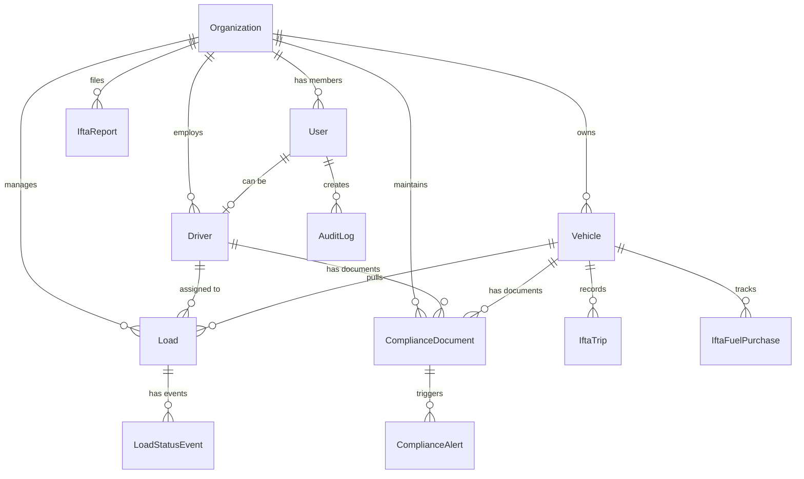

# Database Schema Reference

## Overview

FleetFusion uses a PostgreSQL database with Prisma ORM for type-safe database access. The schema supports multi-tenant architecture with comprehensive fleet management capabilities including vehicles, drivers, loads, compliance tracking, and IFTA reporting.

## Database Configuration

```typescript
// Environment Variables
DATABASE_URL: PostgreSQL connection URL with connection pooling
DIRECT_URL: Direct PostgreSQL connection URL for migrations
```

## Core Entities

### Organization (`organizations`)

The central entity for multi-tenant architecture. Each organization represents a trucking company.

```prisma
model Organization {
  id                  String               @id @default(uuid())
  clerkId             String               @unique // Clerk.js organization ID
  name                String
  slug                String               @unique
  mcNumber            String?              // Motor Carrier Number
  dotNumber           String?              // DOT Number
  address             String?
  city                String?
  state               String?
  zip                 String?
  phone               String?
  email               String?
  logoUrl             String?
  subscriptionTier    SubscriptionTier     @default(free)
  subscriptionStatus  SubscriptionStatus   @default(trial)
  maxUsers            Int                  @default(5)
  billingEmail        String?
  settings            Json?                @default("{...}")
  isActive            Boolean              @default(true)
  createdAt           DateTime             @default(now())
  updatedAt           DateTime             @updatedAt
}
```

**Key Features:**
- Multi-tenant isolation via `organizationId` foreign keys
- Subscription management with tiers and status
- Configurable settings (timezone, units, formats)
- Integration with Clerk.js for authentication

**Relationships:**
- Has many: `users`, `vehicles`, `drivers`, `loads`, `complianceDocuments`, `iftaReports`, `auditLogs`

### User (`users`)

User accounts with role-based access control and organization membership.

```prisma
model User {
  id                 String               @id @default(uuid())
  clerkId            String               @unique // Clerk.js user ID
  organizationId     String?              // Nullable for flexibility
  email              String?
  firstName          String?
  lastName           String?
  profileImage       String?
  role               UserRole             @default(viewer)
  permissions        Json?                @default("[]")
  isActive           Boolean              @default(true)
  lastLogin          DateTime?
  onboardingSteps    Json?                @default("{}")
  onboardingComplete Boolean              @default(false)
  createdAt          DateTime             @default(now())
  updatedAt          DateTime             @updatedAt
}
```

**User Roles:**
```typescript
enum UserRole {
  admin        // Full system access
  manager      // Management functions
  user         // Standard user access
  dispatcher   // Dispatch operations
  driver       // Driver-specific access
  compliance   // Compliance management
  accountant   // Financial/reporting access
  viewer       // Read-only access
}
```

### Vehicle (`vehicles`)

Fleet vehicle management with compliance tracking.

```prisma
model Vehicle {
  id                     String            @id @default(uuid())
  organizationId         String
  type                   String            // truck, trailer, etc.
  status                 VehicleStatus     @default(active)
  make                   String?
  model                  String?
  year                   Int?
  vin                    String?
  licensePlate           String?
  licensePlateState      String?
  unitNumber             String            // Unique within organization
  currentOdometer        Int?
  lastOdometerUpdate     DateTime?
  fuelType               String?
  lastInspectionDate     DateTime?
  nextInspectionDue      DateTime?
  insuranceExpiration    DateTime?
  registrationExpiration DateTime?
  notes                  String?
  customFields           Json?             @default("{}")
  createdAt              DateTime          @default(now())
  updatedAt              DateTime          @updatedAt
}
```

**Vehicle Status:**
```typescript
enum VehicleStatus {
  active
  inactive
  maintenance
  decommissioned
}
```

### Driver (`drivers`)

Driver management with compliance and document tracking.

```prisma
model Driver {
  id                    String         @id @default(uuid())
  organizationId        String
  userId                String?        @unique // Optional link to User
  employeeId            String?
  firstName             String
  lastName              String
  email                 String?
  phone                 String?
  address               String?
  city                  String?
  state                 String?
  zip                   String?
  licenseNumber         String?
  licenseState          String?
  licenseClass          String?
  licenseExpiration     DateTime?
  drugTestDate          DateTime?
  backgroundCheckDate   DateTime?
  medicalCardExpiration DateTime?
  hireDate              DateTime?
  terminationDate       DateTime?
  status                DriverStatus   @default(active)
  emergencyContact1     String?
  emergencyContact2     String?
  emergencyContact3     String?
  notes                 String?
  customFields          Json?          @default("{}")
  createdAt             DateTime       @default(now())
  updatedAt             DateTime       @updatedAt
}
```

### Load (`loads`)

Dispatch and load management with comprehensive tracking.

```prisma
model Load {
  id                    String       @id @default(uuid())
  organizationId        String
  driverId              String?
  vehicleId             String?
  trailerId             String?
  loadNumber            String       // Unique within organization
  referenceNumber       String?
  status                LoadStatus   @default(pending)
  customerName          String?
  customerContact       String?
  customerPhone         String?
  customerEmail         String?
  
  // Origin Details
  originAddress         String
  originCity            String
  originState           String
  originZip             String
  originLat             Decimal?     @db.Decimal(10, 6)
  originLng             Decimal?     @db.Decimal(10, 6)
  
  // Destination Details
  destinationAddress    String
  destinationCity       String
  destinationState      String
  destinationZip        String
  destinationLat        Decimal?     @db.Decimal(10, 6)
  destinationLng        Decimal?     @db.Decimal(10, 6)
  
  // Financial
  rate                  Decimal?     @db.Decimal(10, 2)
  currency              String?      @default("USD")
  
  // Scheduling
  scheduledPickupDate   DateTime?
  actualPickupDate      DateTime?
  scheduledDeliveryDate DateTime?
  actualDeliveryDate    DateTime?
  
  // Load Details
  weight                Int?
  pieces                Int?
  commodity             String?
  hazmat                Boolean?     @default(false)
  estimatedMiles        Int?
  actualMiles           Int?
  priority              LoadPriority @default(medium)
  tags                  String[]     @default([])
  
  notes                 String?
  instructions          String?
  customFields          Json?        @default("{}")
  createdBy             String?
  lastModifiedBy        String?
  createdAt             DateTime     @default(now())
  updatedAt             DateTime     @updatedAt
}
```

**Load Status Workflow:**
```typescript
enum LoadStatus {
  draft          // Initial creation
  pending        // Awaiting assignment
  posted         // Posted to load boards
  booked         // Customer confirmed
  confirmed      // Internal confirmation
  assigned       // Driver/vehicle assigned
  dispatched     // Dispatch sent
  in_transit     // En route to pickup
  at_pickup      // Arrived at pickup
  picked_up      // Load picked up
  en_route       // En route to delivery
  at_delivery    // Arrived at delivery
  delivered      // Load delivered
  pod_required   // Proof of delivery needed
  completed      // Fully completed
  invoiced       // Invoice sent
  paid           // Payment received
  cancelled      // Load cancelled
  problem        // Issue requiring attention
}
```

## Compliance & Documentation

### ComplianceDocument (`compliance_documents`)

Document management for regulatory compliance.

```prisma
model ComplianceDocument {
  id               String       @id @default(uuid())
  organizationId   String
  driverId         String?      // Driver-specific documents
  vehicleId        String?      // Vehicle-specific documents
  type             String       // license, insurance, permit, etc.
  title            String
  documentNumber   String?
  issuingAuthority String?
  fileUrl          String?      // Blob storage URL
  fileName         String?
  fileSize         Int?
  mimeType         String?
  issueDate        DateTime?
  expirationDate   DateTime?    // Critical for compliance alerts
  status           String       @default("active")
  isVerified       Boolean?     @default(false)
  verifiedBy       String?      // User ID
  verifiedAt       DateTime?
  notes            String?
  tags             Json?        @default("[]")
  metadata         Json?        @default("{}")
  createdAt        DateTime     @default(now())
  updatedAt        DateTime     @updatedAt
}
```

### ComplianceAlert (`compliance_alerts`)

Automated compliance monitoring and alerting system.

```prisma
model ComplianceAlert {
  id             String       @id @default(uuid())
  organizationId String
  userId         String?      // Assigned user
  driverId       String?      // Related driver
  vehicleId      String?      // Related vehicle
  type           String       // expiring_document, hos_violation, etc.
  severity       String       // low, medium, high, critical
  title          String
  message        String
  entityType     String       // driver, vehicle, trailer, company, load
  entityId       String
  dueDate        DateTime?
  acknowledged   Boolean      @default(false)
  acknowledgedBy String?
  acknowledgedAt DateTime?
  resolved       Boolean      @default(false)
  resolvedBy     String?
  resolvedAt     DateTime?
  resolutionNotes String?
  metadata       Json?        @default("{}")
  createdAt      DateTime     @default(now())
  updatedAt      DateTime     @updatedAt
}
```

## IFTA (International Fuel Tax Agreement)

### IftaReport (`ifta_reports`)

Quarterly IFTA tax reporting.

```prisma
model IftaReport {
  id              String       @id @default(uuid())
  organizationId  String
  quarter         Int          // 1-4
  year            Int
  status          String       @default("draft")
  totalMiles      Int?
  totalGallons    Decimal?     @db.Decimal(10, 3)
  totalTaxOwed    Decimal?     @db.Decimal(10, 2)
  totalTaxPaid    Decimal?     @db.Decimal(10, 2)
  submittedAt     DateTime?
  submittedBy     String?      // User ID
  dueDate         DateTime?
  filedDate       DateTime?
  reportFileUrl   String?      // Generated report PDF
  calculationData Json?        @default("{}")
  supportingDocs  String?
  notes           String?
  createdAt       DateTime     @default(now())
  updatedAt       DateTime     @updatedAt
}
```

### IftaTrip & IftaFuelPurchase

Supporting data for IFTA calculations.

```prisma
model IftaTrip {
  id             String       @id @default(uuid())
  organizationId String
  vehicleId      String
  date           DateTime
  distance       Int          // Miles driven
  jurisdiction   String       // State/Province code
  fuelUsed       Decimal?     @db.Decimal(10, 3)
  notes          String?
  createdAt      DateTime     @default(now())
  updatedAt      DateTime     @updatedAt
}

model IftaFuelPurchase {
  id             String       @id @default(uuid())
  organizationId String
  vehicleId      String
  date           DateTime
  jurisdiction   String       // State/Province where purchased
  gallons        Decimal      @db.Decimal(10, 3)
  amount         Decimal      @db.Decimal(10, 2)
  vendor         String?
  receiptNumber  String?
  notes          String?
  createdAt      DateTime     @default(now())
  updatedAt      DateTime     @updatedAt
}
```

## Audit & Tracking

### AuditLog (`audit_logs`)

Comprehensive audit trail for all system operations.

```prisma
model AuditLog {
  id             String       @id @default(uuid())
  organizationId String
  userId         String?      // Who performed the action
  entityType     String       // Table/model name
  entityId       String       // Record ID
  action         String       // create, update, delete, etc.
  changes        Json?        // Before/after values
  metadata       Json?        // Additional context
  timestamp      DateTime     @default(now())
}
```

### LoadStatusEvent (`load_status_events`)

Detailed load status tracking history.

```prisma
model LoadStatusEvent {
  id              String     @id @default(uuid())
  loadId          String
  status          LoadStatus
  timestamp       DateTime   @default(now())
  location        Json?      // GPS coordinates, address
  notes           String?
  automaticUpdate Boolean    @default(false)
  source          String     @default("dispatcher")
  createdBy       String?
}
```

## System Tables

### OrganizationMembership (`organization_memberships`)

Many-to-many relationship between users and organizations.

```prisma
model OrganizationMembership {
  id             String   @id @default(uuid())
  organizationId String
  userId         String
  role           String   // Organization-specific role
  createdAt      DateTime @default(now())
  updatedAt      DateTime @updatedAt
}
```

### WebhookEvent (`webhook_events`)

Webhook processing and retry logic.

```prisma
model WebhookEvent {
  id              String    @id @default(uuid())
  eventType       String    // clerk.user.created, etc.
  eventId         String    @unique
  organizationId  String?
  userId          String?
  payload         Json
  status          String    @default("pending")
  processingError String?
  processedAt     DateTime?
  retryCount      Int       @default(0)
  createdAt       DateTime  @default(now())
}
```

## Database Indexes

Key indexes for performance optimization:

```sql
-- Organization lookups
CREATE INDEX idx_orgs_clerk_id ON organizations(clerk_id);
CREATE INDEX idx_orgs_slug ON organizations(slug);

-- User authentication
CREATE INDEX idx_users_clerk_id ON users(clerk_id);
CREATE INDEX idx_users_org_id ON users(organization_id);
CREATE INDEX idx_users_email ON users(email);

-- Vehicle operations
CREATE INDEX idx_vehicles_org_unit ON vehicles(organization_id, unit_number);
CREATE INDEX idx_vehicles_status ON vehicles(status);

-- Load management
CREATE INDEX idx_loads_org_number ON loads(organization_id, load_number);
CREATE INDEX idx_loads_status ON loads(status);
CREATE INDEX idx_loads_pickup_date ON loads(scheduled_pickup_date);

-- Compliance monitoring
CREATE INDEX idx_compliance_expiration ON compliance_documents(expiration_date);
CREATE INDEX idx_alerts_due_date ON compliance_alerts(due_date);

-- Audit trails
CREATE INDEX idx_audit_timestamp ON audit_logs(timestamp);
CREATE INDEX idx_audit_entity ON audit_logs(entity_type, entity_id);
```

## Data Relationships



## Migration Strategy

FleetFusion uses Prisma migrations for database schema management:

```bash
# Development migrations
npx prisma migrate dev --name migration_name

# Production deployment
npx prisma migrate deploy

# Schema reset (development only)
npx prisma migrate reset
```

## Data Retention Policies

- **Audit Logs**: Retained for 7 years for compliance
- **Load History**: Retained indefinitely for reporting
- **IFTA Records**: Retained for 4 years per regulations
- **Compliance Documents**: Retained while active + 3 years
- **User Activity**: Session data purged after 90 days

## Performance Considerations

1. **Partition Strategy**: Consider partitioning large tables by organization_id
2. **Index Maintenance**: Regular REINDEX operations for heavily updated tables
3. **Connection Pooling**: Configured via DATABASE_URL for optimal performance
4. **Query Optimization**: Use Prisma's includeFor selective loading
5. **Caching**: Redis layer for frequently accessed configuration data

## Detailed Table Schemas

### Core Business Tables

#### compliance_documents

| Field             | Type         | Nullable | Description |
|-------------------|--------------|----------|-------------|
| id                | text         | not null | Primary key |
| organization_id   | text         | not null | Tenant isolation |
| driver_id         | text         | null     | Associated driver (optional) |
| vehicle_id        | text         | null     | Associated vehicle (optional) |
| type              | text         | not null | Document type (license, insurance, etc.) |
| title             | text         | not null | Document title/name |
| document_number   | text         | null     | Official document number |
| issuing_authority | text         | null     | Authority that issued document |
| file_url          | text         | null     | Storage URL for document file |
| file_name         | text         | null     | Original filename |
| file_size         | int4         | null     | File size in bytes |
| mime_type         | text         | null     | File MIME type |
| issue_date        | date         | null     | Date document was issued |
| expiration_date   | date         | null     | Document expiration date |
| status            | text         | not null | Document status (active, expired, etc.) |
| is_verified       | bool         | null     | Verification status |
| verified_by       | text         | null     | User who verified document |
| verified_at       | timestamp    | null     | Verification timestamp |
| notes             | text         | null     | Additional notes |
| tags              | jsonb        | null     | Flexible tagging system |
| created_at        | timestamp    | not null | Record creation timestamp |
| updated_at        | timestamp    | not null | Last update timestamp |

#### loads

| Field                | Type            | Nullable | Description |
|----------------------|-----------------|----------|-------------|
| id                   | text            | not null | Primary key |
| organization_id      | text            | not null | Tenant isolation |
| driver_id            | text            | null     | Assigned driver |
| vehicle_id           | text            | null     | Assigned vehicle |
| trailer_id           | text            | null     | Assigned trailer |
| load_number          | text            | not null | Unique load identifier |
| reference_number     | text            | null     | Customer reference |
| status               | LoadStatus      | not null | Current load status |
| customer_name        | text            | null     | Customer/shipper name |
| customer_contact     | text            | null     | Primary contact |
| customer_phone       | text            | null     | Contact phone |
| customer_email       | text            | null     | Contact email |
| origin_address       | text            | not null | Pickup address |
| origin_city          | text            | not null | Pickup city |
| origin_state         | text            | not null | Pickup state |
| origin_zip           | text            | not null | Pickup ZIP code |
| origin_lat           | numeric(10,6)   | null     | Pickup latitude |
| origin_lng           | numeric(10,6)   | null     | Pickup longitude |
| destination_address  | text            | not null | Delivery address |
| destination_city     | text            | not null | Delivery city |
| destination_state    | text            | not null | Delivery state |
| destination_zip      | text            | not null | Delivery ZIP code |
| destination_lat      | numeric(10,6)   | null     | Delivery latitude |
| destination_lng      | numeric(10,6)   | null     | Delivery longitude |
| rate                 | numeric(10,2)   | null     | Load payment rate |
| currency             | text            | null     | Currency code |
| scheduled_pickup_date| timestamp       | null     | Planned pickup time |
| actual_pickup_date   | timestamp       | null     | Actual pickup time |
| scheduled_delivery_date| timestamp     | null     | Planned delivery time |
| actual_delivery_date | timestamp       | null     | Actual delivery time |
| weight               | int4            | null     | Load weight (lbs) |
| pieces               | int4            | null     | Number of pieces |
| commodity            | text            | null     | Commodity description |
| hazmat               | bool            | null     | Hazardous materials flag |
| estimated_miles      | int4            | null     | Estimated distance |
| actual_miles         | int4            | null     | Actual distance traveled |
| notes                | text            | null     | Additional notes |
| instructions         | text            | null     | Special instructions |
| custom_fields        | jsonb           | null     | Flexible custom data |
| created_at           | timestamp       | not null | Record creation timestamp |
| updated_at           | timestamp       | not null | Last update timestamp |

#### audit_logs

| Field           | Type      | Nullable | Description |
|-----------------|-----------|----------|-------------|
| id              | text      | not null | Primary key |
| organization_id | text      | not null | Tenant isolation |
| user_id         | text      | null     | User who performed action |
| entity_type     | text      | not null | Type of entity affected |
| entity_id       | text      | not null | ID of affected entity |
| action          | text      | not null | Action performed |
| changes         | jsonb     | null     | Before/after data |
| metadata        | jsonb     | null     | Additional context |
| timestamp       | timestamp | not null | Action timestamp |

#### drivers

| Field                | Type         | Nullable | Description |
|----------------------|--------------|----------|-------------|
| id                   | text         | not null | Primary key |
| organization_id      | text         | not null | Tenant isolation |
| clerk_user_id        | text         | null     | Linked Clerk user |
| employee_id          | text         | null     | Company employee ID |
| name                 | text         | not null | Driver full name |
| email                | text         | null     | Email address |
| phone                | text         | null     | Phone number |
| license_number       | text         | null     | CDL number |
| license_state        | text         | null     | License issuing state |
| license_expiry       | date         | null     | License expiration |
| dob                  | date         | null     | Date of birth |
| hire_date            | date         | null     | Employment start date |
| status               | DriverStatus | not null | Employment status |
| address              | text         | null     | Home address |
| emergency_contact    | jsonb        | null     | Emergency contact info |
| medical_cert_expiry  | date         | null     | Medical certificate expiry |
| hazmat_expiry        | date         | null     | Hazmat endorsement expiry |
| drug_test_date       | date         | null     | Last drug test date |
| background_check_date| date         | null     | Background check date |
| notes                | text         | null     | Additional notes |
| custom_fields        | jsonb        | null     | Flexible custom data |
| created_at           | timestamp    | not null | Record creation timestamp |
| updated_at           | timestamp    | not null | Last update timestamp |

### Compliance Document Schema Changes

The `compliance_documents` table has been enhanced with additional fields for better tracking and management of compliance documents.

#### New Fields:
- `issuing_authority`: Authority that issued the document
- `file_url`: Storage URL for the document file
- `file_name`: Original filename of the document
- `file_size`: Size of the file in bytes
- `mime_type`: MIME type of the file
- `issue_date`: Date when the document was issued
- `expiration_date`: Expiration date of the document
- `is_verified`: Verification status of the document
- `verified_by`: User who verified the document
- `verified_at`: Timestamp when the document was verified
- `notes`: Additional notes regarding the document
- `tags`: Flexible tagging system for categorizing documents
- `metadata`: Additional metadata in JSON format

#### Updated Fields:
- `status`: Now uses a string type with a default value of "active". This can be extended in the future without schema changes.
- `created_at` and `updated_at`: Timestamps are now automatically managed by the system.

### Load Table Enhancements

The `loads` table has been optimized for better performance and additional tracking capabilities.

#### New Fields:
- `reference_number`: Customer reference number for the load
- `customer_name`, `customer_contact`, `customer_phone`, `customer_email`: Additional fields for customer contact information
- `hazmat`: Boolean flag to indicate if the load contains hazardous materials
- `priority`: Load priority level
- `tags`: Flexible tagging system for categorizing loads
- `instructions`: Special instructions for the load
- `custom_fields`: Flexible custom data in JSON format
- `created_by` and `last_modified_by`: Track who created and last modified the load

#### Updated Fields:
- `status`: Now uses the `LoadStatus` enum for better clarity and control.
- `scheduled_pickup_date`, `actual_pickup_date`, `scheduled_delivery_date`, `actual_delivery_date`: Changed to timestamp type for precise tracking.
- `origin_lat`, `origin_lng`, `destination_lat`, `destination_lng`: Changed to numeric(10,6) type for better precision.
- `rate`: Changed to numeric(10,2) type for consistent financial data handling.
- `notes`: Expanded to text type to allow more detailed notes.

### Audit Log Improvements

The `audit_logs` table structure has been simplified and optimized.

#### New Fields:
- `metadata`: Additional metadata in JSON format for more context about the change.

#### Updated Fields:
- `changes`: Now uses JSONB type to store before/after data for changes.
- `timestamp`: Automatically set to the current timestamp when the row is created.

### Driver Table Updates

The `drivers` table has been updated to streamline driver management and enhance compliance tracking.

#### New Fields:
- `clerk_user_id`: Link to the associated Clerk user account
- `employee_id`: Company-specific employee ID for the driver
- `dob`: Date of birth of the driver
- `hire_date`: Date when the driver was hired
- `address`: Home address of the driver
- `emergency_contact`: JSONB field to store emergency contact information
- `medical_cert_expiry`: Expiration date of the medical certificate
- `hazmat_expiry`: Expiration date of the hazmat endorsement
- `drug_test_date`: Date of the last drug test
- `background_check_date`: Date when the background check was performed
- `notes`: Additional notes regarding the driver
- `custom_fields`: Flexible custom data in JSON format

#### Updated Fields:
- `status`: Now uses the `DriverStatus` enum for better clarity.
- `license_expiry`: Changed to date type to accurately reflect expiration date.
- `created_at` and `updated_at`: Timestamps are now automatically managed by the system.

## Migration Strategy

FleetFusion uses Prisma migrations for database schema management:

```bash
# Development migrations
npx prisma migrate dev --name migration_name

# Production deployment
npx prisma migrate deploy

# Schema reset (development only)
npx prisma migrate reset
```

## Data Retention Policies

- **Audit Logs**: Retained for 7 years for compliance
- **Load History**: Retained indefinitely for reporting
- **IFTA Records**: Retained for 4 years per regulations
- **Compliance Documents**: Retained while active + 3 years
- **User Activity**: Session data purged after 90 days

## Performance Considerations

1. **Partition Strategy**: Consider partitioning large tables by organization_id
2. **Index Maintenance**: Regular REINDEX operations for heavily updated tables
3. **Connection Pooling**: Configured via DATABASE_URL for optimal performance
4. **Query Optimization**: Use Prisma's includeFor selective loading
5. **Caching**: Redis layer for frequently accessed configuration data
