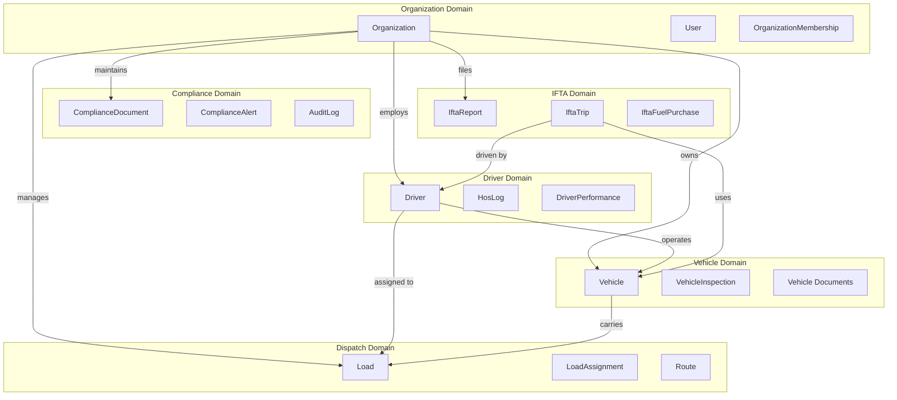

# FleetFusion Domain Model

## Business Domains

FleetFusion is organized around key business domains in the trucking industry. Each domain represents a bounded context with its own models, business rules, and responsibilities.

## Core Domains

### 1. Organization Management 🏢

**Purpose**: Multi-tenant organization structure and subscription management

**Key Entities**:
- `Organization` - Tenant root aggregate
- `User` - Organization members with roles
- `OrganizationMembership` - User-organization relationships with RBAC

**Responsibilities**:
- Tenant data isolation
- Subscription tier management
- User role assignments
- Organization settings and configuration

**Business Rules**:
- Each organization operates independently
- Users can belong to multiple organizations
- Subscription tier determines feature access
- MC Number must be unique per organization

### 2. Vehicle Management 🚚

**Purpose**: Fleet vehicle tracking, maintenance, and compliance

**Key Entities**:
- `Vehicle` - Fleet vehicles (trucks, trailers, etc.)
- `VehicleInspection` - DOT inspections and maintenance records
- `ComplianceDocument` - Vehicle-related compliance documents

**Responsibilities**:
- Vehicle inventory management
- Maintenance scheduling and tracking
- DOT compliance monitoring
- Performance analytics

**Business Rules**:
- VIN numbers must be unique
- Vehicles require valid registration and insurance
- Inspections must be completed on schedule
- Maintenance records are required for compliance

### 3. Driver Management 👨‍✈️

**Purpose**: Driver profiles, licensing, HOS compliance, and performance

**Key Entities**:
- `Driver` - Driver profiles and credentials
- `HosLog` - Hours of Service logging
- `DriverPerformance` - Performance metrics and ratings

**Responsibilities**:
- Driver credential management
- HOS compliance tracking
- Performance monitoring
- Training and certification tracking

**Business Rules**:
- CDL licenses must be current and valid
- HOS rules must be enforced (70/8, 60/7)
- Drug/alcohol testing requirements
- Performance metrics affect assignments

### 4. Dispatch & Load Management 🚦

**Purpose**: Load assignment, routing, and tracking

**Key Entities**:
- `Load` - Freight loads to be transported
- `LoadAssignment` - Driver-load assignments
- `Route` - Planned or actual routes

**Responsibilities**:
- Load posting and management
- Driver-load matching and assignment
- Route planning and optimization
- Real-time load tracking

**Business Rules**:
- Loads must have valid pickup and delivery times
- Driver availability affects assignments
- Equipment requirements must match
- Rate confirmations required

### 5. Compliance Management 📋

**Purpose**: DOT compliance, document management, and audit trails

**Key Entities**:
- `ComplianceDocument` - DOT-required documents
- `ComplianceAlert` - Compliance violations and reminders
- `AuditLog` - System activity tracking

**Responsibilities**:
- Document upload and storage
- Compliance deadline tracking
- Violation alerts and remediation
- Audit trail maintenance

**Business Rules**:
- Documents must be current and valid
- Alerts must be addressed within timeframes
- Audit logs are immutable
- Retention policies must be followed

### 6. IFTA Reporting ⛽

**Purpose**: International Fuel Tax Agreement reporting and tax calculations

**Key Entities**:
- `IftaReport` - Quarterly IFTA tax reports
- `IftaTrip` - Individual trip records with miles/fuel
- `IftaFuelPurchase` - Fuel purchase records

**Responsibilities**:
- Trip mileage and fuel tracking
- Tax calculation by jurisdiction
- Quarterly report generation
- Fuel purchase reconciliation

**Business Rules**:
- Trip records must be accurate and complete
- Fuel purchases require valid receipts
- Tax calculations follow IFTA guidelines
- Reports must be submitted quarterly

### 7. Analytics & Reporting 📊

**Purpose**: Business intelligence, KPIs, and operational insights

**Key Entities**:
- `PerformanceMetric` - KPI calculations
- `AnalyticsReport` - Generated reports
- `Dashboard` - Real-time metrics

**Responsibilities**:
- Real-time dashboard updates
- KPI calculation and tracking
- Report generation and scheduling
- Trend analysis and insights

**Business Rules**:
- Metrics must be accurate and timely
- Historical data is preserved
- Access controls apply to sensitive data
- Performance affects business decisions

## Domain Relationships



## Bounded Context Interactions

### Integration Points

1. **Driver ↔ Vehicle**: Driver assignments and vehicle operations
2. **Driver ↔ Load**: Load assignments and performance tracking
3. **Vehicle ↔ Compliance**: Inspection schedules and document management
4. **Load ↔ IFTA**: Trip data for tax reporting
5. **All Domains ↔ Analytics**: Data aggregation for insights

### Shared Concepts

- **Organization ID**: Tenant isolation key across all domains
- **User Context**: Authentication and authorization
- **Timestamps**: Audit trails and versioning
- **Status Enums**: Consistent state management

## Data Flow Patterns

### Command Flow (Mutations)
```
User Action → Server Action → Domain Validation → Database Update → Cache Invalidation
```

### Query Flow (Reads)
```
Component → Fetcher → Cache Check → Database Query → Response
```

### Event Flow (Side Effects)
```
Domain Event → Event Handler → Cross-Domain Updates → Notifications
```

## Domain Services

### Organization Service
- Multi-tenant data isolation
- Subscription management
- User role administration

### Vehicle Service
- Fleet inventory management
- Maintenance scheduling
- Compliance monitoring

### Driver Service
- Credential verification
- HOS compliance checking
- Performance calculation

### Dispatch Service
- Load optimization
- Route planning
- Assignment algorithms

### Compliance Service
- Document validation
- Alert generation
- Audit trail management

### IFTA Service
- Tax calculations
- Report generation
- Data reconciliation

---

*Each domain maintains its own consistency boundaries while participating in larger business processes through well-defined interfaces.*
