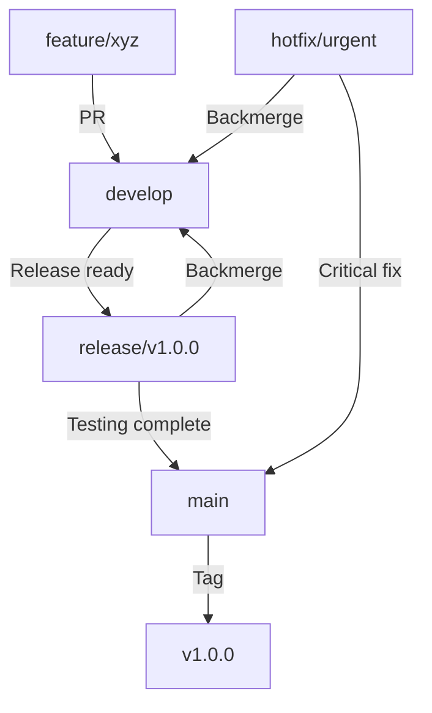

_Here’s a **strictly enforced GitHub automation standards doc** for FleetFusion, incorporating all your required conventions, project management flows, PR/issue automation, and referencing the correct standards from your repo context and personal instructions. This version is clear, actionable, and immediately implementable for solo/automated DevOps:

---

# FleetFusion ▸ AI-Assisted DevOps Automation Standards

## 1️⃣ Environment & Tooling

| Tool       | Version                 | Remarks                                |
| ---------- | ----------------------- | -------------------------------------- |
| Next.js    | 15                      | App Router · RSC first                 |
| React      | 19                      | Zero‑bundle hydration                  |
| TypeScript | 5.x                     | `strict` + `noUncheckedIndexedAccess`  |
| Clerk      | RBAC                    | Multi‑tenant · org + role claims       |
| Postgres   | Neon                    | Serverless, row‑level security         |
| CI/CD      | GitHub Actions → Vercel | Preview → Prod via tag                 |

---

## 2️⃣ GitFlow & Branching Strategy

### Branch Structure
- **`main`**: Production-ready code only
- **`develop`**: Integration branch for features
- **Feature branches**: `feature/description-kebab-case`
- **Hotfix branches**: `hotfix/description-kebab-case`
- **Release branches**: `release/v1.0.0`

### Workflow Rules
1. **NEVER commit directly to `main` or `develop`**
2. All work starts from `develop` branch
3. Feature branches merge back to `develop` via PR
4. Release branches created from `develop`, merged to both `main` and `develop`
5. Hotfixes branch from `main`, merge to both `main` and `develop`

### PR Title Format
- MUST use: `[type]: description`
- Valid types: `feat`, `fix`, `docs`, `test`, `refactor`, `config`, `hotfix`

### Required PR Elements
1. `Closes #[issue-number]` or `Fixes #[issue-number]`
2. Brief description of changes
3. Dependencies (if any): `Depends on #X`
4. Milestone assignment

---

## 3️⃣ Issue Management

### Required Labels
- **Type**: `feature`, `bug`, `documentation`, `testing`, `refactor`, `config`
- **Priority**: `priority/high`, `priority/medium`, `priority/low`
- **Status**: `status/todo`, `status/in-progress`, `status/review`, `status/done`

### Issue Linking
- Use GitHub keywords: `closes #X`, `fixes #X`, `resolves #X`
- For dependencies: `blocked by #X`, `depends on #X`

---

## 4️⃣ Pull Request Standards

### Automated Checks
- **CI Pipeline**: All PRs must pass `test`, `lint`, `typecheck`
- **Branch Protection**: Required status checks on `main` and `develop`
- **Review Required**: At least one approval before merge

### Merge Strategy
- **Feature → develop**: Squash merge
- **Release → main**: Merge commit (preserves release history)
- **Hotfix**: Squash merge to both `main` and `develop`

---

## 5️⃣ Release Management



### Release Process
1. Create release branch from `develop`
2. Version bump and changelog update
3. Testing and bug fixes on release branch
4. Merge to `main` with merge commit
5. Tag release on `main`
6. Backmerge release to `develop`

---

## 6️⃣ CI/CD Pipeline

### Deployment Flow
- **Feature branches**: Preview deployment on Vercel
- **develop**: Staging environment
- **main**: Production deployment
- **Tags**: Versioned production releases

### Required Secrets
- `VERCEL_TOKEN`
- `CLERK_SECRET_KEY`
- `DATABASE_URL`

---

## 7️⃣ GitHub Configuration

### Branch Protection Rules
```yaml
# main branch
- Require PR reviews (1)
- Require status checks
- Restrict pushes (no direct commits)
- Include administrators

# develop branch  
- Require PR reviews (1)
- Require status checks
- Allow force pushes (for rebasing)
```

### Issue Templates
Create in `.github/ISSUE_TEMPLATE/`:
- `feature.yml` - Feature requests
- `bug.yml` - Bug reports
- `docs.yml` - Documentation improvements

---

## 8️⃣ Non-Negotiables

1. **No direct commits to protected branches**
2. **All features via PR with proper titles**
3. **Required CI checks must pass**
4. **Proper issue linking in PRs**
5. **Squash merge for features, merge commit for releases**
6. **Tag all production releases**

---

**Follow these standards strictly. Automation depends on consistent workflow patterns.**