# System Context: Current Codebase

## I am working on a software system with the following directory structure, architecture, and analyzed files:

## Directory Structure
```
fleetfusion-architecture
├── app
│   ├── (auth)
│   │   ├── accept-invitation
│   │   │   └── page.tsx
│   │   ├── forgot-password
│   │   │   └── page.tsx
│   │   ├── onboarding
│   │   │   ├── layout.tsx
│   │   │   └── page.tsx
│   │   ├── sign-in
│   │   │   └── [[...sign-in]]
│   │   │       └── page.tsx
│   │   ├── sign-out
│   │   │   └── page.tsx
│   │   ├── sign-up
│   │   │   └── [[...sign-up]]
│   │   │       └── page.tsx
│   │   ├── error.tsx
│   │   ├── layout.tsx
│   │   └── loading.tsx
│   ├── (funnel)
│   │   ├── about
│   │   │   └── page.tsx
│   │   ├── contact
│   │   │   └── page.tsx
│   │   ├── features
│   │   │   └── page.tsx
│   │   ├── pricing
│   │   │   └── page.tsx
│   │   ├── privacy
│   │   │   └── page.tsx
│   │   ├── refund
│   │   │   └── page.tsx
│   │   ├── services
│   │   │   └── page.tsx
│   │   ├── terms
│   │   │   └── page.tsx
│   │   ├── error.tsx
│   │   ├── layout.tsx
│   │   └── loading.tsx
│   ├── (tenant)
│   │   └── [orgId]
│   │       ├── analytics
│   │       │   └── page.tsx
│   │       ├── compliance
│   │       │   ├── [userId]
│   │       │   │   ├── hos-logs
│   │       │   │   │   └── page.tsx
│   │       │   │   └── page.tsx
│   │       │   └── page.tsx
│   │       ├── dashboard
│   │       │   ├── [userId]
│   │       │   │   └── page.tsx
│   │       │   └── layout.tsx
│   │       ├── dispatch
│   │       │   ├── [id]
│   │       │   │   ├── edit
│   │       │   │   │   └── page.tsx
│   │       │   │   └── new
│   │       │   │       └── page.tsx
│   │       │   └── page.tsx
│   │       ├── drivers
│   │       │   └── [userId]
│   │       │       └── page.tsx
│   │       ├── ifta
│   │       │   └── page.tsx
│   │       ├── settings
│   │       │   └── page.tsx
│   │       ├── vehicles
│   │       │   └── page.tsx
│   │       ├── error.tsx
│   │       ├── layout.tsx
│   │       └── loading.tsx
│   ├── api
│   │   └── clerk
│   │       └── webhook-handler
│   │           └── route.ts
│   ├── globals.css
│   ├── layout.tsx
│   └── page.tsx
├── components
│   ├── admin
│   │   └── users
│   │       ├── InviteUserForm.tsx
│   │       ├── RoleAssignmentModal.tsx
│   │       └── UserTable.tsx
│   ├── analytics
│   │   ├── analytics-dashboard.tsx
│   │   ├── driver-performance.tsx
│   │   ├── financial-metrics.tsx
│   │   ├── MetricCard.tsx
│   │   ├── performance-metrics.tsx
│   │   └── vehicle-utilization.tsx
│   ├── auth
│   │   ├── context.tsx
│   │   └── protected-route.tsx
│   ├── compliance
│   │   ├── compliance-dashboard.tsx
│   │   ├── compliance-documents.tsx
│   │   ├── DocumentUploadForm.tsx
│   │   ├── driver-compliance-table.tsx
│   │   ├── hos-log-viewer.tsx
│   │   └── vehicle-compliance-table.tsx
│   ├── dashboard
│   │   ├── dashboard-cards.tsx
│   │   └── dashboard-skeleton.tsx
│   ├── dispatch
│   │   ├── dispatch-board.tsx
│   │   ├── dispatch-skeleton.tsx
│   │   ├── load-card.tsx
│   │   ├── load-details-dialog.tsx
│   │   └── load-form.tsx
│   ├── drivers
│   │   ├── driver-card.tsx
│   │   ├── driver-details-dialog.tsx
│   │   └── DriverForm.tsx
│   ├── ifta
│   │   ├── ifta-columns.tsx
│   │   ├── ifta-dashboard.tsx
│   │   ├── ifta-report-table.tsx
│   │   ├── ifta-tables.tsx
│   │   ├── ifta-trip-table.tsx
│   │   └── IftaReportForm.tsx
│   ├── onboarding
│   │   ├── CompanySetupForm.tsx
│   │   ├── PreferencesForm.tsx
│   │   └── ProfileSetupForm.tsx
│   ├── pricing
│   │   └── pricing-section.tsx
│   ├── settings
│   │   ├── company-settings.tsx
│   │   ├── CompanyProfileForm.tsx
│   │   ├── integration-settings.tsx
│   │   ├── notification-settings.tsx
│   │   ├── settings-dashboard.tsx
│   │   └── user-settings.tsx
│   ├── shared
│   │   ├── loading-spinner.tsx
│   │   ├── main-nav.tsx
│   │   ├── mobile-nav.tsx
│   │   ├── page-header.tsx
│   │   ├── public-nav.tsx
│   │   ├── shared-footer.tsx
│   │   ├── sign-out-button.tsx
│   │   ├── theme-provider.tsx
│   │   ├── theme-toggle.tsx
│   │   └── user-nav.tsx
│   ├── ui
│   │   ├── accordion.tsx
│   │   ├── alert-dialog.tsx
│   │   ├── alert.tsx
│   │   ├── aspect-ratio.tsx
│   │   ├── avatar.tsx
│   │   ├── badge.tsx
│   │   ├── breadcrumb.tsx
│   │   ├── button.tsx
│   │   ├── calendar.tsx
│   │   ├── card.tsx
│   │   ├── carousel.tsx
│   │   ├── chart.tsx
│   │   ├── checkbox.tsx
│   │   ├── collapsible.tsx
│   │   ├── command.tsx
│   │   ├── context-menu.tsx
│   │   ├── data-table.tsx
│   │   ├── dialog.tsx
│   │   ├── drawer.tsx
│   │   ├── dropdown-menu.tsx
│   │   ├── form.tsx
│   │   ├── hover-card.tsx
│   │   ├── input-otp.tsx
│   │   ├── input.tsx
│   │   ├── label.tsx
│   │   ├── menubar.tsx
│   │   ├── navigation-menu.tsx
│   │   ├── popover.tsx
│   │   ├── progress.tsx
│   │   ├── radio-group.tsx
│   │   ├── resizable.tsx
│   │   ├── scroll-area.tsx
│   │   ├── select.tsx
│   │   ├── separator.tsx
│   │   ├── sheet.tsx
│   │   ├── sidebar.tsx
│   │   ├── skeleton.tsx
│   │   ├── slider.tsx
│   │   ├── sonner.tsx
│   │   ├── switch.tsx
│   │   ├── table.tsx
│   │   ├── tabs.tsx
│   │   ├── textarea.tsx
│   │   ├── toast.tsx
│   │   ├── toaster.tsx
│   │   ├── toggle-group.tsx
│   │   ├── toggle.tsx
│   │   ├── tooltip.tsx
│   │   ├── use-mobile.tsx
│   │   └── use-toast.ts
│   └── vehicles
│       ├── vehicle-card.tsx
│       ├── vehicle-details-dialog.tsx
│       └── VehicleForm.tsx
├── doc
│   ├── Developer-Documentation.md
│   └── User-Documentation.md
├── features
│   ├── admin
│   │   ├── users
│   │   │   └── UserManagementDashboard.tsx
│   │   └── AdminDashboard.tsx
│   ├── analytics
│   │   ├── dashboard-metrics.tsx
│   │   └── MainDashboardFeature.tsx
│   ├── compliance
│   │   └── ComplianceDashboard.tsx
│   ├── dashboard
│   │   └── quick-actions.tsx
│   ├── dispatch
│   │   ├── DispatchBoard.tsx
│   │   └── recent-activity.tsx
│   ├── drivers
│   │   └── DriverListPage.tsx
│   ├── ifta
│   │   └── IftaReportingFeature.tsx
│   ├── onboarding
│   │   └── OnboardingWizard.tsx
│   ├── settings
│   │   ├── CompanySettingsPage.tsx
│   │   └── UserSettingsPage.tsx
│   └── vehicles
│       └── VehicleListPage.tsx
├── hooks
│   ├── use-mobile.tsx
│   └── use-toast.ts
├── lib
│   ├── actions
│   │   ├── admin-actions.ts
│   │   ├── analytics-actions.ts
│   │   ├── compliance-actions.ts
│   │   ├── complianceActions.ts
│   │   ├── dashboard-actions.ts
│   │   ├── dispatch-actions.ts
│   │   ├── dispatchActions.ts
│   │   ├── driver-actions.ts
│   │   ├── driverActions.ts
│   │   ├── ifta-actions.ts
│   │   ├── iftaActions.ts
│   │   ├── invitation-actions.ts
│   │   ├── load-actions.ts
│   │   ├── onboarding-actions.ts
│   │   ├── onboardingActions.ts
│   │   ├── settings-actions.ts
│   │   ├── settingsActions.ts
│   │   ├── userActions.ts
│   │   ├── vehicleActions.ts
│   │   └── vehicles-actions.ts
│   ├── auth
│   │   ├── auth.ts
│   │   └── permissions.ts
│   ├── cache
│   │   └── auth-cache.ts
│   ├── database
│   │   └── index.ts
│   ├── fetchers
│   │   ├── analyticsFetchers.ts
│   │   ├── complianceFetchers.ts
│   │   ├── dispatchFetchers.ts
│   │   ├── driverFetchers.ts
│   │   ├── fetchers.ts
│   │   ├── iftaFetchers.ts
│   │   ├── onboardingFetchers.ts
│   │   ├── settingsFetchers.ts
│   │   ├── userFetchers.ts
│   │   └── vehicleFetchers.ts
│   ├── rate-limit.ts
│   └── utils.ts
├── prisma
│   ├── migrations
│   │   ├── 20250527042129_init
│   │   │   └── migration.sql
│   │   ├── 20250527065545_add_foreign_key_constraints
│   │   │   └── migration.sql
│   │   ├── 20250527065956_add_audit_system_enhanced_onboarding_and_triggers
│   │   │   └── migration.sql
│   │   ├── 20250527182630_add_onboarding_complete_column
│   │   │   └── migration.sql
│   │   └── migration_lock.toml
│   ├── schema.prisma
│   └── seed.ts
├── public
│   ├── black_logo.png
│   ├── landing_hero.png
│   ├── map-pinned_icon.png
│   ├── mountain_bg.png
│   ├── readme_hero.jpeg
│   ├── route_icon.png
│   ├── sunset_bg.png
│   ├── tiers_bg.png
│   ├── trucksz_splash.png
│   ├── valley_bg.png
│   ├── white_logo.png
│   └── winding_bg.png
├── types
│   ├── abac.ts
│   ├── analytics.ts
│   ├── api.ts
│   ├── auth.ts
│   ├── compliance.ts
│   ├── dispatch.ts
│   ├── drivers.ts
│   ├── globals.d.ts
│   ├── ifta.ts
│   ├── index.ts
│   ├── onboarding.ts
│   ├── settings.ts
│   ├── vehicles.ts
│   └── webhooks.ts
├── validations
│   ├── auth.ts
│   ├── compliance.ts
│   ├── dispatch.ts
│   ├── drivers.ts
│   ├── ifta.ts
│   ├── onboarding.ts
│   ├── settings.ts
│   └── vehicles.ts
├── components.json
├── middleware.ts
├── next.config.ts
├── package-lock.json
├── package.json
├── postcss.config.mjs
├── README.md
├── tailwind.config.ts
└── tsconfig.json

```

## Mermaid Diagram

```mermaid
graph TD

    10165["User<br>External Actor"]
    10187["User<br>External Actor"]
    subgraph 10154["External Systems"]
        10163["Clerk Authentication<br>Clerk API"]
        10164["Application Database<br>PostgreSQL / Prisma"]
    end
    subgraph 10155["FleetFusion Web App<br>Next.js / React"]
        10156["Public &amp; Marketing Pages<br>Next.js App Router"]
        10157["Authentication Pages<br>Next.js App Router / Clerk"]
        10158["Core Application UI<br>Next.js App Router"]
        10159["Request Middleware<br>Next.js Middleware"]
        10160["UI Components &amp; Features<br>React / TailwindCSS / Hooks"]
        10161["Business Logic &amp; Data Layer<br>TypeScript / Next.js Server Actions"]
        10162["Webhook Handler<br>Next.js API Route"]
        %% Edges at this level (grouped by source)
        10156["Public &amp; Marketing Pages<br>Next.js App Router"] -->|leads to| 10157["Authentication Pages<br>Next.js App Router / Clerk"]
        10156["Public &amp; Marketing Pages<br>Next.js App Router"] -->|displays| 10160["UI Components &amp; Features<br>React / TailwindCSS / Hooks"]
        10159["Request Middleware<br>Next.js Middleware"] -->|secures| 10157["Authentication Pages<br>Next.js App Router / Clerk"]
        10159["Request Middleware<br>Next.js Middleware"] -->|secures| 10158["Core Application UI<br>Next.js App Router"]
        10157["Authentication Pages<br>Next.js App Router / Clerk"] -->|grants access to| 10158["Core Application UI<br>Next.js App Router"]
        10157["Authentication Pages<br>Next.js App Router / Clerk"] -->|displays| 10160["UI Components &amp; Features<br>React / TailwindCSS / Hooks"]
        10157["Authentication Pages<br>Next.js App Router / Clerk"] -->|uses| 10161["Business Logic &amp; Data Layer<br>TypeScript / Next.js Server Actions"]
        10158["Core Application UI<br>Next.js App Router"] -->|displays| 10160["UI Components &amp; Features<br>React / TailwindCSS / Hooks"]
        10158["Core Application UI<br>Next.js App Router"] -->|uses| 10161["Business Logic &amp; Data Layer<br>TypeScript / Next.js Server Actions"]
        10162["Webhook Handler<br>Next.js API Route"] -->|uses| 10161["Business Logic &amp; Data Layer<br>TypeScript / Next.js Server Actions"]
    end
    subgraph 10166["External Systems"]
        10185["Auth APIs<br>Clerk"]
        10186["Database Systems<br>PostgreSQL, etc."]
    end
    subgraph 10167["Shared Libraries<br>TypeScript/React"]
        10176["UI Component Library<br>React (Shadcn UI)"]
        10177["Application &amp; Feature Components<br>React/TypeScript"]
        10178["Server Actions<br>TypeScript"]
        10179["Auth &amp; Permissions Logic<br>TypeScript"]
        10180["Data Access &amp; Schema<br>Prisma/TypeScript"]
        10181["Utility Libraries<br>TypeScript"]
        10182["Custom Hooks<br>React/TypeScript"]
        10183["Type Definitions<br>TypeScript"]
        10184["Validation Schemas<br>Zod/TypeScript"]
        %% Edges at this level (grouped by source)
        10177["Application &amp; Feature Components<br>React/TypeScript"] -->|builds on| 10176["UI Component Library<br>React (Shadcn UI)"]
        10177["Application &amp; Feature Components<br>React/TypeScript"] -->|interacts with| 10179["Auth &amp; Permissions Logic<br>TypeScript"]
        10177["Application &amp; Feature Components<br>React/TypeScript"] -->|uses| 10181["Utility Libraries<br>TypeScript"]
        10177["Application &amp; Feature Components<br>React/TypeScript"] -->|uses| 10182["Custom Hooks<br>React/TypeScript"]
        10177["Application &amp; Feature Components<br>React/TypeScript"] -->|uses| 10183["Type Definitions<br>TypeScript"]
        10178["Server Actions<br>TypeScript"] -->|checks permissions with| 10179["Auth &amp; Permissions Logic<br>TypeScript"]
        10178["Server Actions<br>TypeScript"] -->|accesses data via| 10180["Data Access &amp; Schema<br>Prisma/TypeScript"]
        10178["Server Actions<br>TypeScript"] -->|uses| 10183["Type Definitions<br>TypeScript"]
        10178["Server Actions<br>TypeScript"] -->|validates input with| 10184["Validation Schemas<br>Zod/TypeScript"]
        10179["Auth &amp; Permissions Logic<br>TypeScript"] -->|accesses data via| 10180["Data Access &amp; Schema<br>Prisma/TypeScript"]
        10179["Auth &amp; Permissions Logic<br>TypeScript"] -->|uses| 10181["Utility Libraries<br>TypeScript"]
        10179["Auth &amp; Permissions Logic<br>TypeScript"] -->|uses| 10183["Type Definitions<br>TypeScript"]
        10180["Data Access &amp; Schema<br>Prisma/TypeScript"] -->|uses| 10183["Type Definitions<br>TypeScript"]
        10181["Utility Libraries<br>TypeScript"] -->|uses| 10183["Type Definitions<br>TypeScript"]
        10182["Custom Hooks<br>React/TypeScript"] -->|uses| 10183["Type Definitions<br>TypeScript"]
        10184["Validation Schemas<br>Zod/TypeScript"] -->|uses| 10183["Type Definitions<br>TypeScript"]
    end
    subgraph 10168["Next.js Application<br>Next.js"]
        10169["Root Pages &amp; Layouts<br>Next.js Pages"]
        10170["Authentication Pages<br>Next.js Pages"]
        10171["Public &amp; Info Pages<br>Next.js Pages"]
        10172["Tenant Application UI<br>Next.js Pages"]
        10173["Clerk Webhook API<br>Next.js API Route"]
        10174["Request Middleware<br>Next.js Middleware"]
        10175["Static Assets<br>Files"]
        %% Edges at this level (grouped by source)
        10169["Root Pages &amp; Layouts<br>Next.js Pages"] -->|links to| 10170["Authentication Pages<br>Next.js Pages"]
        10169["Root Pages &amp; Layouts<br>Next.js Pages"] -->|links to| 10171["Public &amp; Info Pages<br>Next.js Pages"]
        10169["Root Pages &amp; Layouts<br>Next.js Pages"] -->|loads| 10175["Static Assets<br>Files"]
        10174["Request Middleware<br>Next.js Middleware"] -->|allows| 10170["Authentication Pages<br>Next.js Pages"]
        10174["Request Middleware<br>Next.js Middleware"] -->|allows| 10171["Public &amp; Info Pages<br>Next.js Pages"]
        10174["Request Middleware<br>Next.js Middleware"] -->|protects/routes to| 10172["Tenant Application UI<br>Next.js Pages"]
        10171["Public &amp; Info Pages<br>Next.js Pages"] -->|loads| 10175["Static Assets<br>Files"]
        10172["Tenant Application UI<br>Next.js Pages"] -->|loads| 10175["Static Assets<br>Files"]
    end
    %% Edges at this level (grouped by source)
    10165["User<br>External Actor"] -->|visits| 10156["Public &amp; Marketing Pages<br>Next.js App Router"]
    10165["User<br>External Actor"] -->|authenticates with| 10157["Authentication Pages<br>Next.js App Router / Clerk"]
    10159["Request Middleware<br>Next.js Middleware"] -->|validates session via| 10163["Clerk Authentication<br>Clerk API"]
    10157["Authentication Pages<br>Next.js App Router / Clerk"] -->|authenticates via| 10163["Clerk Authentication<br>Clerk API"]
    10163["Clerk Authentication<br>Clerk API"] -->|triggers| 10162["Webhook Handler<br>Next.js API Route"]
    10161["Business Logic &amp; Data Layer<br>TypeScript / Next.js Server Actions"] -->|syncs user data with| 10163["Clerk Authentication<br>Clerk API"]
    10161["Business Logic &amp; Data Layer<br>TypeScript / Next.js Server Actions"] -->|reads/writes| 10164["Application Database<br>PostgreSQL / Prisma"]
    10187["User<br>External Actor"] -->|interacts with| 10169["Root Pages &amp; Layouts<br>Next.js Pages"]
    10187["User<br>External Actor"] -->|navigates to| 10170["Authentication Pages<br>Next.js Pages"]
    10187["User<br>External Actor"] -->|views| 10171["Public &amp; Info Pages<br>Next.js Pages"]
    10187["User<br>External Actor"] -->|uses| 10172["Tenant Application UI<br>Next.js Pages"]
    10169["Root Pages &amp; Layouts<br>Next.js Pages"] -->|uses| 10177["Application &amp; Feature Components<br>React/TypeScript"]
    10174["Request Middleware<br>Next.js Middleware"] -->|uses| 10179["Auth &amp; Permissions Logic<br>TypeScript"]
    10174["Request Middleware<br>Next.js Middleware"] -->|uses| 10181["Utility Libraries<br>TypeScript"]
    10174["Request Middleware<br>Next.js Middleware"] -->|validates session with| 10185["Auth APIs<br>Clerk"]
    10171["Public &amp; Info Pages<br>Next.js Pages"] -->|uses| 10176["UI Component Library<br>React (Shadcn UI)"]
    10171["Public &amp; Info Pages<br>Next.js Pages"] -->|uses| 10177["Application &amp; Feature Components<br>React/TypeScript"]
    10172["Tenant Application UI<br>Next.js Pages"] -->|uses| 10176["UI Component Library<br>React (Shadcn UI)"]
    10172["Tenant Application UI<br>Next.js Pages"] -->|uses| 10177["Application &amp; Feature Components<br>React/TypeScript"]
    10172["Tenant Application UI<br>Next.js Pages"] -->|invokes| 10178["Server Actions<br>TypeScript"]
    10172["Tenant Application UI<br>Next.js Pages"] -->|checks permissions with| 10179["Auth &amp; Permissions Logic<br>TypeScript"]
    10172["Tenant Application UI<br>Next.js Pages"] -->|uses| 10182["Custom Hooks<br>React/TypeScript"]
    10170["Authentication Pages<br>Next.js Pages"] -->|uses| 10176["UI Component Library<br>React (Shadcn UI)"]
    10170["Authentication Pages<br>Next.js Pages"] -->|uses| 10177["Application &amp; Feature Components<br>React/TypeScript"]
    10170["Authentication Pages<br>Next.js Pages"] -->|invokes| 10178["Server Actions<br>TypeScript"]
    10170["Authentication Pages<br>Next.js Pages"] -->|uses| 10179["Auth &amp; Permissions Logic<br>TypeScript"]
    10170["Authentication Pages<br>Next.js Pages"] -->|delegates to| 10185["Auth APIs<br>Clerk"]
    10177["Application &amp; Feature Components<br>React/TypeScript"] -->|calls| 10185["Auth APIs<br>Clerk"]
    10173["Clerk Webhook API<br>Next.js API Route"] -->|uses| 10179["Auth &amp; Permissions Logic<br>TypeScript"]
    10173["Clerk Webhook API<br>Next.js API Route"] -->|updates| 10180["Data Access &amp; Schema<br>Prisma/TypeScript"]
    10173["Clerk Webhook API<br>Next.js API Route"] -->|verifies with| 10185["Auth APIs<br>Clerk"]
    10178["Server Actions<br>TypeScript"] -->|interacts with| 10185["Auth APIs<br>Clerk"]
    10179["Auth &amp; Permissions Logic<br>TypeScript"] -->|interacts with| 10185["Auth APIs<br>Clerk"]
    10180["Data Access &amp; Schema<br>Prisma/TypeScript"] -->|manages| 10186["Database Systems<br>PostgreSQL, etc."]

```



