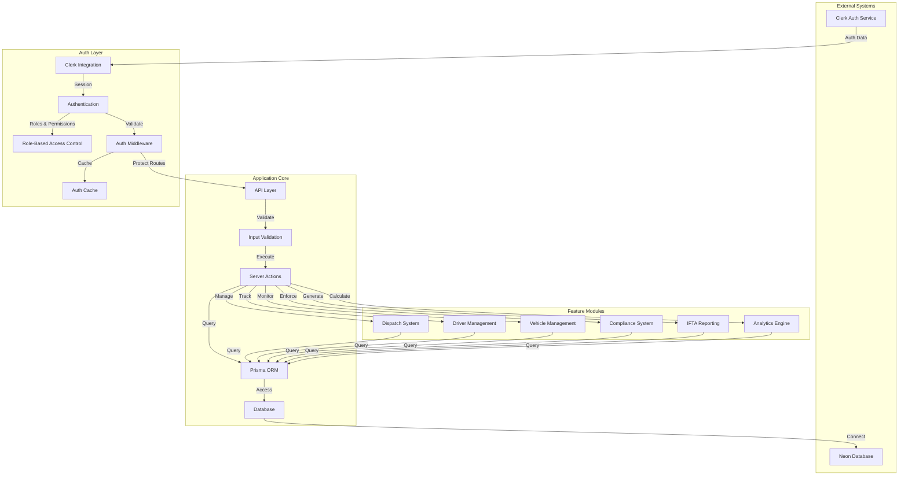

# System Context Refactored Codebase (after refactor)

## I am working on refactoring a software system into the following directory structure, architecture, and analyzed files:

## Directory Structure
```
fleet-fussion-feature-fleetfusion-mvp-implementation
├── app
│   ├── (auth)
│   │   ├── accept-invitation
│   │   │   └── page.tsx
│   │   ├── forgot-password
│   │   │   └── page.tsx
│   │   ├── onboarding
│   │   │   ├── layout.tsx
│   │   │   └── page.tsx
│   │   ├── sign-in
│   │   │   └── [[...sign-in]]
│   │   │       └── page.tsx
│   │   ├── sign-out
│   │   │   └── page.tsx
│   │   ├── sign-up
│   │   │   └── [[...sign-up]]
│   │   │       └── page.tsx
│   │   ├── error.tsx
│   │   ├── layout.tsx
│   │   └── loading.tsx
│   ├── (funnel)
│   │   ├── about
│   │   │   └── page.tsx
│   │   ├── contact
│   │   │   └── page.tsx
│   │   ├── features
│   │   │   └── page.tsx
│   │   ├── pricing
│   │   │   └── page.tsx
│   │   ├── privacy
│   │   │   └── page.tsx
│   │   ├── refund
│   │   │   └── page.tsx
│   │   ├── services
│   │   │   └── page.tsx
│   │   ├── terms
│   │   │   └── page.tsx
│   │   ├── error.tsx
│   │   ├── layout.tsx
│   │   └── loading.tsx
│   ├── (tenant)
│   │   ├── [orgId]
│   │   │   ├── analytics
│   │   │   │   └── page.tsx
│   │   │   ├── compliance
│   │   │   │   ├── [userId]
│   │   │   │   │   ├── hos-logs
│   │   │   │   │   │   └── page.tsx
│   │   │   │   │   └── page.tsx
│   │   │   │   └── page.tsx
│   │   │   ├── dashboard
│   │   │   │   ├── [userId]
│   │   │   │   │   └── page.tsx
│   │   │   │   └── layout.tsx
│   │   │   ├── dispatch
│   │   │   │   ├── [id]
│   │   │   │   │   ├── edit
│   │   │   │   │   │   └── page.tsx
│   │   │   │   │   └── new
│   │   │   │   │       └── page.tsx
│   │   │   │   └── page.tsx
│   │   │   ├── drivers
│   │   │   │   └── [userId]
│   │   │   │       └── page.tsx
│   │   │   ├── ifta
│   │   │   │   └── page.tsx
│   │   │   ├── settings
│   │   │   │   └── page.tsx
│   │   │   ├── vehicles
│   │   │   │   └── page.tsx
│   │   │   ├── error.tsx
│   │   │   ├── layout.tsx
│   │   │   └── loading.tsx
│   │   ├── layout.tsx
│   │   └── page.tsx
│   ├── api
│   │   └── clerk
│   │       └── webhook-handler
│   │           └── route.ts
│   ├── globals.css
│   ├── layout.tsx
│   └── page.tsx
├── components
│   ├── admin
│   │   └── users
│   │       ├── InviteUserForm.tsx
│   │       ├── RoleAssignmentModal.tsx
│   │       └── UserTable.tsx
│   ├── analytics
│   │   ├── analytics-dashboard.tsx
│   │   ├── driver-performance.tsx
│   │   ├── financial-metrics.tsx
│   │   ├── MetricCard.tsx
│   │   ├── performance-metrics.tsx
│   │   └── vehicle-utilization.tsx
│   ├── auth
│   │   ├── context.tsx
│   │   └── protected-route.tsx
│   ├── compliance
│   │   ├── compliance-dashboard.tsx
│   │   ├── compliance-documents.tsx
│   │   ├── DocumentUploadForm.tsx
│   │   ├── driver-compliance-table.tsx
│   │   ├── hos-log-viewer.tsx
│   │   └── vehicle-compliance-table.tsx
│   ├── dashboard
│   │   ├── dashboard-cards.tsx
│   │   └── dashboard-skeleton.tsx
│   ├── dispatch
│   │   ├── dispatch-board.tsx
│   │   ├── dispatch-skeleton.tsx
│   │   ├── load-card.tsx
│   │   ├── load-details-dialog.tsx
│   │   └── load-form.tsx
│   ├── drivers
│   │   ├── driver-card.tsx
│   │   ├── driver-details-dialog.tsx
│   │   └── DriverForm.tsx
│   ├── ifta
│   │   ├── ifta-columns.tsx
│   │   ├── ifta-dashboard.tsx
│   │   ├── ifta-report-table.tsx
│   │   ├── ifta-tables.tsx
│   │   ├── ifta-trip-table.tsx
│   │   └── IftaReportForm.tsx
│   ├── onboarding
│   │   ├── CompanySetupForm.tsx
│   │   ├── PreferencesForm.tsx
│   │   └── ProfileSetupForm.tsx
│   ├── pricing
│   │   └── pricing-section.tsx
│   ├── settings
│   │   ├── company-settings.tsx
│   │   ├── CompanyProfileForm.tsx
│   │   ├── integration-settings.tsx
│   │   ├── notification-settings.tsx
│   │   ├── settings-dashboard.tsx
│   │   └── user-settings.tsx
│   ├── shared
│   │   ├── loading-spinner.tsx
│   │   ├── main-nav.tsx
│   │   ├── mobile-nav.tsx
│   │   ├── page-header.tsx
│   │   ├── public-nav.tsx
│   │   ├── shared-footer.tsx
│   │   ├── sign-out-button.tsx
│   │   ├── theme-provider.tsx
│   │   ├── theme-toggle.tsx
│   │   └── user-nav.tsx
│   ├── ui
│   │   ├── accordion.tsx
│   │   ├── alert-dialog.tsx
│   │   ├── alert.tsx
│   │   ├── aspect-ratio.tsx
│   │   ├── avatar.tsx
│   │   ├── badge.tsx
│   │   ├── breadcrumb.tsx
│   │   ├── button.tsx
│   │   ├── calendar.tsx
│   │   ├── card.tsx
│   │   ├── carousel.tsx
│   │   ├── chart.tsx
│   │   ├── checkbox.tsx
│   │   ├── collapsible.tsx
│   │   ├── command.tsx
│   │   ├── context-menu.tsx
│   │   ├── data-table.tsx
│   │   ├── dialog.tsx
│   │   ├── drawer.tsx
│   │   ├── dropdown-menu.tsx
│   │   ├── form.tsx
│   │   ├── hover-card.tsx
│   │   ├── input-otp.tsx
│   │   ├── input.tsx
│   │   ├── label.tsx
│   │   ├── menubar.tsx
│   │   ├── navigation-menu.tsx
│   │   ├── popover.tsx
│   │   ├── progress.tsx
│   │   ├── radio-group.tsx
│   │   ├── resizable.tsx
│   │   ├── scroll-area.tsx
│   │   ├── select.tsx
│   │   ├── separator.tsx
│   │   ├── sheet.tsx
│   │   ├── sidebar.tsx
│   │   ├── skeleton.tsx
│   │   ├── slider.tsx
│   │   ├── sonner.tsx
│   │   ├── switch.tsx
│   │   ├── table.tsx
│   │   ├── tabs.tsx
│   │   ├── textarea.tsx
│   │   ├── toast.tsx
│   │   ├── toaster.tsx
│   │   ├── toggle-group.tsx
│   │   ├── toggle.tsx
│   │   ├── tooltip.tsx
│   │   ├── use-mobile.tsx
│   │   └── use-toast.ts
│   └── vehicles
│       ├── vehicle-card.tsx
│       ├── vehicle-details-dialog.tsx
│       └── VehicleForm.tsx
├── doc
│   ├── Developer-Documentation.md
│   └── User-Documentation.md
├── features
│   ├── admin
│   │   ├── users
│   │   │   └── UserManagementDashboard.tsx
│   │   └── AdminDashboard.tsx
│   ├── analytics
│   │   ├── dashboard-metrics.tsx
│   │   └── MainDashboardFeature.tsx
│   ├── compliance
│   │   └── ComplianceDashboard.tsx
│   ├── dashboard
│   │   └── quick-actions.tsx
│   ├── dispatch
│   │   ├── DispatchBoard.tsx
│   │   └── recent-activity.tsx
│   ├── drivers
│   │   └── DriverListPage.tsx
│   ├── ifta
│   │   └── IftaReportingFeature.tsx
│   ├── onboarding
│   │   └── OnboardingWizard.tsx
│   ├── settings
│   │   ├── CompanySettingsPage.tsx
│   │   └── UserSettingsPage.tsx
│   └── vehicles
│       └── VehicleListPage.tsx
├── hooks
│   ├── use-mobile.tsx
│   └── use-toast.ts
├── lib
│   ├── actions
│   │   ├── admin-actions.ts
│   │   ├── analytics-actions.ts
│   │   ├── auditActions.ts
│   │   ├── complianceActions.ts
│   │   ├── dashboard-actions.ts
│   │   ├── dispatchActions.ts
│   │   ├── driverActions.ts
│   │   ├── iftaActions.ts
│   │   ├── invitation-actions.ts
│   │   ├── load-actions.ts
│   │   ├── onboardingActions.ts
│   │   ├── settingsActions.ts
│   │   ├── userActions.ts
│   │   └── vehicleActions.ts
│   ├── auth
│   │   ├── auth.ts
│   │   └── permissions.ts
│   ├── cache
│   │   └── auth-cache.ts
│   ├── database
│   │   └── index.ts
│   ├── fetchers
│   │   ├── analyticsFetchers.ts
│   │   ├── driverFetchers.ts
│   │   ├── fetchers.ts
│   │   ├── iftaFetchers.ts
│   │   ├── onboardingFetchers.ts
│   │   ├── settingsFetchers.ts
│   │   ├── userFetchers.ts
│   │   └── vehicleFetchers.ts
│   ├── auth.ts
│   ├── db.ts
│   ├── rate-limit.ts
│   └── utils.ts
├── prisma
│   ├── migrations
│   │   ├── 20250527042129_init
│   │   │   └── migration.sql
│   │   ├── 20250527065545_add_foreign_key_constraints
│   │   │   └── migration.sql
│   │   ├── 20250527065956_add_audit_system_enhanced_onboarding_and_triggers
│   │   │   └── migration.sql
│   │   ├── 20250527182630_add_onboarding_complete_column
│   │   │   └── migration.sql
│   │   └── migration_lock.toml
│   └── schema.prisma
├── public
│   ├── black_logo.png
│   ├── landing_hero.png
│   ├── map-pinned_icon.png
│   ├── mountain_bg.png
│   ├── readme_hero.jpeg
│   ├── route_icon.png
│   ├── sunset_bg.png
│   ├── tiers_bg.png
│   ├── trucksz_splash.png
│   ├── valley_bg.png
│   ├── white_logo.png
│   └── winding_bg.png
├── schemas
│   └── compliance.ts
├── types
│   ├── abac.ts
│   ├── analytics.ts
│   ├── api.ts
│   ├── auth.ts
│   ├── compliance.ts
│   ├── dispatch.ts
│   ├── drivers.ts
│   ├── globals.d.ts
│   ├── ifta.ts
│   ├── index.ts
│   ├── onboarding.ts
│   ├── prisma.d.ts
│   ├── settings.ts
│   ├── vehicles.ts
│   └── webhooks.ts
├── validations
│   ├── auth.ts
│   ├── compliance.ts
│   ├── dispatch.ts
│   ├── drivers.ts
│   ├── ifta.ts
│   ├── onboarding.ts
│   ├── settings.ts
│   └── vehicles.ts
├── c --noEmit
├── components.json
├── middleware.ts
├── next.config.ts
├── package-lock.json
├── package.json
├── postcss.config.mjs
├── README.md
├── tailwind.config.ts
└── tsconfig.json

```

## Mermaid Diagram


## Analyzed Files

# Project Information
- Workspace root: `c:\Development\sandbox\fleet-fussion-feature-fleetfusion-mvp-implementation\fleet-fussion-feature-fleetfusion-mvp-implementation`

## High Value Files

### lib/auth/auth.ts
- Reason: Core authentication implementation with Clerk integration and role-based access control
- File size: 1695 bytes

```ts
 1 | "use server"
 2 | 
 3 | import { currentUser } from "@clerk/nextjs/server"
 4 | import { redirect } from "next/navigation"
 5 | import type { ClerkUserMetadata, ClerkOrganizationMetadata, UserContext } from "@/types/auth"
 6 | 
 7 | // Get the current authenticated user and their role (RBAC only)
 8 | export async function getCurrentUser(): Promise<UserContext | null> {
 9 |   const user = await currentUser();
10 |   if (!user) return null;
11 |   const userMeta = user.publicMetadata as unknown as ClerkUserMetadata;
12 |   return {
13 |     name: user.firstName ? `${user.firstName} ${user.lastName ?? ''}`.trim() : user.username ?? user.emailAddresses[0]?.emailAddress ?? undefined,
14 |     userId: user.id,
15 |     organizationId: userMeta.organizationId || '',
16 |     role: userMeta.role,
17 |     permissions: [], // Permissions are not used in RBAC-only model
18 |     email: user.emailAddresses[0]?.emailAddress ?? '',
19 |     firstName: user.firstName ?? undefined,
20 |     lastName: user.lastName ?? undefined,
21 |     profileImage: user.imageUrl,
22 |     isActive: userMeta.isActive,
23 |     onboardingComplete: userMeta.onboardingComplete,
24 |     organizationMetadata: {} as ClerkOrganizationMetadata, // No org metadata in RBAC-only model
25 |   };
26 | }
27 | 
28 | // Require authentication and redirect to login if not authenticated
29 | export async function requireAuth() {
30 |   const user = await getCurrentUser();
31 |   if (!user) redirect('/sign-in');
32 | }
33 | 
34 | // Require a specific role (or any of a set of roles)
35 | export async function requireRole(roles: string | string[]) {
36 |   const user = await getCurrentUser();
37 |   if (!user) redirect('/sign-in');
38 |   const allowed = Array.isArray(roles) ? roles : [roles];
39 |   if (!allowed.includes(user.role)) redirect('/unauthorized');
40 | }</file_source>

```

### lib/auth/permissions.ts
- Reason: RBAC permission definitions and role management utilities
- File size: 718 bytes

```ts
 1 | /**
 2 |  * RBAC (Role-Based Access Control) Utilities
 3 |  * 
 4 |  * Provides role management utilities
 5 |  * for the FleetFusion multi-tenant system with aligned type structure
 6 |  */
 7 | 
 8 | export type SystemRole = 'admin' | 'manager' | 'driver' | 'viewer';
 9 | export const ROLES: SystemRole[] = ['admin', 'manager', 'driver', 'viewer'];
10 | 
11 | /**
12 |  * Check if a user has a specific role
13 |  */
14 | export function hasRole(user: { role: string } | null, role: SystemRole): boolean {
15 |   return !!user && user.role === role;
16 | }
17 | 
18 | /**
19 |  * Check if a user has any of the specified roles
20 |  */
21 | export function hasAnyRole(user: { role: string } | null, roles: SystemRole[]): boolean {
22 |   return !!user && roles.includes(user.role as SystemRole);
23 | }</file_source>

```

### middleware.ts
- Reason: Global authentication, security headers, and route protection implementation
- File size: 1290 bytes

```ts
 1 | // RBAC-only middleware: global auth, security headers, rate limiting
 2 | import { NextResponse } from 'next/server';
 3 | import type { NextRequest } from 'next/server';
 4 | 
 5 | const publicRoutes = [
 6 |   '/',
 7 |   '/sign-in',
 8 |   '/sign-up',
 9 |   '/forgot-password',
10 |   '/about',
11 |   '/contact',
12 |   '/pricing',
13 |   '/features',
14 |   '/services',
15 |   '/privacy',
16 |   '/terms',
17 |   '/refund',
18 |   '/api/clerk/',
19 | ];
20 | 
21 | export async function middleware(req: NextRequest) {
22 |   const { pathname } = req.nextUrl;
23 |   // Allow public routes
24 |   if (publicRoutes.some((route) => pathname.startsWith(route))) {
25 |     return NextResponse.next();
26 |   }
27 |   // Global auth: check for session cookie
28 |   const sessionToken = req.cookies.get('__session')?.value;
29 |   if (!sessionToken) {
30 |     return NextResponse.redirect(new URL('/sign-in', req.url));
31 |   }
32 |   // Optionally, validate session with Clerk (optional for RBAC)
33 |   // Security headers
34 |   const res = NextResponse.next();
35 |   res.headers.set('X-Frame-Options', 'SAMEORIGIN');
36 |   res.headers.set('X-Content-Type-Options', 'nosniff');
37 |   res.headers.set('Referrer-Policy', 'strict-origin-when-cross-origin');
38 |   // TODO: Add rate limiting logic here if needed
39 |   return res;
40 | }
41 | 
42 | export const config = {
43 |   matcher: ['/((?!.+\\.[\\w]+$|_next).*)', '/', '/(api|trpc)(.*)'],
44 | };</file_source>

```


### prisma/schema.prisma
- Reason: Complete data model definition including all entity relationships and access patterns
- File size: 20400 bytes

```ts
  1 | // This is your Prisma schema file,
  2 | // learn more about it in the docs: https://pris.ly/d/prisma-schema
  3 | 
  4 | // Looking for ways to speed up your queries, or scale easily with your serverless or edge functions?
  5 | // Try Prisma Accelerate: https://pris.ly/cli/accelerate-init
  6 | 
  7 | generator client {
  8 |   provider        = "prisma-client-js"
  9 |   previewFeatures = ["driverAdapters"]
 10 | }
 11 | 
 12 | datasource db {
 13 |   provider  = "postgresql"
 14 |   url       = env("DATABASE_URL")
 15 |   directUrl = env("DIRECT_URL")
 16 | }
 17 | 
 18 | enum UserRole {
 19 |   admin
 20 |   manager
 21 |   user
 22 |   dispatcher
 23 |   driver
 24 |   compliance
 25 |   accountant
 26 |   viewer
 27 | }
 28 | 
 29 | enum SubscriptionTier {
 30 |   free
 31 |   pro
 32 |   enterprise
 33 | }
 34 | 
 35 | enum SubscriptionStatus {
 36 |   active
 37 |   inactive
 38 |   trial
 39 |   cancelled
 40 | }
 41 | 
 42 | enum VehicleStatus {
 43 |   active
 44 |   inactive
 45 |   maintenance
 46 |   decommissioned
 47 | }
 48 | 
 49 | enum DriverStatus {
 50 |   available
 51 |   assigned
 52 |   driving
 53 |   on_duty
 54 |   off_duty
 55 |   sleeper_berth
 56 |   personal_conveyance
 57 |   yard_moves
 58 |   inactive
 59 |   terminated
 60 | }
 61 | 
 62 | enum LoadStatus {
 63 |   pending
 64 |   assigned
 65 |   in_transit
 66 |   delivered
 67 |   cancelled
 68 | }
 69 | 
 70 | model Organization {
 71 |   id                 String             @id @default(uuid())
 72 |   clerkId            String             @unique @map("clerk_id")
 73 |   name               String
 74 |   slug               String             @unique
 75 |   dotNumber          String?            @map("dot_number")
 76 |   mcNumber           String?            @map("mc_number")
 77 |   address            String?
 78 |   city               String?
 79 |   state              String?
 80 |   zip                String?
 81 |   phone              String?
 82 |   email              String?
 83 |   logoUrl            String?            @map("logo_url")
 84 |   subscriptionTier   SubscriptionTier   @default(free) @map("subscription_tier")
 85 |   subscriptionStatus SubscriptionStatus @default(trial) @map("subscription_status")
 86 |   maxUsers           Int                @default(5) @map("max_users")
 87 |   billingEmail       String?            @map("billing_email")
 88 |   settings           Json?              @default("{\"timezone\": \"America/Denver\", \"dateFormat\": \"MM/dd/yyyy\", \"distanceUnit\": \"miles\", \"fuelUnit\": \"gallons\"}")
 89 |   isActive           Boolean            @default(true) @map("is_active")
 90 |   createdAt          DateTime           @default(now()) @map("created_at")
 91 |   updatedAt          DateTime           @updatedAt @map("updated_at")
 92 | 
 93 |   users    User[]
 94 |   vehicles Vehicle[]
 95 |   drivers  Driver[]
 96 |   loads    Load[]
 97 |   auditLogs AuditLog[]
 98 |   // complianceDocuments ComplianceDocument[]
 99 |   // iftaReports         IftaReport[]
100 | 
101 |   @@index([clerkId], name: "organizations_clerk_id_idx")
102 |   @@index([slug], name: "organizations_slug_idx")
103 |   @@map("organizations")
104 | }
105 | 
106 | model User {
107 |   id                 String    @id @default(uuid())
108 |   clerkId            String    @unique @map("clerk_id")
109 |   organizationId     String    @map("organization_id")
110 |   email              String
111 |   firstName          String?   @map("first_name")
112 |   lastName           String?   @map("last_name")
113 |   profileImage       String?   @map("profile_image")
114 |   role               UserRole  @default(viewer)
115 |   permissions        Json?     @default("[]")
116 |   isActive           Boolean   @default(true) @map("is_active")
117 |   onboardingComplete Boolean   @default(false) @map("onboarding_complete") // Corrected mapping
118 |   onboardingSteps    Json?     @default("{}") @map("onboarding_steps") // Track detailed onboarding progress
119 |   lastLogin          DateTime? @map("last_login")
120 |   createdAt          DateTime  @default(now()) @map("created_at")
121 |   updatedAt          DateTime  @updatedAt @map("updated_at")
122 | 
123 |   organization Organization @relation(fields: [organizationId], references: [id], onDelete: Cascade)
124 |   driver       Driver?
125 |   auditLogs    AuditLog[]   @relation("UserAuditLogs")
126 |   // ComplianceDocument  ComplianceDocument[] @relation("VerifiedByUser")
127 |   // IftaReport          IftaReport[]       @relation("SubmittedByUser")
128 | 
129 |   @@index([clerkId], name: "users_clerk_id_idx")
130 |   @@index([organizationId], name: "users_organization_id_idx")
131 |   @@index([email], name: "users_email_idx")
132 |   @@index([role], name: "users_role_idx")
133 |   @@map("users")
134 | }
135 | 
136 | model Vehicle {
137 |   id                     String        @id @default(uuid())
138 |   organizationId         String        @map("organization_id")
139 |   type                   String // 'tractor', 'trailer', 'straight_truck'
140 |   status                 VehicleStatus @default(active)
141 |   make                   String?
142 |   model                  String?
143 |   year                   Int?
144 |   vin                    String?
145 |   licensePlate           String?       @map("license_plate")
146 |   licensePlateState      String?       @map("license_plate_state")
147 |   unitNumber             String        @map("unit_number")
148 |   currentOdometer        Int?          @map("current_odometer")
149 |   lastOdometerUpdate     DateTime?     @map("last_odometer_update")
150 |   fuelType               String?       @map("fuel_type") // 'diesel', 'gas'
151 |   lastInspectionDate     DateTime?     @map("last_inspection_date") @db.Date
152 |   nextInspectionDue      DateTime?     @map("next_inspection_date") @db.Date
153 |   registrationExpiration DateTime?     @map("registration_expiry") @db.Date
154 |   insuranceExpiration    DateTime?     @map("insurance_expiration") @db.Date
155 |   notes                  String?
156 |   customFields           Json?         @default("{}") @map("custom_fields")
157 |   createdAt              DateTime      @default(now()) @map("created_at")
158 |   updatedAt              DateTime      @updatedAt @map("updated_at")
159 | 
160 |   organization Organization @relation(fields: [organizationId], references: [id], onDelete: Cascade)
161 |   loads        Load[]       @relation("VehicleLoads")
162 |   trailerLoads Load[]       @relation("TrailerLoads")
163 |   // complianceDocuments ComplianceDocument[]
164 | 
165 |   @@unique([organizationId, unitNumber], name: "vehicles_org_unit_unique")
166 |   @@index([organizationId], name: "vehicles_organization_id_idx")
167 |   @@index([unitNumber], name: "vehicles_unit_number_idx")
168 |   @@index([status], name: "vehicles_status_idx")
169 |   @@index([type], name: "vehicles_type_idx")
170 |   @@map("vehicles")
171 | }
172 | 
173 | model Driver {
174 |   id                    String       @id @default(uuid())
175 |   organizationId        String       @map("organization_id")
176 |   tenantId              String       @map("tenant_id") // Add tenantId field
177 |   userId                String?      @unique @map("user_id") // Link to user account if driver has login
178 |   employeeId            String?      @map("employee_id")
179 |   firstName             String       @map("first_name")
180 |   lastName              String       @map("last_name")
181 |   email                 String?
182 |   phone                 String?
183 |   address               String?
184 |   city                  String?
185 |   state                 String?
186 |   zip                   String?
187 |   licenseNumber         String?      @map("license_number")
188 |   licenseState          String?      @map("license_state")
189 |   licenseClass          String?      @map("license_class")
190 |   licenseExpiration     DateTime?    @map("license_expiration") @db.Date
191 |   cdlNumber             String?      @map("cdl_number") // Add CDL number field
192 |   medicalCardNumber     String?      @map("medical_card_number")
193 |   medicalCardExpiration DateTime?    @map("medical_card_exp") @db.Date
194 |   drugTestDate          DateTime?    @map("drug_test_date") @db.Date
195 |   backgroundCheckDate   DateTime?    @map("background_check") @db.Date
196 |   hireDate              DateTime?    @map("hire_date") @db.Date
197 |   terminationDate       DateTime?    @map("termination_date") @db.Date
198 |   status                DriverStatus @default(available)
199 |   isActive              Boolean      @default(true) @map("is_active") // Add isActive field
200 |   availabilityStatus    String?      @default("available") @map("availability_status") // Add availability status
201 |   currentAssignment     String?      @map("current_assignment") // Add current assignment field
202 |   payRate               Decimal?     @db.Decimal(10, 2) @map("pay_rate")
203 |   payType               String?      @map("pay_type")
204 |   endorsements          String?      @map("endorsements") // JSON string of endorsements
205 |   restrictions          String?      @map("restrictions") // JSON string of restrictions
206 |   emergencyContact      String?      @map("emergency_contact") // JSON string of emergency contact
207 |   emergencyContact1     String?      @map("emergency_contact_1")
208 |   emergencyContact2     String?      @map("emergency_contact_2")
209 |   emergencyContact3     String?      @map("emergency_contact_3")
210 |   tags                  String?      @map("tags") // JSON string of tags
211 |   notes                 String?
212 |   customFields          Json?        @default("{}") @map("custom_fields")
213 |   createdAt             DateTime     @default(now()) @map("created_at")
214 |   updatedAt             DateTime     @updatedAt @map("updated_at")
215 | 
216 |   organization   Organization     @relation(fields: [organizationId], references: [id], onDelete: Cascade)
217 |   user           User?            @relation(fields: [userId], references: [id])
218 |   loads          Load[]
219 |   hoursOfService HoursOfService[]
220 |   // complianceDocuments ComplianceDocument[]
221 | 
222 |   @@unique([organizationId, employeeId], name: "drivers_org_employee_unique")
223 |   @@index([organizationId], name: "drivers_organization_id_idx")
224 |   @@index([tenantId], name: "drivers_tenant_id_idx")
225 |   @@index([userId], name: "drivers_user_id_idx")
226 |   @@index([status], name: "drivers_status_idx")
227 |   @@index([licenseNumber], name: "drivers_license_number_idx")
228 |   @@index([cdlNumber], name: "drivers_cdl_number_idx")
229 |   @@index([isActive], name: "drivers_is_active_idx")
230 |   @@map("drivers")
231 | }
232 | 
233 | model HoursOfService {
234 |   id             String   @id @default(uuid())
235 |   driverId       String   @map("driver_id")
236 |   date           String
237 |   status         String // HOSStatus enum values as strings
238 |   location       String
239 |   latitude       Decimal? @db.Decimal(10, 6)
240 |   longitude      Decimal? @db.Decimal(10, 6)
241 |   startTime      String   @map("start_time")
242 |   endTime        String?  @map("end_time")
243 |   duration       Int // in minutes
244 |   vehicleId      String?  @map("vehicle_id")
245 |   odometer       Int?
246 |   engineHours    Int?     @map("engine_hours")
247 |   trailer        String?
248 |   shipping       String?
249 |   remark         String?
250 |   isPersonalTime Boolean  @default(false) @map("is_personal_time")
251 |   isDriving      Boolean  @default(false) @map("is_driving")
252 |   source         String   @default("manual") // 'manual', 'eld', 'automatic'
253 |   createdAt      DateTime @default(now()) @map("created_at")
254 |   updatedAt      DateTime @updatedAt @map("updated_at")
255 | 
256 |   driver Driver @relation(fields: [driverId], references: [id], onDelete: Cascade)
257 | 
258 |   @@index([driverId], name: "hours_of_service_driver_id_idx")
259 |   @@index([date], name: "hours_of_service_date_idx")
260 |   @@index([status], name: "hours_of_service_status_idx")
261 |   @@map("hours_of_service")
262 | }
263 | 
264 | model Load {
265 |   id                    String     @id @default(uuid())
266 |   organizationId        String     @map("organization_id")
267 |   driverId              String?    @map("driver_id")
268 |   vehicleId             String?    @map("vehicle_id")
269 |   trailerId             String?    @map("trailer_id")
270 |   loadNumber            String     @map("load_number")
271 |   referenceNumber       String?    @map("reference_number")
272 |   status                LoadStatus @default(pending)
273 |   customerName          String?    @map("customer_name")
274 |   customerContact       String?    @map("customer_contact")
275 |   customerPhone         String?    @map("customer_phone")
276 |   customerEmail         String?    @map("customer_email")
277 |   originAddress         String     @map("origin_address")
278 |   originCity            String     @map("origin_city")
279 |   originState           String     @map("origin_state")
280 |   originZip             String     @map("origin_zip")
281 |   originLat             Decimal?   @map("origin_lat") @db.Decimal(10, 6)
282 |   originLng             Decimal?   @map("origin_lng") @db.Decimal(10, 6)
283 |   destinationAddress    String     @map("destination_address")
284 |   destinationCity       String     @map("destination_city")
285 |   destinationState      String     @map("destination_state")
286 |   destinationZip        String     @map("destination_zip")
287 |   destinationLat        Decimal?   @map("destination_lat") @db.Decimal(10, 6)
288 |   destinationLng        Decimal?   @map("destination_lng") @db.Decimal(10, 6)
289 |   rate                  Decimal?   @db.Decimal(10, 2)
290 |   currency              String?    @default("USD")
291 |   scheduledPickupDate   DateTime?  @map("scheduled_pickup_date")
292 |   actualPickupDate      DateTime?  @map("actual_pickup_date")
293 |   scheduledDeliveryDate DateTime?  @map("scheduled_delivery_date")
294 |   actualDeliveryDate    DateTime?  @map("actual_delivery_date")
295 |   weight                Int?
296 |   pieces                Int?
297 |   commodity             String?
298 |   hazmat                Boolean?   @default(false)
299 |   estimatedMiles        Int?       @map("estimated_miles")
300 |   actualMiles           Int?       @map("actual_miles")
301 |   notes                 String?
302 |   instructions          String?
303 |   customFields          Json?      @default("{}") @map("custom_fields")
304 |   createdAt             DateTime   @default(now()) @map("created_at")
305 |   updatedAt             DateTime   @updatedAt @map("updated_at")
306 | 
307 |   organization Organization @relation(fields: [organizationId], references: [id], onDelete: Cascade)
308 |   driver       Driver?      @relation(fields: [driverId], references: [id])
309 |   vehicle      Vehicle?     @relation("VehicleLoads", fields: [vehicleId], references: [id])
310 |   trailer      Vehicle?     @relation("TrailerLoads", fields: [trailerId], references: [id])
311 | 
312 |   @@unique([organizationId, loadNumber], name: "loads_org_load_unique")
313 |   @@index([organizationId], name: "loads_organization_id_idx")
314 |   @@index([driverId], name: "loads_driver_id_idx")
315 |   @@index([vehicleId], name: "loads_vehicle_id_idx")
316 |   @@index([trailerId], name: "loads_trailer_id_idx")
317 |   @@index([status], name: "loads_status_idx")
318 |   @@index([loadNumber], name: "loads_load_number_idx")
319 |   @@index([scheduledPickupDate], name: "loads_scheduled_pickup_idx")
320 |   @@map("loads")
321 | }
322 | 
323 | // model ComplianceDocument {
324 | //   id                 String    @id @default(uuid())
325 | //   organizationId     String    @map("organization_id")
326 | //   driverId           String?   @map("driver_id")
327 | //   vehicleId          String?   @map("vehicle_id")
328 | //   type               String // 'license', 'medical', 'insurance', 'registration', etc.
329 | //   title              String
330 | //   documentNumber     String?   @map("document_number")
331 | //   issuingAuthority   String?   @map("issuing_authority")
332 | //   fileUrl            String?   @map("file_url")
333 | //   fileName           String?   @map("file_name")
334 | //   fileSize           Int?      @map("file_size")
335 | //   mimeType           String?   @map("mime_type")
336 | //   issueDate          DateTime? @db.Date @map("issue_date")
337 | //   expirationDate     DateTime? @db.Date @map("expiration_date")
338 | //   status             String    @default("active") // 'active', 'expired', 'pending'
339 | //   isVerified         Boolean?  @default(false) @map("is_verified")
340 | //   verifiedBy         String?   @map("verified_by") 
341 | //   verifiedAt         DateTime? @map("verified_at")
342 | //   notes              String?
343 | //   tags               Json?     @default("[]")
344 | //   createdAt          DateTime  @default(now()) @map("created_at")
345 | //   updatedAt          DateTime  @updatedAt @map("updated_at")
346 | 
347 | //   organization   Organization @relation(fields: [organizationId], references: [id], onDelete: Cascade)
348 | //   driver         Driver?      @relation(fields: [driverId], references: [id])
349 | //   vehicle        Vehicle?     @relation(fields: [vehicleId], references: [id])
350 | //   verifiedByUser User?        @relation("VerifiedByUser", fields: [verifiedBy], references: [id])
351 | 
352 | //   @@map("compliance_documents")
353 | //   @@index([organizationId], name: "compliance_documents_organization_id_idx")
354 | //   @@index([driverId], name: "compliance_documents_driver_id_idx")
355 | //   @@index([vehicleId], name: "compliance_documents_vehicle_id_idx")
356 | //   @@index([verifiedBy], name: "compliance_documents_verified_by_idx")
357 | //   @@index([type], name: "compliance_documents_type_idx")
358 | //   @@index([status], name: "compliance_documents_status_idx")
359 | //   @@index([expirationDate], name: "compliance_documents_expiration_idx")
360 | // }
361 | 
362 | // model IftaReport {
363 | //   id                String    @id @default(uuid())
364 | //   organizationId    String    @map("organization_id")
365 | //   quarter           Int
366 | //   year              Int
367 | //   status            String    @default("draft") // 'draft', 'submitted', 'filed'
368 | //   totalMiles        Int?      @map("total_miles")
369 | //   totalGallons      Decimal?  @db.Decimal(10, 3) @map("total_gallons")
370 | //   totalTaxOwed      Decimal?  @db.Decimal(10, 2) @map("total_tax_owed")
371 | //   totalTaxPaid      Decimal?  @db.Decimal(10, 2) @map("total_tax_paid")
372 | //   submittedAt       DateTime? @map("submitted_at")
373 | //   submittedBy       String?   @map("submitted_by") 
374 | //   dueDate           DateTime? @db.Date @map("due_date")
375 | //   filedDate         DateTime? @db.Date @map("filed_date")
376 | //   reportFileUrl     String?   @map("report_file_url")
377 | //   supportingDocs    String?   @map("supporting_docs")
378 | //   notes             String?
379 | //   calculationData   Json?     @default("{}") @map("calculation_data")
380 | //   createdAt         DateTime  @default(now()) @map("created_at")
381 | //   updatedAt         DateTime  @updatedAt @map("updated_at")
382 | 
383 | //   organization    Organization @relation(fields: [organizationId], references: [id], onDelete: Cascade)
384 | //   submittedByUser User?        @relation("SubmittedByUser", fields: [submittedBy], references: [id])
385 | 
386 | //   @@map("ifta_reports")
387 | //   @@index([organizationId], name: "ifta_reports_organization_id_idx")
388 | //   @@index([submittedBy], name: "ifta_reports_submitted_by_idx")
389 | //   @@index([quarter, year], name: "ifta_reports_quarter_year_idx")
390 | //   @@index([status], name: "ifta_reports_status_idx")
391 | //   @@index([dueDate], name: "ifta_reports_due_date_idx")
392 | // }
393 | 
394 | model AuditLog {
395 |   id           String    @id @default(uuid())
396 |   organizationId String  @map("organization_id")
397 |   userId       String?   @map("user_id")
398 |   entityType   String    @map("entity_type") // 'user', 'vehicle', 'driver', 'load', etc.
399 |   entityId     String    @map("entity_id")
400 |   action       String    // 'created', 'updated', 'deleted', 'login', 'logout'
401 |   changes      Json?     // Store what changed (before/after values)
402 |   metadata     Json?     // Additional context (IP address, user agent, etc.)
403 |   timestamp    DateTime  @default(now())
404 | 
405 |   organization Organization @relation(fields: [organizationId], references: [id], onDelete: Cascade)
406 |   user         User?        @relation("UserAuditLogs", fields: [userId], references: [id])
407 | 
408 |   @@map("audit_logs")
409 |   @@index([organizationId], name: "audit_logs_organization_id_idx")
410 |   @@index([userId], name: "audit_logs_user_id_idx")
411 |   @@index([entityType], name: "audit_logs_entity_type_idx")
412 |   @@index([entityId], name: "audit_logs_entity_id_idx")
413 |   @@index([action], name: "audit_logs_action_idx")
414 |   @@index([timestamp], name: "audit_logs_timestamp_idx")
415 | }
416 | 
417 | model WebhookEvent {
418 |   id              String    @id @default(uuid())
419 |   eventType       String    @map("event_type") // Clerk event type
420 |   eventId         String    @map("event_id") @unique(map: "webhook_events_event_id_unique") // Clerk event ID, must be unique and non-null
421 |   organizationId  String?   @map("organization_id")
422 |   userId          String?   @map("user_id")
423 |   payload         Json      // Full webhook payload
424 |   status          String    @default("pending") // 'pending', 'processed', 'failed', 'retried'
425 |   processingError String?   @map("processing_error")
426 |   processedAt     DateTime? @map("processed_at")
427 |   createdAt       DateTime  @default(now()) @map("created_at")
428 |   retryCount      Int       @default(0) @map("retry_count")
429 | 
430 |   @@map("webhook_events")
431 |   @@index([eventType], name: "webhook_events_event_type_idx")
432 |   @@index([organizationId], name: "webhook_events_organization_id_idx")
433 |   @@index([userId], name: "webhook_events_user_id_idx")
434 |   @@index([status], name: "webhook_events_status_idx")
435 |   @@index([createdAt], name: "webhook_events_created_at_idx")
436 | }
437 | 

```

### lib/actions/dispatchActions.ts
- Reason: Core dispatch management system implementation and business logic
- File size: 25289 bytes

```ts
  1 | "use server";
  2 | 
  3 | import { auth } from "@clerk/nextjs/server";
  4 | import { revalidatePath } from "next/cache";
  5 | import { redirect } from "next/navigation";
  6 | import { z } from "zod";
  7 | import prisma from "@/lib/database";
  8 | import {
  9 |   createLoadSchema,
 10 |   updateLoadSchema,
 11 |   loadAssignmentSchema,
 12 |   loadStatusUpdateSchema,
 13 |   bulkLoadOperationSchema,
 14 |   loadDocumentSchema,
 15 |   trackingUpdateSchema,
 16 |   loadAlertSchema,
 17 |   type BulkLoadOperationInput,
 18 |   type CreateLoadInput,
 19 |   type LoadAssignmentInput,
 20 |   type LoadStatusUpdateInput,
 21 |   type UpdateLoadInput,
 22 | } from "@/validations/dispatch";
 23 | import { LoadStatus, DriverStatus, VehicleStatus } from "@prisma/client";
 24 | 
 25 | // Only use LoadStatus: pending, assigned, in_transit, delivered, cancelled
 26 | // Only use VehicleStatus: active, inactive, maintenance, decommissioned
 27 | // Only use DriverStatus: active, inactive, suspended, terminated
 28 | // Update all status assignments and comparisons accordingly
 29 | 
 30 | // Helper function to check user permissions
 31 | async function checkUserPermissions(orgId: string, requiredPermissions: string[]) {
 32 |   const { userId } = await auth();
 33 |   if (!userId) {
 34 |     throw new Error("Unauthorized");
 35 |   }
 36 | 
 37 |   // Check if user belongs to the organization and has required permissions
 38 |   const user = await prisma.user.findFirst({
 39 |     where: {
 40 |       clerkId: userId, // Assuming clerkId is the correct field name
 41 |       organizationId: orgId,
 42 |     },
 43 |   });
 44 | 
 45 |   if (!user) {
 46 |     throw new Error("User not found or not member of organization");
 47 |   }
 48 | 
 49 |   // Access permissions directly if they're a relation on the user model
 50 |   let userPermissions: string[] = [];
 51 |   if (Array.isArray(user.permissions)) {
 52 |     userPermissions = user.permissions
 53 |       .map((p: any) => typeof p === "object" && p !== null && "name" in p ? p.name : null)
 54 |       .filter((name: any) => typeof name === "string");
 55 |   }
 56 |   
 57 |   const hasPermission = requiredPermissions.some(permission => 
 58 |     userPermissions.includes(permission) || userPermissions.includes("*")
 59 |   );
 60 | 
 61 |   if (!hasPermission) {
 62 |     throw new Error(`Insufficient permissions. Required: ${requiredPermissions.join(" or ")}`);
 63 |   }
 64 | 
 65 |   return user;
 66 | }
 67 | 
 68 | // Helper function to create audit log entry
 69 | async function createAuditLog(
 70 |   action: string,
 71 |   entityType: string,
 72 |   entityId: string,
 73 |   changes: Record<string, any>,
 74 |   userId: string,
 75 |   organizationId: string
 76 | ) {
 77 |   await prisma.auditLog.create({
 78 |     data: {
 79 |       action,
 80 |       entityType,
 81 |       entityId,
 82 |       changes: changes as any, // Use 'as any' to handle JSON serialization
 83 |       userId,
 84 |       organizationId,
 85 |       timestamp: new Date(),
 86 |     },
 87 |   });
 88 | }
 89 | 
 90 | // Helper function to generate reference number
 91 | function generateReferenceNumber(): string {
 92 |   const timestamp = Date.now().toString();
 93 |   const random = Math.random().toString(36).substring(2, 5).toUpperCase();
 94 |   return `FL${timestamp.slice(-6)}${random}`;
 95 | }
 96 | 
 97 | // Infer types from Zod schemas
 98 | import type { Customer as CustomerInput, Location as LocationInput } from "@/types/dispatch";
 99 | 
100 | // Minimal types for driver, vehicle, trailer
101 | interface IdObj { id?: string }
102 | 
103 | // Create load action
104 | export async function createLoadAction(orgId: string, data: CreateLoadInput) {
105 |   try {
106 |     const user = await checkUserPermissions(orgId, ["loads:create", "dispatch:manage"]);
107 |     const validatedData = createLoadSchema.parse(data);
108 |     // Generate reference number if not provided
109 |     let referenceNumber = validatedData.referenceNumber;
110 |     if (!referenceNumber) {
111 |       referenceNumber = generateReferenceNumber();
112 |     }
113 |     if (typeof referenceNumber !== "string") {
114 |       referenceNumber = String(referenceNumber ?? "");
115 |     }
116 |     // Check if reference number is unique within tenant
117 |     const existingLoad = await prisma.load.findFirst({
118 |       where: {
119 |         organizationId: orgId,
120 |         referenceNumber,
121 |       },
122 |     });
123 |     if (existingLoad) {
124 |       return {
125 |         success: false,
126 |         error: "Reference number already exists",
127 |       };
128 |     }
129 |     // Ensure rate is a number or string (Decimal)
130 |     const { rate, rateDetails, customer, origin, destination, driver, vehicle, trailer, ...rest } = validatedData;
131 |     if (typeof rate !== "number" && typeof rate !== "string") {
132 |       return {
133 |         success: false,
134 |         error: "Rate must be a number or string",
135 |       };
136 |     }
137 |     // Type guards for nested objects
138 |     const safeCustomer: Partial<CustomerInput> | undefined = (customer && typeof customer === "object") ? customer : undefined;
139 |     const safeOrigin: Partial<LocationInput> | undefined = (origin && typeof origin === "object") ? origin : undefined;
140 |     const safeDestination: Partial<LocationInput> | undefined = (destination && typeof destination === "object") ? destination : undefined;
141 |     const safeDriver = driver && typeof driver === "object" ? (driver as IdObj) : undefined;
142 |     const safeVehicle = vehicle && typeof vehicle === "object" ? (vehicle as IdObj) : undefined;
143 |     const safeTrailer = trailer && typeof trailer === "object" ? (trailer as IdObj) : undefined;
144 |     // Map nested fields to flat DB fields
145 |     const dbData: any = {
146 |       ...rest,
147 |       referenceNumber,
148 |       rate,
149 |       organizationId: orgId,
150 |       status: LoadStatus.pending,
151 |       createdAt: new Date(),
152 |       updatedAt: new Date(),
153 |     };
154 |     if (safeCustomer) {
155 |       dbData.customerName = safeCustomer.name ?? null;
156 |       dbData.customerContact = safeCustomer.contactName ?? null;
157 |       dbData.customerPhone = safeCustomer.phone ?? null;
158 |       dbData.customerEmail = safeCustomer.email ?? null;
159 |     }
160 |     if (safeOrigin) {
161 |       dbData.originAddress = safeOrigin.address ?? null;
162 |       dbData.originCity = safeOrigin.city ?? null;
163 |       dbData.originState = safeOrigin.state ?? null;
164 |       dbData.originZip = safeOrigin.zipCode ?? null;
165 |       dbData.originLat = safeOrigin.latitude ?? null;
166 |       dbData.originLng = safeOrigin.longitude ?? null;
167 |     }
168 |     if (safeDestination) {
169 |       dbData.destinationAddress = safeDestination.address ?? null;
170 |       dbData.destinationCity = safeDestination.city ?? null;
171 |       dbData.destinationState = safeDestination.state ?? null;
172 |       dbData.destinationZip = safeDestination.zipCode ?? null;
173 |       dbData.destinationLat = safeDestination.latitude ?? null;
174 |       dbData.destinationLng = safeDestination.longitude ?? null;
175 |     }
176 |     if (safeDriver && safeDriver.id) dbData.driverId = safeDriver.id;
177 |     if (safeVehicle && safeVehicle.id) dbData.vehicleId = safeVehicle.id;
178 |     if (safeTrailer && safeTrailer.id) dbData.trailerId = safeTrailer.id;
179 |     await prisma.load.create({ data: dbData });
180 |     revalidatePath(`/dashboard/${orgId}/dispatch`);
181 |     return {
182 |       success: true,
183 |     };
184 |   } catch (error) {
185 |     console.error("Error creating load:", error);
186 |     return {
187 |       success: false,
188 |       error: error instanceof Error ? error.message : "Failed to create load",
189 |     };
190 |   }
191 | }
192 | 
193 | // Update load action
194 | export async function updateLoadAction(loadId: string, data: UpdateLoadInput) {
195 |   try {
196 |     const { userId } = await auth();
197 |     if (!userId) {
198 |       throw new Error("Unauthorized");
199 |     }
200 |     // Get load to verify tenant and permissions
201 |     const existingLoad = await prisma.load.findUnique({
202 |       where: { id: loadId },
203 |       select: { organizationId: true, status: true },
204 |     });
205 |     if (!existingLoad) {
206 |       return {
207 |         success: false,
208 |         error: "Load not found",
209 |       };
210 |     }
211 |     const user = await checkUserPermissions(existingLoad.organizationId, ["loads:update", "dispatch:manage"]);
212 |     const validatedData = updateLoadSchema.parse(data);
213 |     // Remove id from validated data as it shouldn't be updated
214 |     const { id, rate, rateDetails, customer, origin, destination, driver, vehicle, trailer, ...updateData } = validatedData;
215 |     if (typeof rate !== "number" && typeof rate !== "string" && typeof rate !== "undefined") {
216 |       return {
217 |         success: false,
218 |         error: "Rate must be a number or string",
219 |       };
220 |     }
221 |     // Type guards for nested objects
222 |     const safeCustomer: Partial<CustomerInput> | undefined = (customer && typeof customer === "object") ? customer : undefined;
223 |     const safeOrigin: Partial<LocationInput> | undefined = (origin && typeof origin === "object") ? origin : undefined;
224 |     const safeDestination: Partial<LocationInput> | undefined = (destination && typeof destination === "object") ? destination : undefined;
225 |     const safeDriver = driver && typeof driver === "object" ? (driver as IdObj) : undefined;
226 |     const safeVehicle = vehicle && typeof vehicle === "object" ? (vehicle as IdObj) : undefined;
227 |     const safeTrailer = trailer && typeof trailer === "object" ? (trailer as IdObj) : undefined;
228 |     // Map nested fields to flat DB fields
229 |     const dbData: any = {
230 |       ...updateData,
231 |       updatedAt: new Date(),
232 |     };
233 |     if (typeof rate !== "undefined") dbData.rate = rate;
234 |     if (safeCustomer) {
235 |       dbData.customerName = safeCustomer.name ?? null;
236 |       dbData.customerContact = safeCustomer.contactName ?? null;
237 |       dbData.customerPhone = safeCustomer.phone ?? null;
238 |       dbData.customerEmail = safeCustomer.email ?? null;
239 |     }
240 |     if (safeOrigin) {
241 |       dbData.originAddress = safeOrigin.address ?? null;
242 |       dbData.originCity = safeOrigin.city ?? null;
243 |       dbData.originState = safeOrigin.state ?? null;
244 |       dbData.originZip = safeOrigin.zipCode ?? null;
245 |       dbData.originLat = safeOrigin.latitude ?? null;
246 |       dbData.originLng = safeOrigin.longitude ?? null;
247 |     }
248 |     if (safeDestination) {
249 |       dbData.destinationAddress = safeDestination.address ?? null;
250 |       dbData.destinationCity = safeDestination.city ?? null;
251 |       dbData.destinationState = safeDestination.state ?? null;
252 |       dbData.destinationZip = safeDestination.zipCode ?? null;
253 |       dbData.destinationLat = safeDestination.latitude ?? null;
254 |       dbData.destinationLng = safeDestination.longitude ?? null;
255 |     }
256 |     if (safeDriver && safeDriver.id) dbData.driverId = safeDriver.id;
257 |     if (safeVehicle && safeVehicle.id) dbData.vehicleId = safeVehicle.id;
258 |     if (safeTrailer && safeTrailer.id) dbData.trailerId = safeTrailer.id;
259 |     // Update the load
260 |     const updatedLoad = await prisma.load.update({
261 |       where: { id: loadId },
262 |       data: dbData,
263 |     });
264 |     // Create audit log
265 |     await createAuditLog(
266 |       "UPDATE",
267 |       "Load",
268 |       loadId,
269 |       updateData,
270 |       user.id,
271 |       existingLoad.organizationId
272 |     );
273 |     revalidatePath(`/dashboard/${existingLoad.organizationId}/dispatch`);
274 |     revalidatePath(`/dashboard/${existingLoad.organizationId}/dispatch/${loadId}`);
275 |     return {
276 |       success: true,
277 |       data: updatedLoad,
278 |     };
279 |   } catch (error) {
280 |     console.error("Error updating load:", error);
281 |     return {
282 |       success: false,
283 |       error: error instanceof Error ? error.message : "Failed to update load",
284 |     };
285 |   }
286 | }
287 | 
288 | // Delete load action
289 | export async function deleteLoadAction(loadId: string) {
290 |   try {
291 |     const { userId } = await auth();
292 |     if (!userId) {
293 |       throw new Error("Unauthorized");
294 |     }
295 | 
296 |     // Get load to verify tenant and permissions
297 |     const existingLoad = await prisma.load.findUnique({
298 |       where: { id: loadId },
299 |       select: { organizationId: true, status: true, referenceNumber: true },
300 |     });
301 | 
302 |     if (!existingLoad) {
303 |       return {
304 |         success: false,
305 |         error: "Load not found",
306 |       };
307 |     }
308 | 
309 |     const user = await checkUserPermissions(existingLoad.organizationId, ["loads:delete", "dispatch:manage"]);
310 | 
311 |     // Check if load can be deleted (only pending or cancelled loads)
312 |     if (
313 |       existingLoad.status !== LoadStatus.pending &&
314 |       existingLoad.status !== LoadStatus.cancelled
315 |     ) {
316 |       return {
317 |         success: false,
318 |         error: "Cannot delete load in current status",
319 |       };
320 |     }
321 | 
322 |     // Delete the load directly
323 |     await prisma.load.delete({ where: { id: loadId } });
324 | 
325 |     // Create audit log
326 |     await createAuditLog(
327 |       "DELETE",
328 |       "Load",
329 |       loadId,
330 |       { referenceNumber: existingLoad.referenceNumber },
331 |       user.id,
332 |       existingLoad.organizationId
333 |     );
334 | 
335 |     revalidatePath(`/dashboard/${existingLoad.organizationId}/dispatch`);
336 |     
337 |     return {
338 |       success: true,
339 |     };
340 |   } catch (error) {
341 |     console.error("Error deleting load:", error);
342 |     return {
343 |       success: false,
344 |       error: error instanceof Error ? error.message : "Failed to delete load",
345 |     };
346 |   }
347 | }
348 | 
349 | // Assign load action
350 | export async function assignLoadAction(data: LoadAssignmentInput) {
351 |   try {
352 |     const { userId } = await auth();
353 |     if (!userId) {
354 |       throw new Error("Unauthorized");
355 |     }
356 | 
357 |     const validatedData = loadAssignmentSchema.parse(data);
358 | 
359 |     // Get load to verify tenant and permissions
360 |     const existingLoad = await prisma.load.findUnique({
361 |       where: { id: validatedData.loadId },
362 |       select: { organizationId: true, status: true, driverId: true, vehicleId: true },
363 |     });
364 | 
365 |     if (!existingLoad) {
366 |       return {
367 |         success: false,
368 |         error: "Load not found",
369 |       };
370 |     }
371 | 
372 |     const user = await checkUserPermissions(existingLoad.organizationId, ["loads:assign", "dispatch:manage"]);
373 | 
374 |     // Verify driver and vehicle belong to the same tenant
375 |     const [driver, vehicle, trailer] = await Promise.all([
376 |       prisma.driver.findFirst({
377 |         where: { id: validatedData.driverId, organizationId: existingLoad.organizationId },
378 |         select: { id: true, status: true, licenseNumber: true },
379 |       }),
380 |       prisma.vehicle.findFirst({
381 |         where: { id: validatedData.vehicleId, organizationId: existingLoad.organizationId },
382 |         select: { id: true, status: true, make: true, model: true, year: true, vin: true, licensePlate: true },
383 |       }),
384 |       validatedData.trailerId ? prisma.vehicle.findFirst({ // Use vehicle if trailer is not a separate model
385 |         where: { 
386 |           id: validatedData.trailerId, 
387 |           organizationId: existingLoad.organizationId,
388 |           type: "trailer" // Assuming you differentiate by type
389 |         },
390 |         select: { id: true, status: true, make: true, model: true, year: true, vin: true, licensePlate: true },
391 |       }) : null,
392 |     ]);
393 | 
394 |     if (!driver) {
395 |       return {
396 |         success: false,
397 |         error: "Driver not found or not available",
398 |       };
399 |     }
400 | 
401 |     if (!vehicle) {
402 |       return {
403 |         success: false,
404 |         error: "Vehicle not found or not available",
405 |       };
406 |     }
407 | 
408 |     if (validatedData.trailerId && !trailer) {
409 |       return {
410 |         success: false,
411 |         error: "Trailer not found or not available",
412 |       };
413 |     }
414 | 
415 |     // Check if driver and vehicle are available
416 |     if (driver.status !== DriverStatus.available) {
417 |       return {
418 |         success: false,
419 |         error: "Driver is not available for assignment",
420 |       };
421 |     }
422 | 
423 |     if (vehicle.status !== VehicleStatus.active) {
424 |       return {
425 |         success: false,
426 |         error: "Vehicle is not available for assignment",
427 |       };
428 |     }
429 | 
430 |     if (trailer && trailer.status !== VehicleStatus.active) {
431 |       return {
432 |         success: false,
433 |         error: "Trailer is not available for assignment",
434 |       };
435 |     }
436 | 
437 |     const assignedAt = new Date();
438 | 
439 |     // Update load with assignment details - use transaction for data consistency
440 |     const updatedLoad = await prisma.$transaction(async (tx) => {
441 |       // Update load
442 |       const load = await tx.load.update({
443 |         where: { id: validatedData.loadId },
444 |         data: {
445 |           status: "assigned",
446 |           driverId: validatedData.driverId,
447 |           vehicleId: validatedData.vehicleId,
448 |           trailerId: validatedData.trailerId,
449 |           updatedAt: new Date(),
450 |         },
451 |       });
452 | 
453 |       // Update driver status
454 |       await tx.driver.update({
455 |         where: { id: validatedData.driverId },
456 |         data: {
457 |           status: "active" as any, // Use type assertion for enum
458 |         },
459 |       });
460 | 
461 |       // Update vehicle status
462 |       await tx.vehicle.update({
463 |         where: { id: validatedData.vehicleId },
464 |         data: {
465 |           status: "active" as any, // Use type assertion for enum
466 |         },
467 |       });
468 | 
469 |       // If trailers are stored as vehicles with type=trailer
470 |       if (validatedData.trailerId) {
471 |         await tx.vehicle.update({
472 |           where: { id: validatedData.trailerId },
473 |           data: {
474 |             status: "active" as any, // Use type assertion for enum
475 |           },
476 |         });
477 |       }
478 | 
479 |       // Use raw SQL if loadStatusEvent isn't in the Prisma schema
480 |       await tx.$executeRaw`
481 |         INSERT INTO "LoadStatusEvent" ("loadId", "status", "timestamp", "notes", "automaticUpdate", "source", "createdBy")
482 |         VALUES (${validatedData.loadId}, 'assigned', ${assignedAt}, ${validatedData.notes || `Assigned to driver with vehicle `}, false, 'dispatcher', ${user.id})
483 |       `;
484 | 
485 |       return load;
486 |     });
487 | 
488 |     // Create audit log
489 |     await createAuditLog(
490 |       "ASSIGN",
491 |       "Load",
492 |       validatedData.loadId,
493 |       validatedData,
494 |       user.id,
495 |       existingLoad.organizationId
496 |     );
497 | 
498 |     revalidatePath(`/dashboard/${existingLoad.organizationId}/dispatch`);
499 |     revalidatePath(`/dashboard/${existingLoad.organizationId}/drivers`);
500 |     revalidatePath(`/dashboard/${existingLoad.organizationId}/vehicles`);
501 |     
502 |     return {
503 |       success: true,
504 |       data: updatedLoad,
505 |     };
506 |   } catch (error) {
507 |     console.error("Error assigning load:", error);
508 |     return {
509 |       success: false,
510 |       error: error instanceof Error ? error.message : "Failed to assign load",
511 |     };
512 |   }
513 | }
514 | 
515 | // Update load status action
516 | export async function updateLoadStatusAction(data: LoadStatusUpdateInput) {
517 |   try {
518 |     const { userId } = await auth();
519 |     if (!userId) {
520 |       throw new Error("Unauthorized");
521 |     }
522 | 
523 |     const validatedData = loadStatusUpdateSchema.parse(data);
524 | 
525 |     // Get load to verify tenant and permissions
526 |     const existingLoad = await prisma.load.findUnique({
527 |       where: { id: validatedData.loadId },
528 |       select: { organizationId: true, status: true, driverId: true, vehicleId: true, trailerId: true },
529 |     });
530 | 
531 |     if (!existingLoad) {
532 |       return {
533 |         success: false,
534 |         error: "Load not found",
535 |       };
536 |     }
537 | 
538 |     const user = await checkUserPermissions(existingLoad.organizationId, ["loads:update", "dispatch:manage"]);
539 | 
540 |     const timestamp = new Date();
541 | 
542 |     // Update load status and related data
543 |     const updatedLoad = await prisma.$transaction(async (tx) => {
544 |       // Update load
545 |       const updateData: any = {
546 |         status: validatedData.status,
547 |         updatedAt: timestamp,
548 |       };
549 | 
550 |       // Set actual times based on status
551 |       // Only 'delivered' is valid for actualDeliveryTime now
552 |       if (validatedData.status === "delivered") {
553 |         updateData.actualDeliveryTime = timestamp;
554 |       }
555 | 
556 |       const load = await tx.load.update({
557 |         where: { id: validatedData.loadId },
558 |         data: updateData,
559 |       });
560 | 
561 |       // Record status event using raw SQL if model doesn't exist
562 |       await tx.$executeRaw`
563 |         INSERT INTO "LoadStatusEvent" ("loadId", "status", "timestamp", "location", "notes", "automaticUpdate", "source", "createdBy")
564 |         VALUES (
565 |           ${validatedData.loadId},
566 |           ${validatedData.status},
567 |           ${timestamp},
568 |           ${validatedData.location || null},
569 |           ${validatedData.notes || null},
570 |           ${validatedData.automaticUpdate || false},
571 |           ${validatedData.source || 'dispatcher'},
572 |           ${user.id}
573 |         )
574 |       `;
575 | 
576 |       // Update driver status based on load status
577 |       if (existingLoad.driverId) {
578 |         let driverStatus: DriverStatus = DriverStatus.available;
579 |         if (["in_transit"].includes(validatedData.status)) {
580 |           driverStatus = DriverStatus.available;
581 |         } else if (["delivered", "cancelled"].includes(validatedData.status)) {
582 |           driverStatus = DriverStatus.inactive;
583 |         }
584 | 
585 |         await tx.driver.update({
586 |           where: { id: existingLoad.driverId },
587 |           data: {
588 |             status: driverStatus as any,
589 |           },
590 |         });
591 |       }
592 | 
593 |       // Update vehicle status
594 |       if (existingLoad.vehicleId) {
595 |         let vehicleStatus: VehicleStatus = VehicleStatus.active;
596 |         if (["delivered", "cancelled"].includes(validatedData.status)) {
597 |           vehicleStatus = VehicleStatus.inactive;
598 |         }
599 | 
600 |         await tx.vehicle.update({
601 |           where: { id: existingLoad.vehicleId },
602 |           data: {
603 |             status: vehicleStatus as any,
604 |           },
605 |         });
606 |       }
607 | 
608 |       // Update trailer status if stored as vehicle with type=trailer
609 |       if (existingLoad.trailerId) {
610 |         let trailerStatus: VehicleStatus = VehicleStatus.active;
611 |         if (["delivered", "cancelled"].includes(validatedData.status)) {
612 |           trailerStatus = VehicleStatus.inactive;
613 |         }
614 | 
615 |         await tx.vehicle.update({
616 |           where: { id: existingLoad.trailerId },
617 |           data: {
618 |             status: trailerStatus as any,
619 |           },
620 |         });
621 |       }
622 | 
623 |       return load;
624 |     });
625 | 
626 |     // Create audit log
627 |     await createAuditLog(
628 |       "STATUS_UPDATE",
629 |       "Load",
630 |       validatedData.loadId,
631 |       validatedData,
632 |       user.id,
633 |       existingLoad.organizationId
634 |     );
635 | 
636 |     revalidatePath(`/dashboard/${existingLoad.organizationId}/dispatch`);
637 |     revalidatePath(`/dashboard/${existingLoad.organizationId}/dispatch/${validatedData.loadId}`);
638 |     
639 |     return {
640 |       success: true,
641 |       data: updatedLoad,
642 |     };
643 |   } catch (error) {
644 |     console.error("Error updating load status:", error);
645 |     return {
646 |       success: false,
647 |       error: error instanceof Error ? error.message : "Failed to update load status",
648 |     };
649 |   }
650 | }
651 | 
652 | // Bulk operations action
653 | export async function bulkLoadOperationAction(orgId: string, data: BulkLoadOperationInput) {
654 |   try {
655 |     const user = await checkUserPermissions(orgId, ["loads:bulk_edit", "dispatch:manage"]);
656 |     
657 |     const validatedData = bulkLoadOperationSchema.parse(data);
658 | 
659 |     // Verify all loads belong to the tenant
660 |     const loads = await prisma.load.findMany({
661 |       where: {
662 |         id: { in: validatedData.loadIds },
663 |         organizationId: orgId,
664 |       },
665 |       select: { id: true, status: true, referenceNumber: true },
666 |     });
667 | 
668 |     if (loads.length !== validatedData.loadIds.length) {
669 |       return {
670 |         success: false,
671 |         error: "Some loads not found or not accessible",
672 |       };
673 |     }
674 | 
675 |     let results: any[] = [];
676 | 
677 |     switch (validatedData.operation) {
678 |       case "delete":
679 |         // Only allow deletion of pending or cancelled loads
680 |         const deletableLoads = loads.filter(load => 
681 |           ["pending", "cancelled"].includes(load.status)
682 |         );
683 |         
684 |         if (deletableLoads.length === 0) {
685 |           return {
686 |             success: false,
687 |             error: "No loads can be deleted in their current status",
688 |           };
689 |         }
690 | 
691 |         // Delete loads directly
692 |         await prisma.load.deleteMany({ 
693 |           where: { id: { in: deletableLoads.map(l => l.id) } }
694 |         });
695 | 
696 |         results = deletableLoads.map(load => ({ id: load.id, success: true }));
697 |         break;
698 | 
699 |       case "update_status":
700 |         if (!validatedData.data?.status) {
701 |           return {
702 |             success: false,
703 |             error: "Status is required for status update operation",
704 |           };
705 |         }
706 | 
707 |         const statusUpdates = await Promise.all(
708 |           validatedData.loadIds.map(async (loadId) => {
709 |             try {
710 |               const result = await updateLoadStatusAction({
711 |                 loadId,
712 |                 status: validatedData.data!.status,
713 |                 notes: validatedData.data?.notes,
714 |                 automaticUpdate: false,
715 |                 source: "dispatcher",
716 |               });
717 |               return { id: loadId, success: result.success, error: result.error };
718 |             } catch (error) {
719 |               return { id: loadId, success: false, error: "Failed to update status" };
720 |             }
721 |           })
722 |         );
723 | 
724 |         results = statusUpdates;
725 |         break;
726 | 
727 |       // Handle other cases that don't involve tags
728 |       default:
729 |         return {
730 |           success: false,
731 |           error: "Unsupported bulk operation",
732 |         };
733 |     }
734 | 
735 |     // Create audit log
736 |     await createAuditLog(
737 |       `BULK_${validatedData.operation.toUpperCase()}`,
738 |       "Load",
739 |       validatedData.loadIds.join(","),
740 |       validatedData,
741 |       user.id,
742 |       orgId
743 |     );
744 | 
745 |     revalidatePath(`/dashboard/${orgId}/dispatch`);
746 |     
747 |     return {
748 |       success: true,
749 |       data: results,
750 |     };
751 |   } catch (error) {
752 |     console.error("Error performing bulk operation:", error);
753 |     return {
754 |       success: false,
755 |       error: error instanceof Error ? error.message : "Failed to perform bulk operation",
756 |     };
757 |   }
758 | }
759 | </file_source>

```

### components/dispatch/dispatch-board.tsx
- Reason: Main dispatch interface and real-time tracking implementation
- File size: 17153 bytes

```tsx
  1 | "use client"
  2 | 
  3 | import { useState } from "react"
  4 | import { useRouter } from "next/navigation"
  5 | import { Badge } from "@/components/ui/badge"
  6 | import { Button } from "@/components/ui/button"
  7 | import { Tabs, TabsContent, TabsList, TabsTrigger } from "@/components/ui/tabs"
  8 | import { LoadCard } from "@/components/dispatch/load-card"
  9 | import { LoadForm } from "@/components/dispatch/load-form"
 10 | import { LoadDetailsDialog } from "@/components/dispatch/load-details-dialog"
 11 | import { PlusCircle, Filter } from "lucide-react"
 12 | import Link from "next/link"
 13 | import { Dialog, DialogContent } from "@/components/ui/dialog"
 14 | import { Select, SelectContent, SelectItem, SelectTrigger, SelectValue } from "@/components/ui/select"
 15 | import { Input } from "@/components/ui/input"
 16 | import { Label } from "@/components/ui/label"
 17 | import { updateLoadStatus } from "@/lib/actions/load-actions"
 18 | import { toast } from "@/hooks/use-toast"
 19 | import type { ReactNode } from "react"
 20 | 
 21 | interface Driver {
 22 |   id: string
 23 |   firstName: string
 24 |   lastName: string
 25 |   status: string
 26 |   email?: string
 27 |   phone?: string
 28 | }
 29 | 
 30 | interface Vehicle {
 31 |   id: string
 32 |   unitNumber: string
 33 |   status: string
 34 |   type: string
 35 |   make?: string
 36 |   model?: string
 37 | }
 38 | 
 39 | interface Load {
 40 |   id: string
 41 |   referenceNumber: string
 42 |   status: string
 43 |   customerName: string
 44 |   originCity: string
 45 |   originState: string
 46 |   destinationCity: string
 47 |   destinationState: string
 48 |   pickupDate: Date
 49 |   deliveryDate: Date
 50 |   driver?: {
 51 |     id: string
 52 |     firstName: string
 53 |     lastName: string
 54 |   } | null
 55 |   vehicle?: {
 56 |     id: string
 57 |     unitNumber: string
 58 |   } | null
 59 |   trailer?: {
 60 |     id: string
 61 |     unitNumber: string
 62 |   } | null
 63 |   commodity?: string
 64 |   weight?: number
 65 |   rate?: number
 66 |   miles?: number
 67 | }
 68 | 
 69 | interface DispatchBoardProps {
 70 |   loads: Load[]
 71 |   drivers: Driver[]
 72 |   vehicles: Vehicle[]
 73 | }
 74 | 
 75 | export function DispatchBoard({ loads, drivers, vehicles }: DispatchBoardProps) {
 76 |   const router = useRouter()
 77 |   const [selectedLoad, setSelectedLoad] = useState<Load | null>(null)
 78 |   const [isDetailsOpen, setIsDetailsOpen] = useState(false)
 79 |   const [isFormOpen, setIsFormOpen] = useState(false)
 80 |   const [isFilterOpen, setIsFilterOpen] = useState(false)
 81 |   const [activeTab, setActiveTab] = useState("all")
 82 |   
 83 |   // Filter states
 84 |   const [filters, setFilters] = useState({
 85 |     status: "",
 86 |     driverId: "",
 87 |     originState: "",
 88 |     destinationState: "",
 89 |     dateRange: ""
 90 |   })
 91 |   
 92 |   // Loading states for status updates
 93 |   const [statusUpdating, setStatusUpdating] = useState<string | null>(null)
 94 | 
 95 |   const pendingLoads = loads.filter((load) => load.status === "pending")
 96 |   const assignedLoads = loads.filter((load) => load.status === "assigned")
 97 |   const inTransitLoads = loads.filter((load) => load.status === "in_transit")
 98 |   const completedLoads = loads.filter((load) => load.status === "completed")
 99 | 
100 |   const handleLoadClick = (load: Load) => {
101 |     setSelectedLoad(load)
102 |     setIsDetailsOpen(true)
103 |   }
104 | 
105 |   const handleNewLoadClick = () => {
106 |     setIsFormOpen(true)
107 |   }
108 | 
109 |   const handleFormClose = () => {
110 |     setIsFormOpen(false)
111 |     // Refresh the page to show updated data
112 |     router.refresh()
113 |   }
114 | 
115 |   const handleFilterClick = () => {
116 |     setIsFilterOpen(true)
117 |   }
118 | 
119 |   // Filter apply function
120 |   const applyFilters = () => {
121 |     setIsFilterOpen(false)
122 |     // Trigger a re-render by updating the active tab
123 |     setActiveTab(activeTab)
124 |   }
125 | 
126 |   // Reset filters function
127 |   const resetFilters = () => {
128 |     setFilters({
129 |       status: "",
130 |       driverId: "",
131 |       originState: "",
132 |       destinationState: "",
133 |       dateRange: ""
134 |     })
135 |   }
136 |   
137 |   // Handle status updates
138 |   const handleStatusUpdate = async (loadId: string, newStatus: string) => {
139 |     setStatusUpdating(loadId)
140 |     
141 |     try {
142 |       const result = await updateLoadStatus(loadId, newStatus)
143 |       
144 |       if (result.success) {
145 |         toast({
146 |           title: "Status Updated",
147 |           description: `Load status updated to ${newStatus.replace('_', ' ')}`,
148 |         })
149 |         router.refresh()
150 |       } else {
151 |         toast({
152 |           title: "Error",
153 |           description: result.message || "Failed to update load status",
154 |           variant: "destructive",
155 |         })
156 |       }
157 |     } catch (error) {
158 |       console.error("Error updating load status:", error)
159 |       toast({
160 |         title: "Error",
161 |         description: "Failed to update load status",
162 |         variant: "destructive",
163 |       })
164 |     } finally {
165 |       setStatusUpdating(null)
166 |     }
167 |   }
168 | 
169 |   // Apply filters to loads
170 |   const filterLoads = (loadsToFilter: Load[]) => {
171 |     return loadsToFilter.filter((load) => {
172 |       if (filters.status && load.status !== filters.status) return false
173 |       if (filters.driverId && load.driver?.id !== filters.driverId) return false
174 |       if (filters.originState && load.originState !== filters.originState) return false
175 |       if (filters.destinationState && load.destinationState !== filters.destinationState) return false
176 |       
177 |       // Date range filtering - simplified to show loads within last 30 days if "recent" is selected
178 |       if (filters.dateRange === "recent") {
179 |         const thirtyDaysAgo = new Date()
180 |         thirtyDaysAgo.setDate(thirtyDaysAgo.getDate() - 30)
181 |         if (new Date(load.pickupDate) < thirtyDaysAgo) return false
182 |       }
183 |       
184 |       return true
185 |     })
186 |   }
187 | 
188 |   // Apply filters to each load category
189 |   const filteredLoads = filterLoads(loads)
190 |   const filteredPendingLoads = filterLoads(pendingLoads)
191 |   const filteredAssignedLoads = filterLoads(assignedLoads)
192 |   const filteredInTransitLoads = filterLoads(inTransitLoads)
193 |   const filteredCompletedLoads = filterLoads(completedLoads)
194 | 
195 |   // Map vehicles to match LoadDetailsDialog expected type
196 |   const mappedVehicles = vehicles.map((v) => ({
197 |     ...v,
198 |     make: v.make || "",
199 |     model: v.model ?? "",
200 |   }))
201 | 
202 |   return (
203 |     <div className="space-y-6 mt-6">
204 |       {/* Header with actions */}
205 |       <div className="flex flex-col md:flex-row md:items-center md:justify-between gap-4 mb-6">
206 |         <div className="flex flex-col gap-2 w-full md:w-auto">
207 |           <div className="flex flex-col sm:flex-row gap-2 w-full sm:w-auto">
208 |             <Button size="sm" className="w-full sm:w-auto" onClick={handleNewLoadClick}>
209 |               <PlusCircle className="h-4 w-4 mr-2" />
210 |               New Load
211 |             </Button>
212 |             <Button variant="outline" size="sm" className="w-full sm:w-auto" onClick={handleFilterClick}>
213 |               <Filter className="h-4 w-4 mr-2" />
214 |               Filter
215 |             </Button>
216 |           </div>
217 |           
218 |           {/* Quick stats */}
219 |           <div className="text-sm text-muted-foreground">
220 |             {filteredLoads.length} loads total • {filteredPendingLoads.length} pending • {filteredInTransitLoads.length} in transit
221 |           </div>
222 |         </div>
223 |       </div>
224 | 
225 |       <Tabs defaultValue="all" value={activeTab} onValueChange={setActiveTab} className="w-full">
226 |         <div className="overflow-x-auto">
227 |           <TabsList className="grid grid-cols-5 w-full min-w-[500px] bg-zinc-800 rounded-md p-1">
228 |             <TabsTrigger value="all" className={activeTab === "all" ? "font-bold border-b-2 border-primary bg-zinc-900" : ""}>
229 |               All <Badge className={`ml-2 ${activeTab === "all" ? "bg-primary text-white" : "bg-zinc-900 text-white"}`}>{filteredLoads.length}</Badge>
230 |             </TabsTrigger>
231 |             <TabsTrigger value="pending" className={activeTab === "pending" ? "font-bold border-b-2 border-yellow-500 bg-zinc-900" : ""}>
232 |               Pending <Badge className={`ml-2 ${activeTab === "pending" ? "bg-yellow-500 text-black" : "bg-yellow-500/30 text-yellow-200"}`}>{filteredPendingLoads.length}</Badge>
233 |             </TabsTrigger>
234 |             <TabsTrigger value="assigned" className={activeTab === "assigned" ? "font-bold border-b-2 border-blue-500 bg-zinc-900" : ""}>
235 |               Assigned <Badge className={`ml-2 ${activeTab === "assigned" ? "bg-blue-500 text-white" : "bg-blue-500/30 text-blue-200"}`}>{filteredAssignedLoads.length}</Badge>
236 |             </TabsTrigger>
237 |             <TabsTrigger value="in_transit" className={activeTab === "in_transit" ? "font-bold border-b-2 border-indigo-500 bg-zinc-900" : ""}>
238 |               In Transit <Badge className={`ml-2 ${activeTab === "in_transit" ? "bg-indigo-500 text-white" : "bg-indigo-500/30 text-indigo-200"}`}>{filteredInTransitLoads.length}</Badge>
239 |             </TabsTrigger>
240 |             <TabsTrigger value="completed" className={activeTab === "completed" ? "font-bold border-b-2 border-green-500 bg-zinc-900" : ""}>
241 |               Completed <Badge className={`ml-2 ${activeTab === "completed" ? "bg-green-500 text-white" : "bg-green-500/30 text-green-200"}`}>{filteredCompletedLoads.length}</Badge>
242 |             </TabsTrigger>
243 |           </TabsList>
244 |         </div>
245 | 
246 |         <TabsContent value="all" className="mt-4">
247 |           <div className="grid grid-cols-1 md:grid-cols-2 lg:grid-cols-3 gap-4">
248 |             {filteredLoads.length > 0 ? (
249 |               filteredLoads.map((load) => (
250 |                 <LoadCard 
251 |                   key={load.id} 
252 |                   load={load} 
253 |                   onClick={() => handleLoadClick(load)}
254 |                   onStatusUpdate={handleStatusUpdate}
255 |                   isUpdating={statusUpdating === load.id}
256 |                 />
257 |               ))
258 |             ) : (
259 |               <div className="col-span-full text-center py-10">
260 |                 <p className="text-muted-foreground">No loads found.</p>
261 |               </div>
262 |             )}
263 |           </div>
264 |         </TabsContent>
265 | 
266 |         <TabsContent value="pending" className="mt-4">
267 |           <div className="grid grid-cols-1 md:grid-cols-2 lg:grid-cols-3 gap-4">
268 |             {filteredPendingLoads.length > 0 ? (
269 |               filteredPendingLoads.map((load) => (
270 |                 <LoadCard 
271 |                   key={load.id} 
272 |                   load={load} 
273 |                   onClick={() => handleLoadClick(load)}
274 |                   onStatusUpdate={handleStatusUpdate}
275 |                   isUpdating={statusUpdating === load.id}
276 |                 />
277 |               ))
278 |             ) : (
279 |               <div className="col-span-full text-center py-10">
280 |                 <p className="text-muted-foreground">No pending loads found.</p>
281 |               </div>
282 |             )}
283 |           </div>
284 |         </TabsContent>
285 | 
286 |         <TabsContent value="assigned" className="mt-4">
287 |           <div className="grid grid-cols-1 md:grid-cols-2 lg:grid-cols-3 gap-4">
288 |             {filteredAssignedLoads.length > 0 ? (
289 |               filteredAssignedLoads.map((load) => (
290 |                 <LoadCard 
291 |                   key={load.id} 
292 |                   load={load} 
293 |                   onClick={() => handleLoadClick(load)}
294 |                   onStatusUpdate={handleStatusUpdate}
295 |                   isUpdating={statusUpdating === load.id}
296 |                 />
297 |               ))
298 |             ) : (
299 |               <div className="col-span-full text-center py-10">
300 |                 <p className="text-muted-foreground">No assigned loads found.</p>
301 |               </div>
302 |             )}
303 |           </div>
304 |         </TabsContent>
305 | 
306 |         <TabsContent value="in_transit" className="mt-4">
307 |           <div className="grid grid-cols-1 md:grid-cols-2 lg:grid-cols-3 gap-4">
308 |             {filteredInTransitLoads.length > 0 ? (
309 |               filteredInTransitLoads.map((load) => (
310 |                 <LoadCard 
311 |                   key={load.id} 
312 |                   load={load} 
313 |                   onClick={() => handleLoadClick(load)}
314 |                   onStatusUpdate={handleStatusUpdate}
315 |                   isUpdating={statusUpdating === load.id}
316 |                 />
317 |               ))
318 |             ) : (
319 |               <div className="col-span-full text-center py-10">
320 |                 <p className="text-muted-foreground">No in-transit loads found.</p>
321 |               </div>
322 |             )}
323 |           </div>
324 |         </TabsContent>
325 | 
326 |         <TabsContent value="completed" className="mt-4">
327 |           <div className="grid grid-cols-1 md:grid-cols-2 lg:grid-cols-3 gap-4">
328 |             {filteredCompletedLoads.length > 0 ? (
329 |               filteredCompletedLoads.map((load) => (
330 |                 <LoadCard 
331 |                   key={load.id} 
332 |                   load={load} 
333 |                   onClick={() => handleLoadClick(load)}
334 |                   onStatusUpdate={handleStatusUpdate}
335 |                   isUpdating={statusUpdating === load.id}
336 |                 />
337 |               ))
338 |             ) : (
339 |               <div className="col-span-full text-center py-10">
340 |                 <p className="text-muted-foreground">No completed loads found.</p>
341 |               </div>
342 |             )}
343 |           </div>
344 |         </TabsContent>
345 |       </Tabs>
346 | 
347 |       {/* Load Form Dialog for New Load */}
348 |       <Dialog open={isFormOpen} onOpenChange={setIsFormOpen}>
349 |         <DialogContent className="max-w-3xl max-h-[90vh] overflow-y-auto">
350 |           <LoadForm drivers={drivers} vehicles={vehicles} onClose={handleFormClose} />
351 |         </DialogContent>
352 |       </Dialog>
353 |       
354 |       {/* Load Details Dialog for selected load */}
355 |       {selectedLoad && (
356 |         <LoadDetailsDialog
357 |           load={selectedLoad}
358 |           drivers={drivers}
359 |           vehicles={mappedVehicles}
360 |           isOpen={isDetailsOpen}
361 |           onClose={() => {
362 |             setIsDetailsOpen(false)
363 |             setSelectedLoad(null)
364 |           }}
365 |         />
366 |       )}
367 | 
368 |       {/* Filter Dialog */}
369 |       <Dialog open={isFilterOpen} onOpenChange={setIsFilterOpen}>
370 |         <DialogContent className="max-w-md">
371 |           <div className="space-y-4">
372 |             <h3 className="text-lg font-semibold">Filter Loads</h3>
373 |             
374 |             <div className="space-y-4">
375 |               <div className="space-y-2">
376 |                 <Label htmlFor="status-filter">Status</Label>
377 |                 <Select 
378 |                   value={filters.status} 
379 |                   onValueChange={(value) => setFilters(prev => ({ ...prev, status: value }))}
380 |                 >
381 |                   <SelectTrigger>
382 |                     <SelectValue placeholder="Select status" />
383 |                   </SelectTrigger>
384 |                   <SelectContent>
385 |                     <SelectItem value="">All statuses</SelectItem>
386 |                     <SelectItem value="pending">Pending</SelectItem>
387 |                     <SelectItem value="assigned">Assigned</SelectItem>
388 |                     <SelectItem value="in_transit">In Transit</SelectItem>
389 |                     <SelectItem value="completed">Completed</SelectItem>
390 |                   </SelectContent>
391 |                 </Select>
392 |               </div>
393 | 
394 |               <div className="space-y-2">
395 |                 <Label htmlFor="driver-filter">Driver</Label>
396 |                 <Select 
397 |                   value={filters.driverId} 
398 |                   onValueChange={(value) => setFilters(prev => ({ ...prev, driverId: value }))}
399 |                 >
400 |                   <SelectTrigger>
401 |                     <SelectValue placeholder="Select driver" />
402 |                   </SelectTrigger>
403 |                   <SelectContent>
404 |                     <SelectItem value="">All drivers</SelectItem>
405 |                     {drivers.map((driver) => (
406 |                       <SelectItem key={driver.id} value={driver.id}>
407 |                         {driver.firstName} {driver.lastName}
408 |                       </SelectItem>
409 |                     ))}
410 |                   </SelectContent>
411 |                 </Select>
412 |               </div>
413 | 
414 |               <div className="space-y-2">
415 |                 <Label htmlFor="origin-filter">Origin State</Label>
416 |                 <Input
417 |                   id="origin-filter"
418 |                   placeholder="e.g., CA"
419 |                   value={filters.originState}
420 |                   onChange={(e) => setFilters(prev => ({ ...prev, originState: e.target.value }))}
421 |                 />
422 |               </div>
423 | 
424 |               <div className="space-y-2">
425 |                 <Label htmlFor="destination-filter">Destination State</Label>
426 |                 <Input
427 |                   id="destination-filter"
428 |                   placeholder="e.g., TX"
429 |                   value={filters.destinationState}
430 |                   onChange={(e) => setFilters(prev => ({ ...prev, destinationState: e.target.value }))}
431 |                 />
432 |               </div>
433 | 
434 |               <div className="space-y-2">
435 |                 <Label htmlFor="date-filter">Date Range</Label>
436 |                 <Select 
437 |                   value={filters.dateRange} 
438 |                   onValueChange={(value) => setFilters(prev => ({ ...prev, dateRange: value }))}
439 |                 >
440 |                   <SelectTrigger>
441 |                     <SelectValue placeholder="Select date range" />
442 |                   </SelectTrigger>
443 |                   <SelectContent>
444 |                     <SelectItem value="">All dates</SelectItem>
445 |                     <SelectItem value="recent">Last 30 days</SelectItem>
446 |                   </SelectContent>
447 |                 </Select>
448 |               </div>
449 |             </div>
450 | 
451 |             <div className="flex justify-end gap-2 pt-4">
452 |               <Button variant="outline" onClick={resetFilters}>
453 |                 Reset
454 |               </Button>
455 |               <Button onClick={applyFilters}>
456 |                 Apply Filters
457 |               </Button>
458 |             </div>
459 |           </div>
460 |         </DialogContent>
461 |       </Dialog>
462 |     </div>
463 |   )
464 | }
465 | 

```

### lib/database/index.ts
- Reason: Database connection configuration and Prisma client setup
- File size: 14749 bytes

```ts
  1 | /**
  2 |  * Database Connection Configuration (Neon + Prisma)
  3 |  *
  4 |  * - Uses Neon serverless driver for serverless/edge environments
  5 |  * - Uses Prisma client singleton pattern to avoid connection exhaustion
  6 |  * - Handles error logging and type-safe queries
  7 |  */
  8 | 
  9 | import { PrismaClient } from '@prisma/client'
 10 | import { PrismaNeon } from '@prisma/adapter-neon'
 11 | import dotenv from 'dotenv'
 12 | import { PrismaClientKnownRequestError } from '@prisma/client/runtime/library'
 13 | 
 14 | dotenv.config()
 15 | const connectionString = `${process.env.DATABASE_URL}`
 16 | 
 17 | const adapter = new PrismaNeon({ connectionString })
 18 | const prisma = new PrismaClient({ adapter })
 19 | export const db = prisma;
 20 | 
 21 | // Utility function to handle database errors
 22 | export function handleDatabaseError(error: unknown): never {
 23 |   console.error('Database error:', error);
 24 |   if (error instanceof PrismaClientKnownRequestError) {
 25 |     switch (error.code) {
 26 |       case 'P2002':
 27 |       case 'P2003':
 28 |       case 'P2025':
 29 |       default:
 30 |         throw new Error(`Database error (Prisma): ${error.message} (Code: ${error.code})`);
 31 |     }
 32 |   } else if (typeof error === 'object' && error !== null && 'code' in error && 'message' in error) {
 33 |     // Fallback for generic SQL errors
 34 |     const sqlError = error as { code: string; message: string };
 35 |     switch (sqlError.code) {
 36 |       case '23505':
 37 |       case '23503':
 38 |       case '23502':
 39 |       case '42P01':
 40 |       default:
 41 |         throw new Error(`Database error: ${sqlError.message} (SQL Code: ${sqlError.code})`);
 42 |     }
 43 |   }
 44 |   throw new Error('Unknown database error occurred');
 45 | }
 46 | 
 47 | /**
 48 |  * Utility to generate a unique slug for organizations (DB-level)
 49 |  */
 50 | async function generateUniqueOrgSlug(baseSlug: string): Promise<string> {
 51 |   let slug = baseSlug;
 52 |   let suffix = 1;
 53 |   const maxAttempts = 50; // Prevent infinite loops
 54 |   
 55 |   while (suffix <= maxAttempts) {
 56 |     const existing = await db.organization.findUnique({ where: { slug } });
 57 |     if (!existing) return slug;
 58 |     slug = `${baseSlug}-${suffix}`;
 59 |     suffix++;
 60 |   }
 61 |   throw new Error(`Could not generate unique slug after ${maxAttempts} attempts for base slug: ${baseSlug}`);
 62 | }
 63 | 
 64 | // Type-safe database queries helper (rewritten for Prisma)
 65 | export class DatabaseQueries {
 66 |   static upsertOrganizationMembership ( arg0: { clerkId: any; organizationId: any; userId: any; role: any; createdAt: Date | undefined; updatedAt: Date | undefined; } )
 67 |   {
 68 |     throw new Error( 'Method not implemented.' );
 69 |   }
 70 |   static deleteOrganizationMembership ( id: any )
 71 |   {
 72 |     throw new Error( 'Method not implemented.' );
 73 |   }
 74 |   /**
 75 |    * Get organization by Clerk ID
 76 |    */
 77 |   static async getOrganizationByClerkId(clerkId: string) {
 78 |     try {
 79 |       const organization = await db.organization.findUnique({
 80 |         where: { clerkId },
 81 |       });
 82 |       return organization || null;
 83 |     } catch (error) {
 84 |       handleDatabaseError(error);
 85 |     }
 86 |   }
 87 | 
 88 |   /**
 89 |    * Get user by Clerk ID
 90 |    */
 91 |   static async getUserByClerkId(clerkId: string) {
 92 |     try {
 93 |       // Validate clerkId is provided
 94 |       if (!clerkId) {
 95 |         console.warn('getUserByClerkId called with undefined/empty clerkId');
 96 |         return null;
 97 |       }
 98 |       
 99 |       const user = await db.user.findUnique({
100 |         where: { clerkId },
101 |       });
102 |       return user || null;
103 |     } catch (error) {
104 |       handleDatabaseError(error);
105 |     }
106 |   }
107 | 
108 |   /**
109 |    * Create or update organization from Clerk webhook
110 |    */
111 |   static async upsertOrganization(data: {
112 |     clerkId: string;
113 |     name: string;
114 |     slug: string;
115 |     // Prisma will use the types from schema.prisma for metadata fields
116 |     // Ensure the structure of metadata matches your Prisma schema for Organization
117 |     dotNumber?: string | null;
118 |     mcNumber?: string | null;
119 |     address?: string | null;
120 |     city?: string | null;
121 |     state?: string | null;
122 |     zip?: string | null;
123 |     phone?: string | null;
124 |     email?: string | null;
125 |     logoUrl?: string | null;
126 |     maxUsers?: number;
127 |     billingEmail?: string | null;
128 |     isActive?: boolean;
129 |   }) {
130 |     try {
131 |       // Validate required fields
132 |       if (!data.clerkId) {
133 |         throw new Error('clerkId is required for organization upsert');
134 |       }
135 |       if (!data.name) {
136 |         throw new Error('name is required for organization upsert');
137 |       }
138 |       if (!data.slug) {
139 |         throw new Error('slug is required for organization upsert');
140 |       }
141 | 
142 |       const { clerkId } = data;
143 |       
144 |       // First, check if organization exists by clerkId
145 |       const existingOrg = await db.organization.findUnique({
146 |         where: { clerkId }
147 |       });
148 | 
149 |       if (existingOrg) {
150 |         // Organization exists, update it without changing the slug to avoid conflicts
151 |         const updateData = {
152 |           name: data.name,
153 |           dotNumber: data.dotNumber,
154 |           mcNumber: data.mcNumber,
155 |           address: data.address,
156 |           city: data.city,
157 |           state: data.state,
158 |           zip: data.zip,
159 |           phone: data.phone,
160 |           email: data.email,
161 |           logoUrl: data.logoUrl,
162 |           maxUsers: data.maxUsers === undefined ? 5 : data.maxUsers,
163 |           billingEmail: data.billingEmail,
164 |           isActive: data.isActive === undefined ? true : data.isActive,
165 |         };
166 |         
167 |         const organization = await db.organization.update({
168 |           where: { clerkId },
169 |           data: updateData,
170 |         });
171 |         return organization;
172 |       } else {
173 |         // Organization doesn't exist, create new one with unique slug
174 |         // Pre-generate a unique slug before attempting to create
175 |         let uniqueSlug = await generateUniqueOrgSlug(data.slug);
176 |         let attempt = 0;
177 |         const maxAttempts = 5;
178 |         let lastError;
179 |         
180 |         while (attempt < maxAttempts) {
181 |           try {
182 |             const orgDataForCreate = {
183 |               clerkId,
184 |               name: data.name,
185 |               slug: uniqueSlug,
186 |               dotNumber: data.dotNumber,
187 |               mcNumber: data.mcNumber,
188 |               address: data.address,
189 |               city: data.city,
190 |               state: data.state,
191 |               zip: data.zip,
192 |               phone: data.phone,
193 |               email: data.email,
194 |               logoUrl: data.logoUrl,
195 |               maxUsers: data.maxUsers === undefined ? 5 : data.maxUsers,
196 |               billingEmail: data.billingEmail,
197 |               isActive: data.isActive === undefined ? true : data.isActive,
198 |             };
199 |             
200 |             const organization = await db.organization.create({
201 |               data: orgDataForCreate,
202 |             });
203 |             return organization;
204 |           } catch (error: unknown) {
205 |             lastError = error;
206 |             if (
207 |               error instanceof PrismaClientKnownRequestError &&
208 |               error.code === 'P2002'
209 |             ) {
210 |               const target = error.meta?.target;
211 |               if (
212 |                 (typeof target === 'string' && target === 'slug') ||
213 |                 (Array.isArray(target) && target.includes('slug'))
214 |               ) {
215 |                 // Slug conflict, generate a new unique slug and try again
216 |                 console.log(`🔄 Slug conflict on attempt ${attempt + 1}, generating new unique slug...`);
217 |                 uniqueSlug = await generateUniqueOrgSlug(data.slug);
218 |                 attempt++;
219 |                 continue;
220 |               } else if (
221 |                 (typeof target === 'string' && target === 'clerkId') ||
222 |                 (Array.isArray(target) && target.includes('clerkId'))
223 |               ) {
224 |                 // ClerkId conflict - this means the organization was just created by another process
225 |                 // Return the existing organization
226 |                 console.log(`✅ Organization with clerkId ${clerkId} was created by another process, fetching it...`);
227 |                 const existingOrg = await db.organization.findUnique({
228 |                   where: { clerkId }
229 |                 });
230 |                 if (existingOrg) {
231 |                   return existingOrg;
232 |                 }
233 |               }
234 |             }
235 |             throw error;
236 |           }
237 |         }
238 |         throw lastError || new Error('Failed to create organization due to conflicts after multiple attempts');
239 |       }
240 |     } catch (error) {
241 |       console.error(`Error in upsertOrganization for clerkId: ${data.clerkId}`, error);
242 |       handleDatabaseError(error);
243 |     }
244 |   }
245 | 
246 |   /**
247 |    * Create or update user from Clerk webhook
248 |    */  static async upsertUser(data: {
249 |     clerkId: string;
250 |     organizationId: string;
251 |     email: string;
252 |     firstName?: string | null;
253 |     lastName?: string | null;
254 |     profileImage?: string | null;
255 |     isActive?: boolean;
256 |     onboardingComplete: boolean;
257 |     lastLogin?: Date | null;
258 |   }) {
259 |     try {
260 |       const { clerkId, organizationId, ...updateData } = data;
261 | 
262 |       // Validate required fields
263 |       if (!clerkId) {
264 |         throw new Error('clerkId is required for user upsert');
265 |       }
266 |       if (!organizationId) {
267 |         throw new Error('organizationId is required for user upsert');
268 |       }
269 |       if (!data.email) {
270 |         throw new Error('email is required for user upsert');
271 |       }
272 | 
273 |       // Check if organization exists, if not, create a placeholder organization
274 |       let organizationExists = await db.organization.findUnique({
275 |         where: { clerkId: organizationId },
276 |       });
277 |       
278 |       if (!organizationExists) {
279 |         console.log(`📝 Creating placeholder organization for ID: ${organizationId}`);
280 |         
281 |         // Try to create a placeholder organization with retry logic for race conditions
282 |         let createAttempts = 0;
283 |         const maxAttempts = 3;
284 |         let lastError;
285 |         while (!organizationExists && createAttempts < maxAttempts) {
286 |           createAttempts++;
287 |           try {
288 |             // Generate a unique slug for the placeholder org
289 |             const baseSlug = `org-${organizationId.substring(0, 8)}`;
290 |             const uniqueSlug = await generateUniqueOrgSlug(baseSlug);
291 |             organizationExists = await db.organization.create({
292 |               data: {
293 |                 clerkId: organizationId,
294 |                 name: `Organization ${organizationId.substring(0, 8)}`,
295 |                 slug: uniqueSlug,
296 |                 subscriptionTier: 'free',
297 |                 subscriptionStatus: 'trial',
298 |                 maxUsers: 5,
299 |                 isActive: true,
300 |               },
301 |             });
302 |             console.log(`✅ Placeholder organization created: ${organizationId}`);
303 |             break;
304 |           } catch (createError: any) {
305 |             lastError = createError;
306 |             if (createError?.code === 'P2002') {
307 |               console.log(`🔄 Unique constraint error, retrying slug for organization: ${organizationId}`);
308 |               await new Promise(resolve => setTimeout(resolve, 100 * createAttempts));
309 |               organizationExists = await db.organization.findUnique({ where: { clerkId: organizationId } });
310 |               if (organizationExists) {
311 |                 console.log(`✅ Found existing organization after race condition: ${organizationId}`);
312 |                 break;
313 |               }
314 |             } else {
315 |               console.error(`❌ Non-recoverable error creating organization: ${createError.message}`);
316 |               break;
317 |             }
318 |           }
319 |         }
320 |         if (!organizationExists) {
321 |           throw lastError || new Error(`Could not create or find organization with ID ${organizationId} after ${maxAttempts} attempts`);
322 |         }
323 |       }
324 | 
325 |       const userDataForUpdate = {
326 |         ...updateData,
327 |       };
328 | 
329 |       const userDataForCreate = {
330 |         clerkId,
331 |         email: data.email,
332 |         firstName: data.firstName,
333 |         lastName: data.lastName,
334 |         profileImage: data.profileImage,
335 |         isActive: data.isActive === undefined ? true : data.isActive,
336 |         onboardingComplete: data.onboardingComplete === undefined ? false : data.onboardingComplete,
337 |         lastLogin: data.lastLogin,
338 |         organization: {
339 |           connect: { id: organizationExists.id },
340 |         },
341 |       };
342 | 
343 |       const user = await db.user.upsert({
344 |         where: { clerkId },
345 |         update: userDataForUpdate,
346 |         create: userDataForCreate,
347 |       });
348 |       return user;
349 |     } catch (error) {
350 |       console.error(`Error in upsertUser for clerkId: ${data.clerkId}`, error);
351 |       handleDatabaseError(error);
352 |     }
353 |   }
354 | 
355 |   /**
356 |    * Delete organization
357 |    */
358 |   static async deleteOrganization(clerkId: string) {
359 |     try {
360 |       // Check if organization exists first
361 |       const organization = await db.organization.findUnique({
362 |         where: { clerkId },
363 |       });
364 |       
365 |       if (!organization) {
366 |         console.warn(`Organization with clerkId ${clerkId} does not exist, skipping delete.`);
367 |         return { success: true, message: 'Organization already deleted or does not exist' };
368 |       }
369 |       
370 |       await db.organization.delete({
371 |         where: { clerkId },
372 |       });
373 |       console.log(`✅ Organization deleted successfully: ${clerkId}`);
374 |       return { success: true, message: 'Organization deleted successfully' };
375 |     } catch (error) {
376 |       // If the error is a Prisma P2025 (record does not exist), treat as success (idempotent)
377 |       if (error instanceof PrismaClientKnownRequestError && error.code === 'P2025') {
378 |         console.warn(`Organization with clerkId ${clerkId} does not exist, skipping delete.`);
379 |         return { success: true, message: 'Organization already deleted or does not exist' };
380 |       }
381 |       console.error(`Error deleting organization ${clerkId}:`, error);
382 |       return { success: false, message: `Failed to delete organization: ${error instanceof Error ? error.message : 'Unknown error'}` };
383 |     }
384 |   }
385 | 
386 |   /**
387 |    * Delete user
388 |    */
389 |   static async deleteUser(clerkId: string) {
390 |     try {
391 |       // Check if user exists first
392 |       const user = await db.user.findUnique({
393 |         where: { clerkId },
394 |       });
395 |       
396 |       if (!user) {
397 |         console.warn(`User with clerkId ${clerkId} does not exist, skipping delete.`);
398 |         return { success: true, message: 'User already deleted or does not exist' };
399 |       }
400 |       
401 |       await db.user.delete({
402 |         where: { clerkId },
403 |       });
404 |       console.log(`✅ User deleted successfully: ${clerkId}`);
405 |       return { success: true, message: 'User deleted successfully' };
406 |     } catch (error) {
407 |       // If the error is a Prisma P2025 (record does not exist), treat as success (idempotent)
408 |       if (error instanceof PrismaClientKnownRequestError && error.code === 'P2025') {
409 |         console.warn(`User with clerkId ${clerkId} does not exist, skipping delete.`);
410 |         return { success: true, message: 'User already deleted or does not exist' };
411 |       }
412 |       console.error(`Error deleting user ${clerkId}:`, error);
413 |       return { success: false, message: `Failed to delete user: ${error instanceof Error ? error.message : 'Unknown error'}` };
414 |     }
415 |   }
416 | }
417 | 
418 | export default db;</file_source>

```

### lib/actions/analytics-actions.ts
- Reason: Analytics and performance metrics generation implementation
- File size: 0 bytes


### components/analytics/analytics-dashboard.tsx
- Reason: Analytics visualization and metrics display components
- File size: 6329 bytes

```tsx
  1 | "use client"
  2 | 
  3 | import { useState } from "react"
  4 | import { Card, CardContent, CardDescription, CardHeader, CardTitle } from "@/components/ui/card"
  5 | import { Tabs, TabsContent, TabsList, TabsTrigger } from "@/components/ui/tabs"
  6 | import { Button } from "@/components/ui/button"
  7 | import { Select, SelectContent, SelectItem, SelectTrigger, SelectValue } from "@/components/ui/select"
  8 | import { PerformanceMetrics } from "./performance-metrics"
  9 | import { FinancialMetrics } from "./financial-metrics"
 10 | import { DriverPerformance } from "./driver-performance"
 11 | import { VehicleUtilization } from "./vehicle-utilization"
 12 | import { Download, Filter } from "lucide-react"
 13 | 
 14 | export function AnalyticsDashboard() {
 15 |   const [timeRange, setTimeRange] = useState("30d")
 16 | 
 17 |   return (
 18 |     <div className="space-y-6">
 19 |       <div className="flex flex-col md:flex-row md:items-center md:justify-between gap-4">
 20 |         <div>
 21 |           <h2 className="text-3xl font-bold tracking-tight">Analytics</h2>
 22 |           <p className="text-muted-foreground">Track key performance indicators and business metrics</p>
 23 |         </div>
 24 |         <div className="flex items-center gap-2">
 25 |           <Select value={timeRange} onValueChange={setTimeRange}>
 26 |             <SelectTrigger className="w-[180px]">
 27 |               <SelectValue placeholder="Select time range" />
 28 |             </SelectTrigger>
 29 |             <SelectContent>
 30 |               <SelectItem value="7d">Last 7 days</SelectItem>
 31 |               <SelectItem value="30d">Last 30 days</SelectItem>
 32 |               <SelectItem value="90d">Last 90 days</SelectItem>
 33 |               <SelectItem value="ytd">Year to date</SelectItem>
 34 |               <SelectItem value="custom">Custom range</SelectItem>
 35 |             </SelectContent>
 36 |           </Select>
 37 |           <Button variant="outline">
 38 |             <Filter className="mr-2 h-4 w-4" />
 39 |             Filter
 40 |           </Button>
 41 |           <Button variant="outline">
 42 |             <Download className="mr-2 h-4 w-4" />
 43 |             Export
 44 |           </Button>
 45 |         </div>
 46 |       </div>
 47 | 
 48 |       <div className="grid gap-4 md:grid-cols-2 lg:grid-cols-4">
 49 |         <Card>
 50 |           <CardHeader className="flex flex-row items-center justify-between space-y-0 pb-2">
 51 |             <CardTitle className="text-sm font-medium">Total Revenue</CardTitle>
 52 |           </CardHeader>
 53 |           <CardContent>
 54 |             <div className="text-2xl font-bold">$128,450</div>
 55 |             <p className="text-xs text-muted-foreground flex items-center">
 56 |               <span className="text-green-500 mr-1">↑ 12%</span> vs previous period
 57 |             </p>
 58 |           </CardContent>
 59 |         </Card>
 60 | 
 61 |         <Card>
 62 |           <CardHeader className="flex flex-row items-center justify-between space-y-0 pb-2">
 63 |             <CardTitle className="text-sm font-medium">Total Miles</CardTitle>
 64 |           </CardHeader>
 65 |           <CardContent>
 66 |             <div className="text-2xl font-bold">42,587</div>
 67 |             <p className="text-xs text-muted-foreground flex items-center">
 68 |               <span className="text-green-500 mr-1">↑ 8%</span> vs previous period
 69 |             </p>
 70 |           </CardContent>
 71 |         </Card>
 72 | 
 73 |         <Card>
 74 |           <CardHeader className="flex flex-row items-center justify-between space-y-0 pb-2">
 75 |             <CardTitle className="text-sm font-medium">Fuel Costs</CardTitle>
 76 |           </CardHeader>
 77 |           <CardContent>
 78 |             <div className="text-2xl font-bold">$26,842</div>
 79 |             <p className="text-xs text-muted-foreground flex items-center">
 80 |               <span className="text-red-500 mr-1">↑ 5%</span> vs previous period
 81 |             </p>
 82 |           </CardContent>
 83 |         </Card>
 84 | 
 85 |         <Card>
 86 |           <CardHeader className="flex flex-row items-center justify-between space-y-0 pb-2">
 87 |             <CardTitle className="text-sm font-medium">On-Time Delivery</CardTitle>
 88 |           </CardHeader>
 89 |           <CardContent>
 90 |             <div className="text-2xl font-bold">94.2%</div>
 91 |             <p className="text-xs text-muted-foreground flex items-center">
 92 |               <span className="text-green-500 mr-1">↑ 2%</span> vs previous period
 93 |             </p>
 94 |           </CardContent>
 95 |         </Card>
 96 |       </div>
 97 | 
 98 |       <Tabs defaultValue="performance" className="space-y-4">
 99 |         <TabsList>
100 |           <TabsTrigger value="performance">Performance</TabsTrigger>
101 |           <TabsTrigger value="financial">Financial</TabsTrigger>
102 |           <TabsTrigger value="drivers">Driver Performance</TabsTrigger>
103 |           <TabsTrigger value="vehicles">Vehicle Utilization</TabsTrigger>
104 |         </TabsList>
105 | 
106 |         <TabsContent value="performance">
107 |           <Card>
108 |             <CardHeader>
109 |               <CardTitle>Performance Metrics</CardTitle>
110 |               <CardDescription>Key operational performance indicators</CardDescription>
111 |             </CardHeader>
112 |             <CardContent>
113 |               <PerformanceMetrics timeRange={ "" } performanceData={ [] }  />
114 |             </CardContent>
115 |           </Card>
116 |         </TabsContent>
117 | 
118 |         <TabsContent value="financial">
119 |           <Card>
120 |             <CardHeader>
121 |               <CardTitle>Financial Metrics</CardTitle>
122 |               <CardDescription>Revenue, costs, and profitability analysis</CardDescription>
123 |             </CardHeader>
124 |             <CardContent>
125 |               <FinancialMetrics timeRange={ timeRange } financialData={ [] } expenseBreakdown={ [] } />
126 |             </CardContent>
127 |           </Card>
128 |         </TabsContent>
129 | 
130 |         <TabsContent value="drivers">
131 |           <Card>
132 |             <CardHeader>
133 |               <CardTitle>Driver Performance</CardTitle>
134 |               <CardDescription>Driver productivity and safety metrics</CardDescription>
135 |             </CardHeader>
136 |             <CardContent>
137 |               <DriverPerformance timeRange={ timeRange } driverPerformanceMetrics={ [] } />
138 |             </CardContent>
139 |           </Card>
140 |         </TabsContent>
141 | 
142 |         <TabsContent value="vehicles">
143 |           <Card>
144 |             <CardHeader>
145 |               <CardTitle>Vehicle Utilization</CardTitle>
146 |               <CardDescription>Vehicle usage and maintenance metrics</CardDescription>
147 |             </CardHeader>
148 |             <CardContent>
149 |               <VehicleUtilization timeRange={ timeRange } vehicleData={ [] } />
150 |             </CardContent>
151 |           </Card>
152 |         </TabsContent>
153 |       </Tabs>
154 |     </div>
155 |   )
156 | }
157 | </file_source>

```


### lib/actions/iftaActions.ts
- Reason: IFTA reporting and compliance management implementation
- File size: 493 bytes

```ts
 1 | "use server";
 2 | 
 3 | export async function logIftaTripDataAction(orgId: string, vehicleId: string, tripData: any) {
 4 |   // ...log trip data...
 5 |   return { success: true };
 6 | }
 7 | 
 8 | export async function logFuelPurchaseAction(orgId: string, vehicleId: string, purchaseData: any) {
 9 |   // ...log fuel purchase...
10 |   return { success: true };
11 | }
12 | 
13 | export async function generateIftaReportAction(orgId: string, quarter: string, year: string) {
14 |   // ...generate report...
15 |   return { success: true };
16 | }
17 | </file_source>

```

### components/compliance/compliance-dashboard.tsx
- Reason: Compliance monitoring and reporting interface
- File size: 8828 bytes

```tsx
  1 | "use client"
  2 | 
  3 | import { useState } from "react"
  4 | import { Card, CardContent, CardDescription, CardHeader, CardTitle } from "@/components/ui/card"
  5 | import { Tabs, TabsContent, TabsList, TabsTrigger } from "@/components/ui/tabs"
  6 | import { Button } from "@/components/ui/button"
  7 | import { Badge } from "@/components/ui/badge"
  8 | import { AlertTriangle, CheckCircle, Clock, FileText, TrendingUp } from "lucide-react"
  9 | import { Progress } from "@/components/ui/progress"
 10 | import { DriverComplianceTable } from "./driver-compliance-table"
 11 | import { VehicleComplianceTable } from "./vehicle-compliance-table"
 12 | import { ComplianceDocuments } from "./compliance-documents"
 13 | 
 14 | export function ComplianceDashboard() {
 15 |   const [activeTab, setActiveTab] = useState("overview")
 16 | 
 17 |   return (
 18 |     <div className="space-y-6">
 19 |       <div className="flex flex-col md:flex-row md:items-center md:justify-between gap-4">
 20 |         <div>
 21 |           <h2 className="text-3xl font-bold tracking-tight">Compliance</h2>
 22 |           <p className="text-muted-foreground">
 23 |             Monitor and manage compliance for drivers, vehicles, and documentation
 24 |           </p>
 25 |         </div>
 26 |         <div className="flex items-center gap-2">
 27 |           <Button variant="outline">Export Report</Button>
 28 |           <Button>Run Compliance Check</Button>
 29 |         </div>
 30 |       </div>
 31 | 
 32 |       <Tabs defaultValue="overview" value={activeTab} onValueChange={setActiveTab} className="space-y-4">
 33 |         <TabsList className="grid grid-cols-4 w-full md:w-auto">
 34 |           <TabsTrigger value="overview">Overview</TabsTrigger>
 35 |           <TabsTrigger value="drivers">Drivers</TabsTrigger>
 36 |           <TabsTrigger value="vehicles">Vehicles</TabsTrigger>
 37 |           <TabsTrigger value="documents">Documents</TabsTrigger>
 38 |         </TabsList>
 39 | 
 40 |         <TabsContent value="overview" className="space-y-4">
 41 |           <div className="grid gap-4 md:grid-cols-2 lg:grid-cols-4">
 42 |             <Card>
 43 |               <CardHeader className="flex flex-row items-center justify-between space-y-0 pb-2">
 44 |                 <CardTitle className="text-sm font-medium">Driver Compliance</CardTitle>
 45 |                 <CheckCircle className="h-4 w-4 text-green-500" />
 46 |               </CardHeader>
 47 |               <CardContent>
 48 |                 <div className="text-2xl font-bold">92%</div>
 49 |                 <p className="text-xs text-muted-foreground">2 drivers need attention</p>
 50 |                 <Progress value={92} className="mt-2" />
 51 |               </CardContent>
 52 |             </Card>
 53 | 
 54 |             <Card>
 55 |               <CardHeader className="flex flex-row items-center justify-between space-y-0 pb-2">
 56 |                 <CardTitle className="text-sm font-medium">Vehicle Compliance</CardTitle>
 57 |                 <AlertTriangle className="h-4 w-4 text-amber-500" />
 58 |               </CardHeader>
 59 |               <CardContent>
 60 |                 <div className="text-2xl font-bold">85%</div>
 61 |                 <p className="text-xs text-muted-foreground">4 vehicles need attention</p>
 62 |                 <Progress value={85} className="mt-2" />
 63 |               </CardContent>
 64 |             </Card>
 65 | 
 66 |             <Card>
 67 |               <CardHeader className="flex flex-row items-center justify-between space-y-0 pb-2">
 68 |                 <CardTitle className="text-sm font-medium">HOS Violations</CardTitle>
 69 |                 <Clock className="h-4 w-4 text-red-500" />
 70 |               </CardHeader>
 71 |               <CardContent>
 72 |                 <div className="text-2xl font-bold">3</div>
 73 |                 <p className="text-xs text-muted-foreground">Last 7 days</p>
 74 |                 <Progress value={30} className="mt-2" />
 75 |               </CardContent>
 76 |             </Card>
 77 | 
 78 |             <Card>
 79 |               <CardHeader className="flex flex-row items-center justify-between space-y-0 pb-2">
 80 |                 <CardTitle className="text-sm font-medium">Document Status</CardTitle>
 81 |                 <FileText className="h-4 w-4 text-blue-500" />
 82 |               </CardHeader>
 83 |               <CardContent>
 84 |                 <div className="text-2xl font-bold">96%</div>
 85 |                 <p className="text-xs text-muted-foreground">1 document expiring soon</p>
 86 |                 <Progress value={96} className="mt-2" />
 87 |               </CardContent>
 88 |             </Card>
 89 |           </div>
 90 | 
 91 |           <div className="grid gap-4 md:grid-cols-2">
 92 |             <Card>
 93 |               <CardHeader>
 94 |                 <CardTitle>Upcoming Deadlines</CardTitle>
 95 |                 <CardDescription>Compliance items requiring attention in the next 30 days</CardDescription>
 96 |               </CardHeader>
 97 |               <CardContent>
 98 |                 <div className="space-y-4">
 99 |                   <div className="flex items-center justify-between">
100 |                     <div className="space-y-1">
101 |                       <p className="text-sm font-medium">Driver Medical Card - John Smith</p>
102 |                       <p className="text-xs text-muted-foreground">Expires in 12 days</p>
103 |                     </div>
104 |                     <Badge variant="outline" className="bg-amber-50 text-amber-700 border-amber-200">
105 |                       Expiring Soon
106 |                     </Badge>
107 |                   </div>
108 |                   <div className="flex items-center justify-between">
109 |                     <div className="space-y-1">
110 |                       <p className="text-sm font-medium">Vehicle #T-103 Annual Inspection</p>
111 |                       <p className="text-xs text-muted-foreground">Due in 15 days</p>
112 |                     </div>
113 |                     <Badge variant="outline" className="bg-amber-50 text-amber-700 border-amber-200">
114 |                       Due Soon
115 |                     </Badge>
116 |                   </div>
117 |                   <div className="flex items-center justify-between">
118 |                     <div className="space-y-1">
119 |                       <p className="text-sm font-medium">IFTA Q2 Filing</p>
120 |                       <p className="text-xs text-muted-foreground">Due in 22 days</p>
121 |                     </div>
122 |                     <Badge variant="outline" className="bg-blue-50 text-blue-700 border-blue-200">
123 |                       Upcoming
124 |                     </Badge>
125 |                   </div>
126 |                   <div className="flex items-center justify-between">
127 |                     <div className="space-y-1">
128 |                       <p className="text-sm font-medium">Driver CDL - Maria Garcia</p>
129 |                       <p className="text-xs text-muted-foreground">Expires in 28 days</p>
130 |                     </div>
131 |                     <Badge variant="outline" className="bg-blue-50 text-blue-700 border-blue-200">
132 |                       Upcoming
133 |                     </Badge>
134 |                   </div>
135 |                 </div>
136 |               </CardContent>
137 |             </Card>
138 | 
139 |             <Card>
140 |               <CardHeader>
141 |                 <CardTitle>Compliance Trends</CardTitle>
142 |                 <CardDescription>30-day compliance metrics</CardDescription>
143 |               </CardHeader>
144 |               <CardContent className="h-[250px] flex items-center justify-center">
145 |                 <div className="flex flex-col items-center justify-center space-y-2">
146 |                   <TrendingUp className="h-12 w-12 text-green-500" />
147 |                   <p className="text-sm text-center">Overall compliance score improved by 4% in the last 30 days</p>
148 |                   <Button variant="outline" size="sm">
149 |                     View Detailed Report
150 |                   </Button>
151 |                 </div>
152 |               </CardContent>
153 |             </Card>
154 |           </div>
155 |         </TabsContent>
156 | 
157 |         <TabsContent value="drivers" className="space-y-4">
158 |           <Card>
159 |             <CardHeader>
160 |               <CardTitle>Driver Compliance Status</CardTitle>
161 |               <CardDescription>Monitor driver licenses, medical cards, and HOS compliance</CardDescription>
162 |             </CardHeader>
163 |             <CardContent>
164 |               <DriverComplianceTable />
165 |             </CardContent>
166 |           </Card>
167 |         </TabsContent>
168 | 
169 |         <TabsContent value="vehicles" className="space-y-4">
170 |           <Card>
171 |             <CardHeader>
172 |               <CardTitle>Vehicle Compliance Status</CardTitle>
173 |               <CardDescription>Track vehicle inspections, registrations, and maintenance</CardDescription>
174 |             </CardHeader>
175 |             <CardContent>
176 |               <VehicleComplianceTable />
177 |             </CardContent>
178 |           </Card>
179 |         </TabsContent>
180 | 
181 |         <TabsContent value="documents" className="space-y-4">
182 |           <Card>
183 |             <CardHeader>
184 |               <CardTitle>Compliance Documents</CardTitle>
185 |               <CardDescription>Manage and track required documentation</CardDescription>
186 |             </CardHeader>
187 |             <CardContent>
188 |               <ComplianceDocuments documents={ [] } />
189 |             </CardContent>
190 |           </Card>
191 |         </TabsContent>
192 |       </Tabs>
193 |     </div>
194 |   )
195 | }
196 | </file_source>

```

### lib/cache/auth-cache.ts
- Reason: Authentication caching strategy implementation
- File size: 5428 bytes

```ts
  1 | /**
  2 |  * Enhanced Authentication Cache Layer
  3 |  * 
  4 |  * Implements sophisticated in-memory caching for auth data with:
  5 |  * - Multi-level caching (L1 hot cache + L2 warm cache)
  6 |  * - LRU eviction strategy
  7 |  * - Circuit breaker pattern
  8 |  * - Performance metrics collection
  9 |  * - Smart cache warming
 10 |  */
 11 | 
 12 | import { UserContext, ClerkUserMetadata, ClerkOrganizationMetadata } from '@/types/auth';
 13 | 
 14 | interface CacheItem<T> {
 15 |   data: T;
 16 |   timestamp: number;
 17 |   ttl: number;
 18 |   accessCount: number;
 19 |   lastAccessed: number;
 20 | }
 21 | 
 22 | interface CacheMetrics {
 23 |   hits: number;
 24 |   misses: number;
 25 |   evictions: number;
 26 |   errors: number;
 27 |   totalRequests: number;
 28 | }
 29 | 
 30 | interface CircuitBreakerState {
 31 |   isOpen: boolean;
 32 |   failures: number;
 33 |   lastFailure: number;
 34 |   nextAttempt: number;
 35 | }
 36 | 
 37 | class AuthCache {  // L1 Cache - Hot data (frequently accessed)
 38 |   private userHotCache = new Map<string, CacheItem<UserContext>>();
 39 |   private permissionHotCache = new Map<string, CacheItem<string[]>>();
 40 |   private orgCache = new Map<string, CacheItem<ClerkOrganizationMetadata>>();
 41 |   
 42 |   private readonly USER_CACHE_TTL = 5 * 60 * 1000; // 5 minutes
 43 |   private readonly ORG_CACHE_TTL = 10 * 60 * 1000; // 10 minutes
 44 |   private readonly PERMISSION_CACHE_TTL = 5 * 60 * 1000; // 5 minutes
 45 |   
 46 |   // Cache cleanup interval
 47 |   private cleanupInterval: NodeJS.Timeout;
 48 | 
 49 |   constructor() {
 50 |     // Clean up expired items every 2 minutes
 51 |     this.cleanupInterval = setInterval(() => {
 52 |       this.cleanup();
 53 |     }, 2 * 60 * 1000);
 54 |   }
 55 | 
 56 |   /**
 57 |    * Check if cache item is valid
 58 |    */
 59 |   private isValid<T>(item: CacheItem<T>): boolean {
 60 |     return Date.now() - item.timestamp < item.ttl;
 61 |   }
 62 | 
 63 |   /**
 64 |    * Get user from cache
 65 |    */
 66 |   getUser(clerkId: string): UserContext | null {
 67 |     const item = this.userHotCache.get(clerkId);
 68 |     if (item && this.isValid(item)) {
 69 |       return item.data;
 70 |     }
 71 |     if (item) {
 72 |       this.userHotCache.delete(clerkId);
 73 |     }
 74 |     return null;
 75 |   }
 76 | 
 77 |   /**
 78 |    * Set user in cache
 79 |    */
 80 |   setUser(clerkId: string, user: UserContext): void {
 81 |     this.userHotCache.set(clerkId, {
 82 |         data: user,
 83 |         timestamp: Date.now(),
 84 |         ttl: this.USER_CACHE_TTL,
 85 |         accessCount: 0,
 86 |         lastAccessed: 0
 87 |     });
 88 |   }
 89 | 
 90 |   /**
 91 |    * Get organization from cache
 92 |    */
 93 |   getOrganization(clerkId: string): ClerkOrganizationMetadata | null {
 94 |     const item = this.orgCache.get(clerkId);
 95 |     if (item && this.isValid(item)) {
 96 |       return item.data;
 97 |     }
 98 |     if (item) {
 99 |       this.orgCache.delete(clerkId);
100 |     }
101 |     return null;
102 |   }
103 |   /**
104 |    * Set organization in cache
105 |    */
106 |   setOrganization(clerkId: string, org: ClerkOrganizationMetadata): void {
107 |     this.orgCache.set(clerkId, {
108 |       data: org,
109 |       timestamp: Date.now(),
110 |       ttl: this.ORG_CACHE_TTL,
111 |       accessCount: 0,
112 |       lastAccessed: Date.now()
113 |     });
114 |   }
115 | 
116 |   /**
117 |    * Get permissions from cache
118 |    */
119 |   getPermissions(userId: string): string[] | null {
120 |     const item = this.permissionHotCache.get(userId);
121 |     if (item && this.isValid(item)) {
122 |       return item.data;
123 |     }
124 |     if (item) {
125 |       this.permissionHotCache.delete(userId);
126 |     }
127 |     return null;
128 |   }
129 | 
130 |   /**
131 |    * Set permissions in cache
132 |    */
133 |   setPermissions(userId: string, permissions: string[]): void {
134 |     this.permissionHotCache.set(userId, {
135 |         data: permissions,
136 |         timestamp: Date.now(),
137 |         ttl: this.PERMISSION_CACHE_TTL,
138 |         accessCount: 0,
139 |         lastAccessed: 0
140 |     });
141 |   }
142 | 
143 |   /**
144 |    * Invalidate user cache
145 |    */
146 |   invalidateUser(clerkId: string): void {
147 |     this.userHotCache.delete(clerkId);
148 |     this.permissionHotCache.delete(clerkId);
149 |   }
150 | 
151 |   /**
152 |    * Invalidate organization cache
153 |    */
154 |   invalidateOrganization(clerkId: string): void {
155 |     this.orgCache.delete(clerkId);
156 |     // Invalidate all users of this organization
157 |     for (const [userId, item] of this.userHotCache.entries()) {
158 |       if (item.data.organizationId === clerkId) {
159 |         this.userHotCache.delete(userId);
160 |         this.permissionHotCache.delete(userId);
161 |       }
162 |     }
163 |   }
164 | 
165 |   /**
166 |    * Clear all cache
167 |    */
168 |   clear(): void {
169 |     this.userHotCache.clear();
170 |     this.orgCache.clear();
171 |     this.permissionHotCache.clear();
172 |   }
173 | 
174 |   /**
175 |    * Clean up expired items
176 |    */
177 |   private cleanup(): void {
178 |     const now = Date.now();
179 |     
180 |     // Clean user cache
181 |     for (const [key, item] of this.userHotCache.entries()) {
182 |       if (now - item.timestamp >= item.ttl) {
183 |         this.userHotCache.delete(key);
184 |       }
185 |     }
186 |     
187 |     // Clean organization cache
188 |     for (const [key, item] of this.orgCache.entries()) {
189 |       if (now - item.timestamp >= item.ttl) {
190 |         this.orgCache.delete(key);
191 |       }
192 |     }
193 |     
194 |     // Clean permission cache
195 |     for (const [key, item] of this.permissionHotCache.entries()) {
196 |       if (now - item.timestamp >= item.ttl) {
197 |         this.permissionHotCache.delete(key);
198 |       }
199 |     }
200 |   }
201 | 
202 |   /**
203 |    * Get cache statistics
204 |    */
205 |   getStats() {
206 |     return {
207 |       userCacheSize: this.userHotCache.size,
208 |       orgCacheSize: this.orgCache.size,
209 |       permissionCacheSize: this.permissionHotCache.size,
210 |     };
211 |   }
212 | 
213 |   /**
214 |    * Destroy cache and cleanup interval
215 |    */
216 |   destroy(): void {
217 |     clearInterval(this.cleanupInterval);
218 |     this.clear();
219 |   }
220 | }
221 | 
222 | // Export singleton instance
223 | export const authCache = new AuthCache();
224 | 
225 | // Graceful shutdown
226 | if (typeof process !== 'undefined') {
227 |   process.on('SIGTERM', () => {
228 |     authCache.destroy();
229 |   });
230 |   process.on('SIGINT', () => {
231 |     authCache.destroy();
232 |   });
233 | }
234 | </file_source>

```

### lib/rate-limit.ts
- Reason: Rate limiting implementation for API protection
- File size: 5926 bytes

```ts
  1 | /**
  2 |  * Rate Limiting Utility for FleetFusion
  3 |  * 
  4 |  * Provides in-memory rate limiting functionality using a sliding window approach.
  5 |  * For production use, consider using Redis for distributed rate limiting.
  6 |  */
  7 | 
  8 | interface RateLimitConfig {
  9 |   interval: string // e.g., '1h', '1m', '1s'
 10 |   limit: number // Maximum requests allowed in the interval
 11 | }
 12 | 
 13 | interface RateLimitResult {
 14 |   success: boolean
 15 |   limit: number
 16 |   remaining: number
 17 |   reset: number // Unix timestamp when the window resets
 18 | }
 19 | 
 20 | // In-memory storage for rate limit data
 21 | // Note: In production, use Redis or a database for distributed systems
 22 | const rateLimitStore = new Map<string, { count: number; resetTime: number }>()
 23 | 
 24 | /**
 25 |  * Parse interval string to milliseconds
 26 |  */
 27 | function parseInterval(interval: string): number {
 28 |   const match = interval.match(/^(\d+)([smhd])$/)
 29 |   if (!match) {
 30 |     throw new Error(`Invalid interval format: ${interval}. Use format like '1h', '30m', '60s'`)
 31 |   }
 32 | 
 33 |   const [, value, unit] = match
 34 |   const num = parseInt(value, 10)
 35 | 
 36 |   switch (unit) {
 37 |     case 's': return num * 1000
 38 |     case 'm': return num * 60 * 1000
 39 |     case 'h': return num * 60 * 60 * 1000
 40 |     case 'd': return num * 24 * 60 * 60 * 1000
 41 |     default: throw new Error(`Unsupported time unit: ${unit}`)
 42 |   }
 43 | }
 44 | 
 45 | /**
 46 |  * Clean up expired entries from the store
 47 |  */
 48 | function cleanupExpiredEntries(): void {
 49 |   const now = Date.now()
 50 |   for (const [key, entry] of rateLimitStore.entries()) {
 51 |     if (entry.resetTime <= now) {
 52 |       rateLimitStore.delete(key)
 53 |     }
 54 |   }
 55 | }
 56 | 
 57 | /**
 58 |  * Create a rate limiter function
 59 |  */
 60 | export function ratelimit(config: RateLimitConfig) {
 61 |   const intervalMs = parseInterval(config.interval)
 62 | 
 63 |   return async function(identifier: string): Promise<RateLimitResult> {
 64 |     // Clean up expired entries periodically
 65 |     if (Math.random() < 0.1) { // 10% chance to clean up on each call
 66 |       cleanupExpiredEntries()
 67 |     }
 68 | 
 69 |     const now = Date.now()
 70 |     const key = `${identifier}:${config.interval}`
 71 |     const existing = rateLimitStore.get(key)
 72 | 
 73 |     // If no existing entry or the window has reset, create a new entry
 74 |     if (!existing || existing.resetTime <= now) {
 75 |       const resetTime = now + intervalMs
 76 |       rateLimitStore.set(key, { count: 1, resetTime })
 77 |       
 78 |       return {
 79 |         success: true,
 80 |         limit: config.limit,
 81 |         remaining: config.limit - 1,
 82 |         reset: resetTime
 83 |       }
 84 |     }
 85 | 
 86 |     // Check if limit is exceeded
 87 |     if (existing.count >= config.limit) {
 88 |       return {
 89 |         success: false,
 90 |         limit: config.limit,
 91 |         remaining: 0,
 92 |         reset: existing.resetTime
 93 |       }
 94 |     }
 95 | 
 96 |     // Increment the count
 97 |     existing.count += 1
 98 |     rateLimitStore.set(key, existing)
 99 | 
100 |     return {
101 |       success: true,
102 |       limit: config.limit,
103 |       remaining: config.limit - existing.count,
104 |       reset: existing.resetTime
105 |     }
106 |   }
107 | }
108 | 
109 | /**
110 |  * Get the current status of a rate limit without incrementing
111 |  */
112 | export function getRateLimitStatus(identifier: string, interval: string): RateLimitResult | null {
113 |   const key = `${identifier}:${interval}`
114 |   const existing = rateLimitStore.get(key)
115 |   
116 |   if (!existing) {
117 |     return null
118 |   }
119 | 
120 |   const now = Date.now()
121 |   if (existing.resetTime <= now) {
122 |     rateLimitStore.delete(key)
123 |     return null
124 |   }
125 | 
126 |   // Determine limit based on common intervals (this is a simplified approach)
127 |   const limit = interval === '1h' ? 5 : interval === '1m' ? 60 : 100
128 | 
129 |   return {
130 |     success: existing.count < limit,
131 |     limit,
132 |     remaining: Math.max(0, limit - existing.count),
133 |     reset: existing.resetTime
134 |   }
135 | }
136 | 
137 | /**
138 |  * Reset rate limit for a specific identifier
139 |  * Useful for testing or administrative purposes
140 |  */
141 | export function resetRateLimit(identifier: string, interval?: string): void {
142 |   if (interval) {
143 |     const key = `${identifier}:${interval}`
144 |     rateLimitStore.delete(key)
145 |   } else {
146 |     // Reset all rate limits for this identifier
147 |     for (const key of rateLimitStore.keys()) {
148 |       if (key.startsWith(`${identifier}:`)) {
149 |         rateLimitStore.delete(key)
150 |       }
151 |     }
152 |   }
153 | }
154 | 
155 | /**
156 |  * Get stats about the rate limit store
157 |  * Useful for monitoring and debugging
158 |  */
159 | export function getRateLimitStats(): {
160 |   totalEntries: number
161 |   activeEntries: number
162 |   expiredEntries: number
163 | } {
164 |   const now = Date.now()
165 |   let activeEntries = 0
166 |   let expiredEntries = 0
167 | 
168 |   for (const entry of rateLimitStore.values()) {
169 |     if (entry.resetTime > now) {
170 |       activeEntries++
171 |     } else {
172 |       expiredEntries++
173 |     }
174 |   }
175 | 
176 |   return {
177 |     totalEntries: rateLimitStore.size,
178 |     activeEntries,
179 |     expiredEntries
180 |   }
181 | }
182 | 
183 | /**
184 |  * Middleware helper for Next.js API routes
185 |  * Returns a function that can be used in API routes to apply rate limiting
186 |  */
187 | export function withRateLimit(config: RateLimitConfig) {
188 |   const limiter = ratelimit(config)
189 | 
190 |   return async function(
191 |     identifier: string,
192 |     handler: () => Promise<Response> | Response
193 |   ): Promise<Response> {
194 |     const result = await limiter(identifier)
195 | 
196 |     if (!result.success) {
197 |       return new Response(
198 |         JSON.stringify({
199 |           success: false,
200 |           error: 'Rate limit exceeded',
201 |           code: 'RATE_LIMIT_EXCEEDED',
202 |           resetTime: result.reset,
203 |           remaining: result.remaining
204 |         }),
205 |         {
206 |           status: 429,
207 |           headers: {
208 |             'Content-Type': 'application/json',
209 |             'X-RateLimit-Limit': result.limit.toString(),
210 |             'X-RateLimit-Remaining': result.remaining.toString(),
211 |             'X-RateLimit-Reset': result.reset.toString()
212 |           }
213 |         }
214 |       )
215 |     }
216 | 
217 |     const response = await handler()
218 | 
219 |     // Add rate limit headers to successful responses
220 |     if (response instanceof Response) {
221 |       response.headers.set('X-RateLimit-Limit', result.limit.toString())
222 |       response.headers.set('X-RateLimit-Remaining', result.remaining.toString())
223 |       response.headers.set('X-RateLimit-Reset', result.reset.toString())
224 |     }
225 | 
226 |     return response
227 |   }
228 | }
229 | </file_source>

```

### components/shared/main-nav.tsx
- Reason: Main navigation implementation showing module relationships
- File size: 3817 bytes

```tsx
 1 | import Link from "next/link"
 2 | import { cn } from "@/lib/utils/utils"
 3 | import { Home, Truck, Users, ClipboardList, FileText, BarChart2, Settings, ChevronLeft, ChevronRight, Activity } from "lucide-react"
 4 | import { Button } from "@/components/ui/button"
 5 | import { SignOutButton } from "@/components/shared/sign-out-button"
 6 | 
 7 | interface MainNavProps {
 8 |   className?: string
 9 |   collapsed: boolean
10 |   setCollapsed: (collapsed: boolean) => void
11 | }
12 | 
13 | export function MainNav({ className, collapsed, setCollapsed }: MainNavProps) {
14 |   return (
15 |     <aside
16 |       className={cn(
17 |         // Modern glassmorphism sidebar
18 |         "fixed left-0 top-16 bottom-0 z-40 flex flex-col border-r border-[hsl(var(--sidebar-border))] bg-[hsl(var(--sidebar-background))] backdrop-blur-lg shadow-xl transition-all duration-300 ease-in-out",
19 |         collapsed ? "w-20" : "w-72",
20 |         className
21 |       )}
22 |       data-collapsed={collapsed}
23 |     >
24 |       <div className="flex flex-col flex-1 overflow-y-auto overflow-x-hidden">
25 |         {/* Navigation Links */}
26 |         <nav className="flex-1 px-8 py-4 mt-6 space-y-4">
27 |           <SidebarLink href="/dashboard" icon={<Home />} collapsed={collapsed}>Dashboard</SidebarLink>
28 |           <SidebarLink href="/dispatch" icon={<ClipboardList />} collapsed={collapsed}>Dispatch</SidebarLink>
29 |           <SidebarLink href="/drivers" icon={<Users />} collapsed={collapsed}>Drivers</SidebarLink>
30 |           <SidebarLink href="/vehicles" icon={<Truck />} collapsed={collapsed}>Vehicles</SidebarLink>
31 |           <SidebarLink href="/compliance" icon={<FileText />} collapsed={collapsed}>Compliance</SidebarLink>
32 |           <SidebarLink href="/ifta" icon={<Activity />} collapsed={collapsed}>IFTA</SidebarLink>
33 |           <SidebarLink href="/analytics" icon={<BarChart2 />} collapsed={collapsed}>Analytics</SidebarLink>
34 |         </nav>
35 | 
36 |         {/* Bottom Settings Link */}
37 |         <div className="px-2 py-4 border-t border-[hsl(var(--sidebar-border))]/60">
38 |           <SidebarLink href="/settings" icon={<Settings />} collapsed={collapsed}>Settings</SidebarLink>
39 |           {/* Sign Out Button */}
40 |           <div className={cn(collapsed ? "flex justify-center" : "mt-4")}>
41 |             <SignOutButton />
42 |           </div>
43 |         </div>
44 |         
45 | 
46 |         {/* Collapse Button */}
47 |         <Button
48 |           variant="ghost"
49 |           size="icon"
50 |           className="absolute -right-4 top-3 h-8 w-8 rounded-full border border-[hsl(var(--sidebar-border))] bg-black shadow-md hover:bg-[hsl(var(--sidebar-accent))]"
51 |           onClick={() => setCollapsed(!collapsed)}
52 |         >
53 |           {collapsed ? (
54 |             <ChevronRight className="h-4 w-4 text-zinc-400" />
55 |           ) : (
56 |             <ChevronLeft className="h-4 w-4 text-zinc-400" />
57 |           )}
58 |         </Button>
59 |       </div>
60 |     </aside>
61 |   )
62 | }
63 | 
64 | function SidebarLink({ href, children, icon, collapsed }: { href: string; children: React.ReactNode; icon: React.ReactNode; collapsed: boolean }) {
65 |   // Highlight active link (optional: add logic for active route)
66 |   return (
67 |     <Link
68 |       href={href}
69 |       className={cn(
70 |         "flex items-center gap-3 rounded-xl px-3 py-2 text-zinc-300 font-medium transition-all duration-200 hover:text-white hover:bg-zinc-800/70 group sidebar-link",
71 |         collapsed ? "justify-center px-2" : "justify-start",
72 |         // Add shadow and icon highlight on hover
73 |         "hover:shadow-md",
74 |       )}
75 |     >
76 |       <span className="w-5 h-5 flex-shrink-0 group-hover:text-primary transition-colors duration-200">{icon}</span>
77 |       {!collapsed && <span className="truncate text-base">{children}</span>}
78 |     </Link>
79 |   )
80 | }
81 | 
82 | // Add sidebar-link styles via Tailwind in globals.css or as a component if not present:
83 | // .sidebar-link { @apply text-base font-medium rounded-lg px-3 py-2 transition-colors hover:bg-muted hover:text-primary text-muted-foreground; }
84 | 

```

### features/dispatch/DispatchBoard.tsx
- Reason: Core dispatch feature implementation with real-time updates
- File size: 143 bytes

```tsx
1 | import React from "react";
2 | 
3 | export function DispatchBoard() {
4 |   // ...dispatch board logic...
5 |   return <div>{/* ...loads... */}</div>;
6 | }
7 | </file_source>

```

### lib/actions/driverActions.ts
- Reason: Driver management and tracking system implementation
- File size: 21284 bytes

```tsx
  1 | "use server"
  2 | 
  3 | import { auth } from "@clerk/nextjs/server"
  4 | import { revalidatePath } from "next/cache"
  5 | import { z } from "zod"
  6 | import type { 
  7 |   Driver, 
  8 |   DriverFormData, 
  9 |   DriverUpdateData, 
 10 |   DriverActionResult,
 11 |   DriverBulkActionResult
 12 | } from "@/types/drivers"
 13 | import { db } from "../database"
 14 | import { createAuditLog } from "./auditActions"
 15 | import { 
 16 |   driverFormSchema,
 17 |   driverUpdateSchema,
 18 |   driverStatusUpdateSchema,
 19 |   driverDocumentSchema,
 20 |   hosEntrySchema,
 21 |   driverAssignmentSchema,
 22 |   driverBulkUpdateSchema
 23 | } from "@/validations/drivers"
 24 | 
 25 | // Helper function to convert Prisma Driver to Driver interface
 26 | function convertPrismaDriverToDriver(prismaDriver: any): Driver {
 27 |   return {
 28 |     ...prismaDriver,
 29 |     tenantId: prismaDriver.tenantId || prismaDriver.organizationId,
 30 |     address: prismaDriver.address ? JSON.parse(prismaDriver.address) : undefined,
 31 |     endorsements: prismaDriver.endorsements ? JSON.parse(prismaDriver.endorsements) : undefined,
 32 |     restrictions: prismaDriver.restrictions ? JSON.parse(prismaDriver.restrictions) : undefined,
 33 |     emergencyContact: prismaDriver.emergencyContact ? JSON.parse(prismaDriver.emergencyContact) : undefined,
 34 |     tags: prismaDriver.tags ? JSON.parse(prismaDriver.tags) : undefined,
 35 |     payRate: prismaDriver.payRate ? Number(prismaDriver.payRate) : undefined,
 36 |     createdAt: prismaDriver.createdAt.toISOString(),
 37 |     updatedAt: prismaDriver.updatedAt.toISOString(),
 38 |     hireDate: prismaDriver.hireDate?.toISOString() || '',
 39 |     medicalCardExpiration: prismaDriver.medicalCardExpiration?.toISOString() || ''
 40 |   } as Driver
 41 | }
 42 | 
 43 | // ================== Core CRUD Operations ==================
 44 | 
 45 | /**
 46 |  * Create a new driver
 47 |  */
 48 | export async function createDriverAction(
 49 |   tenantId: string,
 50 |   data: DriverFormData
 51 | ): Promise<DriverActionResult> {
 52 |   try {
 53 |     const { userId } = await auth()
 54 |     if (!userId) {
 55 |       return { success: false, error: "Authentication required", code: "UNAUTHORIZED" }
 56 |     }
 57 | 
 58 |     // Validate input data
 59 |     const validatedData = driverFormSchema.parse(data)
 60 | 
 61 |     // Create driver record
 62 |     const newDriver = await db.driver.create({
 63 |       data: {
 64 |         organizationId: tenantId,
 65 |         tenantId: tenantId,
 66 |         firstName: validatedData.firstName,
 67 |         lastName: validatedData.lastName,
 68 |         email: validatedData.email,
 69 |         phone: validatedData.phone,
 70 |         address: validatedData.address?.street || null,
 71 |         city: validatedData.address?.city || null,
 72 |         state: validatedData.address?.state || null,
 73 |         zip: validatedData.address?.zipCode || null,
 74 |         employeeId: validatedData.employeeId || null,
 75 |         hireDate: validatedData.hireDate,
 76 |         payRate: validatedData.payRate || null,
 77 |         payType: validatedData.payType || null,
 78 |         cdlNumber: validatedData.cdlNumber,
 79 |         endorsements: validatedData.endorsements ? JSON.stringify(validatedData.endorsements) : null,
 80 |         restrictions: validatedData.restrictions ? JSON.stringify(validatedData.restrictions) : null,
 81 |         medicalCardNumber: validatedData.medicalCardNumber || null,
 82 |         medicalCardExpiration: validatedData.medicalCardExpiration,
 83 |         availabilityStatus: 'available',
 84 |         isActive: true,
 85 |         emergencyContact: validatedData.emergencyContact ? JSON.stringify(validatedData.emergencyContact) : null,
 86 |         notes: validatedData.notes || null,
 87 |         tags: validatedData.tags ? JSON.stringify(validatedData.tags) : null,
 88 |       }
 89 |     })
 90 | 
 91 |     if (!newDriver) {
 92 |       return { success: false, error: "Failed to create driver", code: "CREATE_FAILED" }
 93 |     }
 94 | 
 95 |     // Create audit log
 96 |     await createAuditLog({
 97 |       tenantId,
 98 |       userId,
 99 |       action: "driver.created",
100 |       entityType: "driver",
101 |       entityId: newDriver.id,
102 |       details: { 
103 |         driverName: `${validatedData.firstName} ${validatedData.lastName}`,
104 |         cdlNumber: validatedData.cdlNumber 
105 |       }
106 |     })
107 | 
108 |     revalidatePath(`/dashboard/${tenantId}/driver`)
109 |     
110 |     return { 
111 |       success: true, 
112 |       data: convertPrismaDriverToDriver(newDriver)
113 |     }
114 | 
115 |   } catch (error) {
116 |     console.error("Error creating driver:", error)
117 |     
118 |     if (error instanceof z.ZodError) {
119 |       return { 
120 |         success: false, 
121 |         error: "Invalid input data", 
122 |         code: "VALIDATION_ERROR" 
123 |       }
124 |     }
125 |     
126 |     return { 
127 |       success: false, 
128 |       error: "Failed to create driver", 
129 |       code: "INTERNAL_ERROR" 
130 |     }
131 |   }
132 | }
133 | 
134 | /**
135 |  * Update an existing driver
136 |  */
137 | export async function updateDriverAction(
138 |   driverId: string,
139 |   data: DriverUpdateData
140 | ): Promise<DriverActionResult> {
141 |   try {
142 |     const { userId } = await auth()
143 |     if (!userId) {
144 |       return { success: false, error: "Authentication required", code: "UNAUTHORIZED" }
145 |     }
146 | 
147 |     // Get existing driver to check permissions
148 |     const existingDriver = await db.driver.findFirst({
149 |       where: {
150 |         id: driverId,
151 |         isActive: true
152 |       }
153 |     })
154 | 
155 |     if (!existingDriver) {
156 |       return { success: false, error: "Driver not found", code: "NOT_FOUND" }
157 |     }
158 | 
159 |     // Validate input data
160 |     const validatedData = driverUpdateSchema.parse(data)
161 | 
162 |     // Prepare update object
163 |     const updateData: any = {
164 |       updatedAt: new Date(),
165 |       updatedBy: userId
166 |     }
167 | 
168 |     // Update only provided fields
169 |     if (validatedData.phone !== undefined) updateData.phone = validatedData.phone
170 |     if (validatedData.address !== undefined) updateData.address = validatedData.address ? JSON.stringify(validatedData.address) : null
171 |     if (validatedData.payRate !== undefined) updateData.payRate = validatedData.payRate
172 |     if (validatedData.payType !== undefined) updateData.payType = validatedData.payType
173 |     if (validatedData.homeTerminal !== undefined) updateData.homeTerminal = validatedData.homeTerminal
174 |     if (validatedData.cdlExpiration !== undefined) updateData.cdlExpiration = validatedData.cdlExpiration
175 |     if (validatedData.endorsements !== undefined) updateData.endorsements = validatedData.endorsements ? JSON.stringify(validatedData.endorsements) : null
176 |     if (validatedData.restrictions !== undefined) updateData.restrictions = validatedData.restrictions ? JSON.stringify(validatedData.restrictions) : null
177 |     if (validatedData.medicalCardExpiration !== undefined) updateData.medicalCardExpiration = validatedData.medicalCardExpiration
178 |     if (validatedData.status !== undefined) updateData.status = validatedData.status
179 |     if (validatedData.availabilityStatus !== undefined) updateData.availabilityStatus = validatedData.availabilityStatus
180 |     if (validatedData.emergencyContact !== undefined) updateData.emergencyContact = validatedData.emergencyContact ? JSON.stringify(validatedData.emergencyContact) : null
181 |     if (validatedData.notes !== undefined) updateData.notes = validatedData.notes
182 |     if (validatedData.tags !== undefined) updateData.tags = validatedData.tags ? JSON.stringify(validatedData.tags) : null
183 | 
184 |     // Update driver
185 |     const updatedDriver = await db.driver.update({
186 |       where: { id: driverId },
187 |       data: updateData
188 |     })
189 | 
190 |     if (!updatedDriver) {
191 |       return { success: false, error: "Failed to update driver", code: "UPDATE_FAILED" }
192 |     }
193 | 
194 |     // Create audit log
195 |     await createAuditLog({
196 |       tenantId: existingDriver.tenantId,
197 |       userId,
198 |       action: "driver.updated",
199 |       entityType: "driver",
200 |       entityId: driverId,
201 |       details: {
202 |         driverName: `${existingDriver.firstName} ${existingDriver.lastName}`,
203 |         updatedFields: Object.keys(validatedData)
204 |       }
205 |     })
206 | 
207 |     revalidatePath(`/dashboard/${existingDriver.tenantId}/driver`)
208 |     revalidatePath(`/dashboard/${existingDriver.tenantId}/driver/${driverId}`)
209 |     
210 |     return { 
211 |       success: true, 
212 |       data: convertPrismaDriverToDriver(updatedDriver)
213 |     }
214 | 
215 |   } catch (error) {
216 |     console.error("Error updating driver:", error)
217 |     
218 |     if (error instanceof z.ZodError) {
219 |       return { 
220 |         success: false, 
221 |         error: "Invalid input data", 
222 |         code: "VALIDATION_ERROR" 
223 |       }
224 |     }
225 |     
226 |     return { 
227 |       success: false, 
228 |       error: "Failed to update driver", 
229 |       code: "INTERNAL_ERROR" 
230 |     }
231 |   }
232 | }
233 | 
234 | /**
235 |  * Delete (deactivate) a driver
236 |  */
237 | export async function deleteDriverAction(driverId: string): Promise<DriverActionResult> {
238 |   try {
239 |     const { userId } = await auth()
240 |     if (!userId) {
241 |       return { success: false, error: "Authentication required", code: "UNAUTHORIZED" }
242 |     }
243 | 
244 |     // Get existing driver to check permissions
245 |     const existingDriver = await db.driver.findFirst({
246 |       where: {
247 |         id: driverId,
248 |         isActive: true
249 |       }
250 |     })
251 | 
252 |     if (!existingDriver) {
253 |       return { success: false, error: "Driver not found", code: "NOT_FOUND" }
254 |     }
255 | 
256 |     // Check if driver has active assignments
257 |     if (existingDriver.status === 'assigned' || existingDriver.status === 'driving') {
258 |       return { 
259 |         success: false, 
260 |         error: "Cannot delete driver with active assignments", 
261 |         code: "HAS_ACTIVE_ASSIGNMENTS" 
262 |       }
263 |     }
264 | 
265 |     // Soft delete (deactivate) driver
266 |     const deletedDriver = await db.driver.update({
267 |       where: { id: driverId },
268 |       data: {
269 |         isActive: false,
270 |         status: 'terminated',
271 |         availabilityStatus: 'suspended',
272 |         terminationDate: new Date(),
273 |         updatedAt: new Date(),
274 |       }
275 |     })
276 | 
277 |     if (!deletedDriver) {
278 |       return { success: false, error: "Failed to delete driver", code: "DELETE_FAILED" }
279 |     }
280 | 
281 |     // Create audit log
282 |     await createAuditLog({
283 |       tenantId: existingDriver.tenantId,
284 |       userId,
285 |       action: "driver.deleted",
286 |       entityType: "driver",
287 |       entityId: driverId,
288 |       details: {
289 |         driverName: `${existingDriver.firstName} ${existingDriver.lastName}`,
290 |         cdlNumber: existingDriver.cdlNumber
291 |       }
292 |     })
293 | 
294 |     revalidatePath(`/dashboard/${existingDriver.tenantId}/driver`)
295 |     
296 |     return { success: true }
297 | 
298 |   } catch (error) {
299 |     console.error("Error deleting driver:", error)
300 |     return { 
301 |       success: false, 
302 |       error: "Failed to delete driver", 
303 |       code: "INTERNAL_ERROR" 
304 |     }
305 |   }
306 | }
307 | 
308 | // ================== Status Management ==================
309 | 
310 | /**
311 |  * Update driver status
312 |  */
313 | export async function updateDriverStatusAction(
314 |   driverId: string,
315 |   statusUpdate: z.infer<typeof driverStatusUpdateSchema>
316 | ): Promise<DriverActionResult> {
317 |   try {
318 |     const { userId } = await auth()
319 |     if (!userId) {
320 |       return { success: false, error: "Authentication required", code: "UNAUTHORIZED" }
321 |     }
322 | 
323 |     // Get existing driver
324 |     const existingDriver = await db.driver.findFirst({
325 |       where: {
326 |         id: driverId,
327 |         isActive: true
328 |       }
329 |     })
330 | 
331 |     if (!existingDriver) {
332 |       return { success: false, error: "Driver not found", code: "NOT_FOUND" }
333 |     }
334 | 
335 |     // Validate input
336 |     const validatedData = driverStatusUpdateSchema.parse(statusUpdate)
337 | 
338 |     // Update driver status
339 |     const updateData: any = {
340 |       status: validatedData.status,
341 |       updatedAt: new Date(),
342 |       updatedBy: userId
343 |     }
344 | 
345 |     if (validatedData.availabilityStatus) {
346 |       updateData.availabilityStatus = validatedData.availabilityStatus
347 |     }
348 | 
349 |     if (validatedData.location) {
350 |       updateData.currentLocation = JSON.stringify(validatedData.location)
351 |     }
352 | 
353 |     const updatedDriver = await db.driver.update({
354 |       where: { id: driverId },
355 |       data: updateData
356 |     })
357 | 
358 |     // Create HOS entry if it's a status change
359 |     if (validatedData.status !== existingDriver.status) {
360 |       await db.hoursOfService.create({
361 |         data: {
362 |           driverId,
363 |           date: new Date().toISOString().split('T')[0],
364 |           status: validatedData.status === 'driving' ? 'driving' : 
365 |                  validatedData.status === 'on_duty' ? 'on_duty_not_driving' : 'off_duty',
366 |           location: validatedData.location?.address || 'Unknown',
367 |           latitude: validatedData.location?.latitude || null,
368 |           longitude: validatedData.location?.longitude || null,
369 |           startTime: new Date().toISOString(),
370 |           duration: 0,
371 |           isPersonalTime: false,
372 |           isDriving: validatedData.status === 'driving',
373 |           source: 'manual',
374 |           createdAt: new Date(),
375 |           updatedAt: new Date()
376 |         }
377 |       })
378 |     }
379 | 
380 |     // Create audit log
381 |     await createAuditLog({
382 |       tenantId: existingDriver.tenantId,
383 |       userId,
384 |       action: "driver.status_updated",
385 |       entityType: "driver",
386 |       entityId: driverId,
387 |       details: {
388 |         driverName: `${existingDriver.firstName} ${existingDriver.lastName}`,
389 |         oldStatus: existingDriver.status,
390 |         newStatus: validatedData.status,
391 |         notes: validatedData.notes
392 |       }
393 |     })
394 | 
395 |     revalidatePath(`/dashboard/${existingDriver.tenantId}/driver`)
396 |     revalidatePath(`/dashboard/${existingDriver.tenantId}/driver/${driverId}`)
397 |     
398 |     return { 
399 |       success: true, 
400 |       data: convertPrismaDriverToDriver(updatedDriver)
401 |     }
402 | 
403 |   } catch (error) {
404 |     console.error("Error updating driver status:", error)
405 |     
406 |     if (error instanceof z.ZodError) {
407 |       return { 
408 |         success: false, 
409 |         error: "Invalid status data", 
410 |         code: "VALIDATION_ERROR" 
411 |       }
412 |     }
413 |     
414 |     return { 
415 |       success: false, 
416 |       error: "Failed to update driver status", 
417 |       code: "INTERNAL_ERROR" 
418 |     }
419 |   }
420 | }
421 | 
422 | // ================== Bulk Operations ==================
423 | 
424 | /**
425 |  * Bulk update drivers
426 |  */
427 | export async function bulkUpdateDriverAction(
428 |   bulkUpdate: z.infer<typeof driverBulkUpdateSchema>
429 | ): Promise<DriverBulkActionResult> {
430 |   try {
431 |     const { userId } = await auth()
432 |     if (!userId) {
433 |       return { 
434 |         success: false, 
435 |         processed: 0,
436 |         succeeded: 0,
437 |         failed: 0,
438 |         errors: [{ driverId: "unknown", error: "Authentication required" }]
439 |       }
440 |     }
441 | 
442 |     // Validate input
443 |     const validatedData = driverBulkUpdateSchema.parse(bulkUpdate)
444 | 
445 |     // Get existing drivers and validate permissions
446 |     const existingDrivers = await db.driver.findMany({
447 |       where: {
448 |         id: { in: validatedData.driverIds },
449 |         isActive: true
450 |       }
451 |     })
452 | 
453 |     if (existingDrivers.length === 0) {
454 |       return { 
455 |         success: false, 
456 |         processed: 0,
457 |         succeeded: 0,
458 |         failed: 0,
459 |         errors: [{ driverId: "unknown", error: "No drivers found" }]
460 |       }
461 |     }
462 | 
463 |     // Check if all requested drivers exist
464 |     const missingDriverIds = validatedData.driverIds.filter(
465 |       id => !existingDrivers.find(d => d.id === id)
466 |     )
467 |     
468 |     const errors: Array<{ driverId: string; error: string }> = []
469 |     
470 |     if (missingDriverIds.length > 0) {
471 |       missingDriverIds.forEach(id => {
472 |         errors.push({ driverId: id, error: "Driver not found" })
473 |       })
474 |     }
475 | 
476 |     // Prepare update data
477 |     const updateData: any = {
478 |       updatedAt: new Date(),
479 |       updatedBy: userId
480 |     }
481 | 
482 |     if (validatedData.updates.status) {
483 |       updateData.status = validatedData.updates.status
484 |     }
485 | 
486 |     if (validatedData.updates.availabilityStatus) {
487 |       updateData.availabilityStatus = validatedData.updates.availabilityStatus
488 |     }
489 | 
490 |     if (validatedData.updates.homeTerminal) {
491 |       updateData.homeTerminal = validatedData.updates.homeTerminal
492 |     }
493 | 
494 |     if (validatedData.updates.tags) {
495 |       updateData.tags = JSON.stringify(validatedData.updates.tags)
496 |     }
497 | 
498 |     // Update drivers
499 |     const updatedDrivers = await db.driver.updateMany({
500 |       where: {
501 |         id: { in: existingDrivers.map(d => d.id) }
502 |       },
503 |       data: updateData
504 |     })
505 | 
506 |     // Create audit logs for each driver
507 |     for (const driver of existingDrivers) {
508 |       await createAuditLog({
509 |         tenantId: driver.tenantId,
510 |         userId,
511 |         action: "driver.bulk_updated",
512 |         entityType: "driver",
513 |         entityId: driver.id,
514 |         details: {
515 |           driverName: `${driver.firstName} ${driver.lastName}`,
516 |           updates: validatedData.updates
517 |         }
518 |       })
519 |     }
520 | 
521 |     // Revalidate paths
522 |     const tenantIds = [...new Set(existingDrivers.map(d => d.tenantId))]
523 |     for (const tenantId of tenantIds) {
524 |       revalidatePath(`/dashboard/${tenantId}/driver`)
525 |     }
526 | 
527 |     return { 
528 |       success: true,
529 |       processed: validatedData.driverIds.length,
530 |       succeeded: updatedDrivers.count,
531 |       failed: validatedData.driverIds.length - updatedDrivers.count,
532 |       errors: errors,
533 |       data: undefined // Bulk operations don't return driver data
534 |     }
535 | 
536 |   } catch (error) {
537 |     console.error("Error bulk updating drivers:", error)
538 |     
539 |     if (error instanceof z.ZodError) {
540 |       return { 
541 |         success: false,
542 |         processed: 0,
543 |         succeeded: 0,
544 |         failed: 0,
545 |         errors: [{ driverId: "unknown", error: "Invalid bulk update data" }]
546 |       }
547 |     }
548 |     
549 |     return { 
550 |       success: false,
551 |       processed: 0,
552 |       succeeded: 0,
553 |       failed: 0,
554 |       errors: [{ driverId: "unknown", error: "Failed to bulk update drivers" }]
555 |     }
556 |   }
557 | }
558 | 
559 | // ================== Assignment Management ==================
560 | 
561 | /**
562 |  * Assign driver to a load/vehicle
563 |  */
564 | export async function assignDriverAction(
565 |   assignmentData: z.infer<typeof driverAssignmentSchema>
566 | ): Promise<DriverActionResult> {
567 |   try {
568 |     const { userId } = await auth()
569 |     if (!userId) {
570 |       return { success: false, error: "Authentication required", code: "UNAUTHORIZED" }
571 |     }
572 | 
573 |     // Validate input
574 |     const validatedData = driverAssignmentSchema.parse(assignmentData)
575 | 
576 |     // Get driver to check permissions
577 |     const driver = await db.driver.findFirst({
578 |       where: {
579 |         id: validatedData.driverId,
580 |         isActive: true
581 |       }
582 |     })
583 | 
584 |     if (!driver) {
585 |       return { success: false, error: "Driver not found", code: "NOT_FOUND" }
586 |     }
587 | 
588 |     // Check driver availability
589 |     if (driver.availabilityStatus !== 'available') {
590 |       return { 
591 |         success: false, 
592 |         error: "Driver is not available for assignment", 
593 |         code: "DRIVER_NOT_AVAILABLE" 
594 |       }
595 |     }
596 | 
597 |     // Update driver status
598 |     await db.driver.update({
599 |       where: { id: validatedData.driverId },
600 |       data: {
601 |         status: 'assigned',
602 |         availabilityStatus: 'busy',
603 |         currentAssignment: validatedData.loadId || null,
604 |         updatedAt: new Date(),
605 |       }
606 |     })
607 | 
608 |     // Create audit log
609 |     await createAuditLog({
610 |       tenantId: driver.tenantId,
611 |       userId,
612 |       action: "driver.assigned",
613 |       entityType: "driver",
614 |       entityId: validatedData.driverId,
615 |       details: {
616 |         driverName: `${driver.firstName} ${driver.lastName}`,
617 |         assignmentType: validatedData.assignmentType,
618 |         loadId: validatedData.loadId,
619 |         vehicleId: validatedData.vehicleId
620 |       }
621 |     })
622 | 
623 |     revalidatePath(`/dashboard/${driver.tenantId}/driver`)
624 |     revalidatePath(`/dashboard/${driver.tenantId}/dispatch`)
625 |     
626 |     return { success: true }
627 | 
628 |   } catch (error) {
629 |     console.error("Error assigning driver:", error)
630 |     
631 |     if (error instanceof z.ZodError) {
632 |       return { 
633 |         success: false, 
634 |         error: "Invalid assignment data", 
635 |         code: "VALIDATION_ERROR" 
636 |       }
637 |     }
638 |     
639 |     return { 
640 |       success: false, 
641 |       error: "Failed to assign driver", 
642 |       code: "INTERNAL_ERROR" 
643 |     }
644 |   }
645 | }
646 | 
647 | /**
648 |  * Unassign driver from current assignment
649 |  */
650 | export async function unassignDriverAction(driverId: string): Promise<DriverActionResult> {
651 |   try {
652 |     const { userId } = await auth()
653 |     if (!userId) {
654 |       return { success: false, error: "Authentication required", code: "UNAUTHORIZED" }
655 |     }
656 | 
657 |     // Get driver
658 |     const driver = await db.driver.findFirst({
659 |       where: {
660 |         id: driverId,
661 |         isActive: true
662 |       }
663 |     })
664 | 
665 |     if (!driver) {
666 |       return { success: false, error: "Driver not found", code: "NOT_FOUND" }
667 |     }
668 | 
669 |     // Update driver status
670 |     await db.driver.update({
671 |       where: { id: driverId },
672 |       data: {
673 |         status: 'available',
674 |         availabilityStatus: 'available',
675 |         currentAssignment: null,
676 |         updatedAt: new Date(),
677 |       }
678 |     })
679 | 
680 |     // Create audit log
681 |     await createAuditLog({
682 |       tenantId: driver.tenantId,
683 |       userId,
684 |       action: "driver.unassigned",
685 |       entityType: "driver",
686 |       entityId: driverId,
687 |       details: {
688 |         driverName: `${driver.firstName} ${driver.lastName}`,
689 |         previousAssignment: driver.currentAssignment
690 |       }
691 |     })
692 | 
693 |     revalidatePath(`/dashboard/${driver.tenantId}/driver`)
694 |     revalidatePath(`/dashboard/${driver.tenantId}/dispatch`)
695 |     
696 |     return { success: true }
697 | 
698 |   } catch (error) {
699 |     console.error("Error unassigning driver:", error)
700 |     return { 
701 |       success: false, 
702 |       error: "Failed to unassign driver", 
703 |       code: "INTERNAL_ERROR" 
704 |     }
705 |   }
706 | }
707 | 
708 |

```

### lib/actions/vehicleActions.ts
- Reason: Vehicle tracking and management implementation
- File size: 1224 bytes

```ts
 1 | "use server";
 2 | 
 3 | import { revalidatePath } from "next/cache";
 4 | import { redirect } from "next/navigation";
 5 | import { auth } from "@clerk/nextjs/server";
 6 | import { prisma } from "@/lib/db";
 7 | // All other code commented out for migration
 8 | // TODO: Re-implement with Prisma and correct types
 9 | 
10 | export async function createVehicleAction(organizationId: string, data: any) {
11 |   // TODO: Implement with Prisma
12 |   return { error: 'Not implemented' };
13 | }
14 | 
15 | export async function updateVehicleStatus(vehicleId: string, data: any) {
16 |   // TODO: Implement with Prisma
17 |   return { error: 'Not implemented' };
18 | }
19 | 
20 | export async function updateVehicleAction(vehicleId: string, data: any) {
21 |   // TODO: Implement with Prisma
22 |   return { error: 'Not implemented' };
23 | }
24 | 
25 | export async function deleteVehicleAction(vehicleId: string) {
26 |   // TODO: Implement with Prisma
27 |   return { error: 'Not implemented' };
28 | }
29 | 
30 | export async function assignVehicleToDriverAction(vehicleId: string, driverId: string) {
31 |   // TODO: Implement with Prisma
32 |   return { error: 'Not implemented' };
33 | }
34 | 
35 | export async function unassignVehicleFromDriverAction(vehicleId: string) {
36 |   // TODO: Implement with Prisma
37 |   return { error: 'Not implemented' };
38 | }
39 | </file_source>

```

### components/compliance/hos-log-viewer.tsx
- Reason: Hours of Service compliance monitoring implementation
- File size: 9502 bytes

```tsx
  1 | "use client"
  2 | 
  3 | import { useState } from "react"
  4 | import { Card, CardContent, CardDescription, CardHeader, CardTitle } from "@/components/ui/card"
  5 | import { Tabs, TabsContent, TabsList, TabsTrigger } from "@/components/ui/tabs"
  6 | import { Button } from "@/components/ui/button"
  7 | import { Select, SelectContent, SelectItem, SelectTrigger, SelectValue } from "@/components/ui/select"
  8 | import { Calendar } from "@/components/ui/calendar"
  9 | import { Popover, PopoverContent, PopoverTrigger } from "@/components/ui/popover"
 10 | import { format } from "date-fns"
 11 | import { CalendarIcon, ChevronLeft, ChevronRight, Download, Filter } from "lucide-react"
 12 | 
 13 | export function HosLogViewer() {
 14 |   const [date, setDate] = useState<Date>(new Date())
 15 |   const [driver, setDriver] = useState<string>("all")
 16 | 
 17 |   return (
 18 |     <div className="space-y-6">
 19 |       <div className="flex flex-col md:flex-row md:items-center md:justify-between gap-4">
 20 |         <div>
 21 |           <h2 className="text-3xl font-bold tracking-tight">Hours of Service Logs</h2>
 22 |           <p className="text-muted-foreground">View and manage driver hours of service records</p>
 23 |         </div>
 24 |         <div className="flex items-center gap-2">
 25 |           <Button variant="outline">
 26 |             <Filter className="mr-2 h-4 w-4" />
 27 |             Filter
 28 |           </Button>
 29 |           <Button variant="outline">
 30 |             <Download className="mr-2 h-4 w-4" />
 31 |             Export
 32 |           </Button>
 33 |         </div>
 34 |       </div>
 35 | 
 36 |       <div className="flex flex-col md:flex-row gap-4">
 37 |         <Card className="md:w-1/3">
 38 |           <CardHeader>
 39 |             <CardTitle>Log Selection</CardTitle>
 40 |             <CardDescription>Select driver and date to view logs</CardDescription>
 41 |           </CardHeader>
 42 |           <CardContent className="space-y-4">
 43 |             <div className="space-y-2">
 44 |               <label className="text-sm font-medium">Driver</label>
 45 |               <Select value={driver} onValueChange={setDriver}>
 46 |                 <SelectTrigger>
 47 |                   <SelectValue placeholder="Select driver" />
 48 |                 </SelectTrigger>
 49 |                 <SelectContent>
 50 |                   <SelectItem value="all">All Drivers</SelectItem>
 51 |                   <SelectItem value="john">John Smith</SelectItem>
 52 |                   <SelectItem value="maria">Maria Garcia</SelectItem>
 53 |                   <SelectItem value="robert">Robert Johnson</SelectItem>
 54 |                   <SelectItem value="sarah">Sarah Williams</SelectItem>
 55 |                   <SelectItem value="michael">Michael Brown</SelectItem>
 56 |                 </SelectContent>
 57 |               </Select>
 58 |             </div>
 59 | 
 60 |             <div className="space-y-2">
 61 |               <label className="text-sm font-medium">Date</label>
 62 |               <Popover>
 63 |                 <PopoverTrigger asChild>
 64 |                   <Button variant="outline" className="w-full justify-start text-left font-normal">
 65 |                     <CalendarIcon className="mr-2 h-4 w-4" />
 66 |                     {format(date, "PPP")}
 67 |                   </Button>
 68 |                 </PopoverTrigger>
 69 |                 <PopoverContent className="w-auto p-0">
 70 |                   <Calendar selected={date} onSelect={(date) => date && setDate(date)} />
 71 |                 </PopoverContent>
 72 |               </Popover>
 73 |             </div>
 74 | 
 75 |             <div className="flex justify-between">
 76 |               <Button variant="outline" size="sm">
 77 |                 <ChevronLeft className="mr-1 h-4 w-4" />
 78 |                 Previous Day
 79 |               </Button>
 80 |               <Button variant="outline" size="sm">
 81 |                 Next Day
 82 |                 <ChevronRight className="ml-1 h-4 w-4" />
 83 |               </Button>
 84 |             </div>
 85 |           </CardContent>
 86 |         </Card>
 87 | 
 88 |         <Card className="md:w-2/3">
 89 |           <CardHeader>
 90 |             <CardTitle>Driver's Daily Log</CardTitle>
 91 |             <CardDescription>
 92 |               {driver === "all" ? "All Drivers" : driver.charAt(0).toUpperCase() + driver.slice(1)} -{" "}
 93 |               {format(date, "MMMM d, yyyy")}
 94 |             </CardDescription>
 95 |           </CardHeader>
 96 |           <CardContent>
 97 |             <Tabs defaultValue="graph">
 98 |               <TabsList className="grid w-full grid-cols-3">
 99 |                 <TabsTrigger value="graph">Graph</TabsTrigger>
100 |                 <TabsTrigger value="events">Events</TabsTrigger>
101 |                 <TabsTrigger value="summary">Summary</TabsTrigger>
102 |               </TabsList>
103 | 
104 |               <TabsContent value="graph" className="pt-4">
105 |                 <div className="h-[300px] border rounded-md p-4 flex items-center justify-center">
106 |                   <div className="text-center text-muted-foreground">
107 |                     <p>HOS Graph Visualization</p>
108 |                     <p className="text-sm">Shows driving, on-duty, off-duty, and sleeper berth time</p>
109 |                   </div>
110 |                 </div>
111 |               </TabsContent>
112 | 
113 |               <TabsContent value="events" className="pt-4">
114 |                 <div className="rounded-md border">
115 |                   <table className="w-full">
116 |                     <thead>
117 |                       <tr className="border-b bg-muted/50">
118 |                         <th className="p-2 text-left text-sm font-medium">Time</th>
119 |                         <th className="p-2 text-left text-sm font-medium">Status</th>
120 |                         <th className="p-2 text-left text-sm font-medium">Location</th>
121 |                         <th className="p-2 text-left text-sm font-medium">Remarks</th>
122 |                       </tr>
123 |                     </thead>
124 |                     <tbody>
125 |                       <tr className="border-b">
126 |                         <td className="p-2 text-sm">00:00</td>
127 |                         <td className="p-2 text-sm">Off Duty</td>
128 |                         <td className="p-2 text-sm">Chicago, IL</td>
129 |                         <td className="p-2 text-sm">End of day</td>
130 |                       </tr>
131 |                       <tr className="border-b">
132 |                         <td className="p-2 text-sm">06:30</td>
133 |                         <td className="p-2 text-sm">On Duty</td>
134 |                         <td className="p-2 text-sm">Chicago, IL</td>
135 |                         <td className="p-2 text-sm">Pre-trip inspection</td>
136 |                       </tr>
137 |                       <tr className="border-b">
138 |                         <td className="p-2 text-sm">07:00</td>
139 |                         <td className="p-2 text-sm">Driving</td>
140 |                         <td className="p-2 text-sm">Chicago, IL</td>
141 |                         <td className="p-2 text-sm">En route to delivery</td>
142 |                       </tr>
143 |                       <tr className="border-b">
144 |                         <td className="p-2 text-sm">11:30</td>
145 |                         <td className="p-2 text-sm">On Duty</td>
146 |                         <td className="p-2 text-sm">Milwaukee, WI</td>
147 |                         <td className="p-2 text-sm">Loading/Unloading</td>
148 |                       </tr>
149 |                       <tr>
150 |                         <td className="p-2 text-sm">12:30</td>
151 |                         <td className="p-2 text-sm">Driving</td>
152 |                         <td className="p-2 text-sm">Milwaukee, WI</td>
153 |                         <td className="p-2 text-sm">Return trip</td>
154 |                       </tr>
155 |                     </tbody>
156 |                   </table>
157 |                 </div>
158 |               </TabsContent>
159 | 
160 |               <TabsContent value="summary" className="pt-4">
161 |                 <div className="space-y-4">
162 |                   <div className="grid grid-cols-2 gap-4">
163 |                     <div className="space-y-1">
164 |                       <p className="text-sm font-medium">Driving Time</p>
165 |                       <p className="text-2xl font-bold">5:30</p>
166 |                       <p className="text-xs text-muted-foreground">Available: 5:30</p>
167 |                     </div>
168 |                     <div className="space-y-1">
169 |                       <p className="text-sm font-medium">On Duty Time</p>
170 |                       <p className="text-2xl font-bold">8:00</p>
171 |                       <p className="text-xs text-muted-foreground">Available: 6:00</p>
172 |                     </div>
173 |                     <div className="space-y-1">
174 |                       <p className="text-sm font-medium">Off Duty Time</p>
175 |                       <p className="text-2xl font-bold">14:00</p>
176 |                     </div>
177 |                     <div className="space-y-1">
178 |                       <p className="text-sm font-medium">Sleeper Berth</p>
179 |                       <p className="text-2xl font-bold">2:00</p>
180 |                     </div>
181 |                   </div>
182 | 
183 |                   <div className="rounded-md border p-3">
184 |                     <p className="text-sm font-medium">Cycle Summary</p>
185 |                     <p className="text-xs text-muted-foreground mt-1">70-hour/8-day rule</p>
186 |                     <div className="mt-2 space-y-2">
187 |                       <div className="flex justify-between text-sm">
188 |                         <span>Hours used in last 8 days:</span>
189 |                         <span className="font-medium">58:30</span>
190 |                       </div>
191 |                       <div className="flex justify-between text-sm">
192 |                         <span>Hours available tomorrow:</span>
193 |                         <span className="font-medium">11:30</span>
194 |                       </div>
195 |                     </div>
196 |                   </div>
197 |                 </div>
198 |               </TabsContent>
199 |             </Tabs>
200 |           </CardContent>
201 |         </Card>
202 |       </div>
203 |     </div>
204 |   )
205 | }
206 | 

```

### lib/actions/auditActions.ts
- Reason: System-wide audit logging implementation
- File size: 779 bytes

```ts
 1 | import { db } from "@/lib/database";
 2 | 
 3 | interface CreateAuditLogParams {
 4 |   tenantId: string;
 5 |   userId?: string;
 6 |   action: string;
 7 |   entityType: string;
 8 |   entityId: string;
 9 |   details?: Record<string, any>;
10 |   changes?: Record<string, any>;
11 |   metadata?: Record<string, any>;
12 | }
13 | 
14 | export const createAuditLog = async (params: CreateAuditLogParams) => {
15 |   try {
16 |     await db.auditLog.create({
17 |       data: {
18 |         organizationId: params.tenantId,
19 |         userId: params.userId || null,
20 |         action: params.action,
21 |         entityType: params.entityType,
22 |         entityId: params.entityId,
23 |       },
24 |     });
25 |   } catch (error) {
26 |     console.error("Failed to create audit log:", error);
27 |     // Don't throw the error to avoid disrupting the main operation
28 |   }
29 | };

```

### types/abac.ts
- Reason: Attribute-based access control type definitions
- File size: 5856 bytes

```tsx
  1 | /**
  2 |  * FleetFusion ABAC (Attribute-Based Access Control) Type Definitions
  3 |  * 
  4 |  * This file defines all role types, permissions, and attributes used for
  5 |  * authorization throughout the application. These types are used by Clerk
  6 |  * for custom session claims and by our middleware for access control.
  7 |  */
  8 | 
  9 | /**
 10 |  * System Roles - Core roles available in the FleetFusion platform
 11 |  * These are synchronized with Clerk's organization roles
 12 |  */
 13 | export const SystemRoles = {
 14 |   ADMIN: 'admin',
 15 |   DISPATCHER: 'dispatcher',
 16 |   DRIVER: 'driver',
 17 |   COMPLIANCE_OFFICER: 'compliance_officer',
 18 |   ACCOUNTANT: 'accountant',
 19 |   VIEWER: 'viewer',
 20 | } as const;
 21 | 
 22 | export type SystemRole = typeof SystemRoles[keyof typeof SystemRoles];
 23 | 
 24 | /**
 25 |  * Resource Types - Entities that can be accessed/modified in the system
 26 |  */
 27 | export const ResourceTypes = {
 28 |   USER: 'user',
 29 |   DRIVER: 'driver',
 30 |   VEHICLE: 'vehicle',
 31 |   LOAD: 'load',
 32 |   DOCUMENT: 'document',
 33 |   IFTA: 'ifta_report',
 34 |   ORGANIZATION: 'organization',
 35 |   BILLING: 'billing',
 36 | } as const;
 37 | 
 38 | export type ResourceType = typeof ResourceTypes[keyof typeof ResourceTypes];
 39 | 
 40 | /**
 41 |  * Permission Actions - Operations that can be performed on resources
 42 |  */
 43 | export const PermissionActions = {
 44 |   CREATE: 'create',
 45 |   READ: 'read',
 46 |   UPDATE: 'update',
 47 |   DELETE: 'delete',
 48 |   MANAGE: 'manage', // Full control (all operations)
 49 |   ASSIGN: 'assign', // Special action for dispatchers to assign drivers to loads
 50 |   APPROVE: 'approve', // Special action for compliance officers
 51 |   REPORT: 'report', // Special action for generating reports
 52 | } as const;
 53 | 
 54 | export type PermissionAction = typeof PermissionActions[keyof typeof PermissionActions];
 55 | 
 56 | /**
 57 |  * Permission - Represents a single permission (action + resource)
 58 |  * Example: { action: 'create', resource: 'load' }
 59 |  */
 60 | export interface Permission {
 61 |   action: PermissionAction;
 62 |   resource: ResourceType;
 63 | }
 64 | 
 65 | /**
 66 |  * Role Permission Map - Defines permissions for each role
 67 |  */
 68 | export const RolePermissions: Record<SystemRole, Permission[]> = {
 69 |   [SystemRoles.ADMIN]: [
 70 |     // Admin has full access to everything
 71 |     ...Object.values(ResourceTypes).flatMap((resource) => 
 72 |       Object.values(PermissionActions).map((action) => ({
 73 |         action,
 74 |         resource: resource as ResourceType,
 75 |       }))
 76 |     )
 77 |   ],
 78 |   
 79 |   [SystemRoles.DISPATCHER]: [
 80 |     // Dispatcher permissions
 81 |     { action: PermissionActions.CREATE, resource: ResourceTypes.LOAD },
 82 |     { action: PermissionActions.READ, resource: ResourceTypes.LOAD },
 83 |     { action: PermissionActions.UPDATE, resource: ResourceTypes.LOAD },
 84 |     { action: PermissionActions.DELETE, resource: ResourceTypes.LOAD },
 85 |     { action: PermissionActions.ASSIGN, resource: ResourceTypes.DRIVER },
 86 |     { action: PermissionActions.ASSIGN, resource: ResourceTypes.VEHICLE },
 87 |     { action: PermissionActions.READ, resource: ResourceTypes.DRIVER },
 88 |     { action: PermissionActions.READ, resource: ResourceTypes.VEHICLE },
 89 |     { action: PermissionActions.READ, resource: ResourceTypes.DOCUMENT },
 90 |   ],
 91 |   
 92 |   [SystemRoles.DRIVER]: [
 93 |     // Driver permissions
 94 |     { action: PermissionActions.READ, resource: ResourceTypes.LOAD },
 95 |     { action: PermissionActions.UPDATE, resource: ResourceTypes.LOAD }, // For updating status
 96 |     { action: PermissionActions.CREATE, resource: ResourceTypes.DOCUMENT }, // Upload their documents
 97 |     { action: PermissionActions.READ, resource: ResourceTypes.DOCUMENT }, // View their documents
 98 |   ],
 99 |   
100 |   [SystemRoles.COMPLIANCE_OFFICER]: [
101 |     // Compliance officer permissions
102 |     { action: PermissionActions.READ, resource: ResourceTypes.DRIVER },
103 |     { action: PermissionActions.READ, resource: ResourceTypes.VEHICLE },
104 |     { action: PermissionActions.READ, resource: ResourceTypes.DOCUMENT },
105 |     { action: PermissionActions.CREATE, resource: ResourceTypes.DOCUMENT },
106 |     { action: PermissionActions.UPDATE, resource: ResourceTypes.DOCUMENT },
107 |     { action: PermissionActions.APPROVE, resource: ResourceTypes.DOCUMENT },
108 |     { action: PermissionActions.REPORT, resource: ResourceTypes.DOCUMENT },
109 |   ],
110 |   
111 |   [SystemRoles.ACCOUNTANT]: [
112 |     // Accountant permissions
113 |     { action: PermissionActions.READ, resource: ResourceTypes.LOAD },
114 |     { action: PermissionActions.READ, resource: ResourceTypes.DRIVER },
115 |     { action: PermissionActions.READ, resource: ResourceTypes.VEHICLE },
116 |     { action: PermissionActions.CREATE, resource: ResourceTypes.IFTA },
117 |     { action: PermissionActions.READ, resource: ResourceTypes.IFTA },
118 |     { action: PermissionActions.UPDATE, resource: ResourceTypes.IFTA },
119 |     { action: PermissionActions.REPORT, resource: ResourceTypes.IFTA },
120 |     { action: PermissionActions.READ, resource: ResourceTypes.BILLING },
121 |   ],
122 |   
123 |   [SystemRoles.VIEWER]: [
124 |     // Viewer permissions (read-only access)
125 |     { action: PermissionActions.READ, resource: ResourceTypes.LOAD },
126 |     { action: PermissionActions.READ, resource: ResourceTypes.DRIVER },
127 |     { action: PermissionActions.READ, resource: ResourceTypes.VEHICLE },
128 |     { action: PermissionActions.READ, resource: ResourceTypes.DOCUMENT },
129 |     { action: PermissionActions.READ, resource: ResourceTypes.IFTA },
130 |   ]
131 | };
132 | 
133 | /**
134 |  * Interface for user session with ABAC attributes
135 |  * This is what will be added to the Clerk session claims
136 |  */
137 | export interface UserSessionAttributes {
138 |   role: SystemRole;
139 |   organizationId: string;
140 |   permissions: Permission[];
141 | }
142 | 
143 | /**
144 |  * Check if a user has a specific permission
145 |  */
146 | export function hasPermission(
147 |   userPermissions: Permission[],
148 |   action: PermissionAction,
149 |   resource: ResourceType
150 | ): boolean {
151 |   return userPermissions.some(
152 |     (permission) => 
153 |       (permission.action === action || permission.action === PermissionActions.MANAGE) && 
154 |       permission.resource === resource
155 |   );
156 | }
157 | 
158 | /**
159 |  * Get permissions for a specific role
160 |  */
161 | export function getPermissionsForRole(role: SystemRole): Permission[] {
162 |   return RolePermissions[role] || [];
163 | }
164 | 

```

