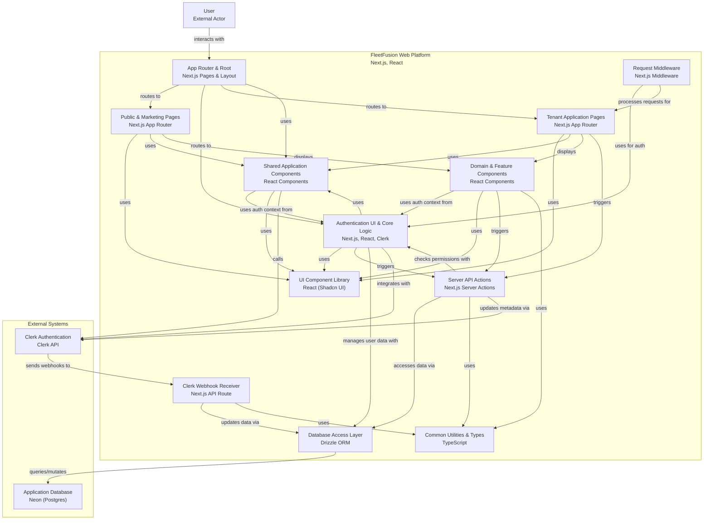

# Comprehensive Code Mapping: ABAC, Multi-Tenant Architecture, Clerk Integration, and Neon Integration

---

Here is all the code in your workspace relevant to the Clerk webhook handler, event types,
onboarding, ABAC, JWT claims, and database sync:

---

## Key Concepts

user.id for role-based access control org.id for tenant-based access control

sign-up => onboarding => app / (tenant) / [orgId] / dashboard / [userId] / page.tsx sign-in => app /
(tenant) / [orgId] / dashboard / [userId] / page.tsx

## Directory Structure

```
fleetfusion-architecture
├── app
│   ├── (auth)
│   │   ├── forgot-password
│   │   │   └── page.tsx
│   │   ├── onboarding
│   │   │   └── page.tsx
│   │   ├── sign-in
│   │   │   └── [[...sign-in]]
│   │   │       └── page.tsx
│   │   ├── sign-out
│   │   │   └── page.tsx
│   │   ├── sign-up
│   │   │   └── [[...sign-up]]
│   │   │       └── page.tsx
│   │   ├── error.tsx
│   │   ├── layout.tsx
│   │   └── loading.tsx
│   ├── (funnel)
│   │   ├── about
│   │   │   └── page.tsx
│   │   ├── contact
│   │   │   └── page.tsx
│   │   ├── features
│   │   │   └── page.tsx
│   │   ├── pricing
│   │   │   └── page.tsx
│   │   ├── privacy
│   │   │   └── page.tsx
│   │   ├── refund
│   │   │   └── page.tsx
│   │   ├── services
│   │   │   └── page.tsx
│   │   ├── terms
│   │   │   └── page.tsx
│   │   ├── error.tsx
│   │   ├── layout.tsx
│   │   └── loading.tsx
│   ├── (tenant)
│   │   └── [orgId]
│   │       ├── analytics
│   │       │   └── page.tsx
│   │       ├── compliance
│   │       │   ├── [userId]
│   │       │   │   └── hos-logs
│   │       │   │       └── page.tsx
│   │       │   └── page.tsx
│   │       ├── dashboard
│   │       │   ├── [userId]
│   │       │   │   └── layout.tsx
│   │       │   └── page.tsx
│   │       ├── dispatch
│   │       │   ├── [id]
│   │       │   │   ├── edit
│   │       │   │   │   └── page.tsx
│   │       │   │   └── new
│   │       │   │       └── page.tsx
│   │       │   └── page.tsx
│   │       ├── drivers
│   │       │   └── [userId]
│   │       │       └── page.tsx
│   │       ├── ifta
│   │       │   └── page.tsx
│   │       ├── settings
│   │       │   └── page.tsx
│   │       ├── vehicles
│   │       │   └── page.tsx
│   │       ├── error.tsx
│   │       ├── layout.tsx
│   │       └── loading.tsx
│   ├── api
│   │   └── clerk
│   │       └── webhook-handler
│   │           └── route.ts
│   ├── globals.css
│   ├── layout.tsx
│   └── page.tsx
├── components
│   ├── analytics
│   │   ├── analytics-dashboard.tsx
│   │   ├── driver-performance.tsx
│   │   ├── financial-metrics.tsx
│   │   ├── performance-metrics.tsx
│   │   └── vehicle-utilization.tsx
│   ├── auth
│   │   ├── context.tsx
│   │   └── protected-route.tsx
│   ├── compliance
│   │   ├── compliance-dashboard.tsx
│   │   ├── compliance-documents.tsx
│   │   ├── driver-compliance-table.tsx
│   │   ├── hos-log-viewer.tsx
│   │   └── vehicle-compliance-table.tsx
│   ├── dashboard
│   │   ├── dashboard-cards.tsx
│   │   └── dashboard-skeleton.tsx
│   ├── dispatch
│   │   ├── dispatch-board.tsx
│   │   ├── dispatch-skeleton.tsx
│   │   ├── load-card.tsx
│   │   ├── load-details-dialog.tsx
│   │   └── load-form.tsx
│   ├── drivers
│   │   ├── driver-card.tsx
│   │   └── driver-details-dialog.tsx
│   ├── ifta
│   │   ├── ifta-columns.tsx
│   │   ├── ifta-dashboard.tsx
│   │   ├── ifta-report-table.tsx
│   │   ├── ifta-tables.tsx
│   │   └── ifta-trip-table.tsx
│   ├── pricing
│   │   └── pricing-section.tsx
│   ├── settings
│   │   ├── company-settings.tsx
│   │   ├── integration-settings.tsx
│   │   ├── notification-settings.tsx
│   │   ├── settings-dashboard.tsx
│   │   └── user-settings.tsx
│   ├── shared
│   │   ├── loading-spinner.tsx
│   │   ├── main-nav.tsx
│   │   ├── mobile-nav.tsx
│   │   ├── public-nav.tsx
│   │   ├── shared-footer.tsx
│   │   ├── sign-out-button.tsx
│   │   ├── theme-provider.tsx
│   │   ├── theme-toggle.tsx
│   │   └── user-nav.tsx
│   ├── ui
│   │   ├── accordion.tsx
│   │   ├── alert-dialog.tsx
│   │   ├── alert.tsx
│   │   ├── aspect-ratio.tsx
│   │   ├── avatar.tsx
│   │   ├── badge.tsx
│   │   ├── breadcrumb.tsx
│   │   ├── button.tsx
│   │   ├── calendar.tsx
│   │   ├── card.tsx
│   │   ├── carousel.tsx
│   │   ├── chart.tsx
│   │   ├── checkbox.tsx
│   │   ├── collapsible.tsx
│   │   ├── command.tsx
│   │   ├── context-menu.tsx
│   │   ├── data-table.tsx
│   │   ├── dialog.tsx
│   │   ├── drawer.tsx
│   │   ├── dropdown-menu.tsx
│   │   ├── form.tsx
│   │   ├── hover-card.tsx
│   │   ├── input-otp.tsx
│   │   ├── input.tsx
│   │   ├── label.tsx
│   │   ├── menubar.tsx
│   │   ├── navigation-menu.tsx
│   │   ├── page-header.tsx
│   │   ├── popover.tsx
│   │   ├── progress.tsx
│   │   ├── radio-group.tsx
│   │   ├── resizable.tsx
│   │   ├── scroll-area.tsx
│   │   ├── select.tsx
│   │   ├── separator.tsx
│   │   ├── sheet.tsx
│   │   ├── sidebar.tsx
│   │   ├── skeleton.tsx
│   │   ├── slider.tsx
│   │   ├── sonner.tsx
│   │   ├── switch.tsx
│   │   ├── table.tsx
│   │   ├── tabs.tsx
│   │   ├── textarea.tsx
│   │   ├── toast.tsx
│   │   ├── toaster.tsx
│   │   ├── toggle-group.tsx
│   │   ├── toggle.tsx
│   │   ├── tooltip.tsx
│   │   ├── use-mobile.tsx
│   │   └── use-toast.ts
│   └── vehicles
│       ├── vehicle-card.tsx
│       └── vehicle-details-dialog.tsx
├── doc
│   ├── Developer-Documentation.md
│   └── User-Documentation.md
├── features
│   ├── analytics
│   │   └── dashboard-metrics.tsx
│   ├── dashboard
│   │   └── quick-actions.tsx
│   └── dispatch
│       └── recent-activity.tsx
├── hooks
│   ├── use-mobile.tsx
│   └── use-toast.ts
├── lib
│   ├── actions
│   │   ├── compliance.ts
│   │   ├── drivers.ts
│   │   ├── loads.ts
│   │   ├── onboarding.ts
│   │   └── vehicles.ts
│   ├── auth
│   │   ├── auth.ts
│   │   └── permissions.ts
│   ├── database
│   │   └── index.ts
│   ├── fetchers
│   │   └── fetchers.ts
│   ├── rate-limit.ts
│   └── utils.ts
├── prisma
│   ├── migrations
│   │   ├── 20250527042129_init
│   │   │   └── migration.sql
│   │   ├── 20250527065545_add_foreign_key_constraints
│   │   │   └── migration.sql
│   │   ├── 20250527065956_add_audit_system_enhanced_onboarding_and_triggers
│   │   │   └── migration.sql
│   │   ├── 20250527182630_add_onboarding_complete_column
│   │   │   └── migration.sql
│   │   └── migration_lock.toml
│   └── schema.prisma
├── public
│   ├── black_logo.png
│   ├── landing_hero.png
│   ├── map-pinned_icon.png
│   ├── mountain_bg.png
│   ├── readme_hero.jpeg
│   ├── route_icon.png
│   ├── sunset_bg.png
│   ├── tiers_bg.png
│   ├── trucksz_splash.png
│   ├── valley_bg.png
│   ├── white_logo.png
│   └── winding_bg.png
├── types
│   ├── abac.ts
│   ├── analytics.ts
│   ├── api.ts
│   ├── auth.ts
│   ├── compliance.ts
│   ├── dispatch.ts
│   ├── drivers.ts
│   ├── globals.d.ts
│   ├── ifta.ts
│   ├── index.ts
│   └── webhooks.ts
├── validations
│   ├── auth.ts
│   ├── compliance.ts
│   ├── dispatch.ts
│   ├── drivers.ts
│   ├── ifta.ts
│   └── vehicles.ts
├── components.json
├── middleware.ts
├── next.config.ts
├── package-lock.json
├── package.json
├── postcss.config.mjs
├── README.md
├── tailwind.config.ts
└── tsconfig.json

```

## System Context

**1. Webhook Handler Implementation**

- `app/api/clerk/webhook-handler/route.ts`
  - Contains the main webhook handler, event switch, verification with Svix, rate limiting, and all
    event processing logic.
  - Handles: `user.created`, `user.updated`, `user.deleted`, `organization.created`,
    `organization.updated`, `organization.deleted`, `organizationMembership.created`,
    `organizationMembership.updated`, `organizationMembership.deleted`, and more.
  - Uses `DatabaseQueries` for upsert/delete operations.
  - Verifies webhooks using Svix and `CLERK_WEBHOOK_SECRET`.
  - Handles onboarding metadata sync and ABAC fields.

**2. Webhook Event Types and Payloads**

- `types/webhooks.ts`

  - Defines all webhook event types, payload structures for user/org/membership, and verification
    result types.
  - Types: `WebhookEventType`, `UserWebhookData`, `OrganizationWebhookData`,
    `OrganizationMembershipWebhookData`, etc.

- `types/auth.ts`
  - Defines `ClerkUserMetadata`, `ClerkOrganizationMetadata`, `UserRole`, `ROLE_PERMISSIONS`, and
    JWT claim structure.
  - Includes onboarding and ABAC-related fields.

**3. Database Synchronization Logic**

- `lib/database/index.ts`

  - `DatabaseQueries` class with:
    - `upsertUser`
    - `upsertOrganization`
    - `deleteUser`
    - `deleteOrganization`
    - (No explicit `upsertOrganizationMembership`, but membership is handled via user/org upserts.)
  - All methods used by the webhook handler for syncing Clerk data to Neon PostgreSQL.

- `lib/database/schema.ts`
  - Schema for `users` and `organizations` tables, including ABAC fields, onboarding, and metadata.

**4. Onboarding and Metadata Sync**

- `lib/actions/onboarding.ts`

  - `setClerkMetadata` server action: updates Clerk metadata and creates org/user records for
    instant UX, webhooks ensure DB consistency.
  - Handles onboarding flow, sets `onboardingComplete`, and triggers Clerk org creation.

- `app/(auth)/onboarding/page.tsx`
  - Client onboarding flow, calls `setClerkMetadata`, and updates Clerk metadata.

**5. Validation and Types**

- `validations/auth.ts`
  - Zod schemas for webhook payloads, onboarding, and metadata.

**6. Documentation and Developer Notes**

- `doc/Developer-Documentation.md`
  - Explains Clerk integration, onboarding, ABAC, JWT claims, and webhook responsibilities.

---

**Key Code Excerpts Directly Supporting the Notes File:**

- **Webhook Verification with Svix:**  
  `app/api/clerk/webhook-handler/route.ts` (see `verifyWebhook` function)
- **Event Switch Handling:**  
  `app/api/clerk/webhook-handler/route.ts` (see `switch (type) { ... }`)
- **Onboarding Metadata Sync:**  
  `lib/actions/onboarding.ts`, `app/(auth)/onboarding/page.tsx`
- **Database Upserts:**  
  `lib/database/index.ts` (`DatabaseQueries`)
- **ABAC/JWT Claims:**  
  `types/auth.ts`, `types/webhooks.ts`
- **Rate Limiting:**  
  `app/api/clerk/webhook-handler/route.ts` (see `webhookRateLimit`)
- **Error Handling:**  
  `app/api/clerk/webhook-handler/route.ts` (try/catch, logging, response codes)
- **Event Types and Payloads:**  
  `types/webhooks.ts`, `types/auth.ts`
- **Clerk Custom Claims/JWT Structure:**  
  `types/auth.ts`, `doc/Developer-Documentation.md`

---

## Mermaid Diagram



## Neon POSTGRESQL Tables

### loads

| Column                    | Type          | Nullable | Notes |
| ------------------------- | ------------- | -------- | ----- |
| id                        | uuid          | not null |       |
| organization_id           | uuid          | not null |       |
| driver_id                 | uuid          | null     |       |
| vehicle_id                | uuid          | null     |       |
| trailer_id                | uuid          | null     |       |
| reference_number          | varchar(100)  | null     |       |
| status                    | varchar(20)   | not null |       |
| customer_name             | varchar(255)  | not null |       |
| customer_contact          | varchar(100)  | null     |       |
| customer_phone            | varchar(20)   | null     |       |
| customer_email            | varchar(255)  | null     |       |
| customer_address          | text          | null     |       |
| origin_name               | varchar(255)  | null     |       |
| origin_address            | text          | not null |       |
| origin_city               | varchar(100)  | not null |       |
| origin_state              | varchar(50)   | not null |       |
| origin_zip                | varchar(20)   | not null |       |
| origin_lat                | numeric(10,8) | null     |       |
| origin_lng                | numeric(11,8) | null     |       |
| origin_contact_name       | varchar(100)  | null     |       |
| origin_contact_phone      | varchar(20)   | null     |       |
| origin_notes              | text          | null     |       |
| destination_name          | varchar(255)  | null     |       |
| destination_address       | text          | not null |       |
| destination_city          | varchar(100)  | not null |       |
| destination_state         | varchar(50)   | not null |       |
| destination_zip           | varchar(20)   | not null |       |
| destination_lat           | numeric(10,8) | null     |       |
| destination_lng           | numeric(11,8) | null     |       |
| destination_contact_name  | varchar(100)  | null     |       |
| destination_contact_phone | varchar(20)   | null     |       |
| destination_notes         | text          | null     |       |
| scheduled_pickup_date     | timestamptz   | null     |       |
| scheduled_delivery_date   | timestamptz   | null     |       |
| actual_pickup_date        | timestamptz   | null     |       |
| actual_delivery_date      | timestamptz   | null     |       |
| commodity                 | varchar(255)  | null     |       |
| weight                    | numeric(10,2) | null     |       |
| pieces                    | int4          | null     |       |
| temperature_controlled    | bool          | null     |       |
| hazmat                    | bool          | null     |       |
| rate_amount               | numeric(10,2) | null     |       |
| rate_currency             | varchar(3)    | not null |       |
| rate_type                 | varchar(20)   | not null |       |
| rate_per_mile             | numeric(6,3)  | null     |       |
| detention_rate            | numeric(6,2)  | null     |       |
| fuel_surcharge            | numeric(6,2)  | null     |       |
| accessorial_charges       | numeric(10,2) | null     |       |
| estimated_miles           | int4          | null     |       |
| actual_miles              | int4          | null     |       |
| instructions              | text          | null     |       |
| notes                     | text          | null     |       |
| created_at                | timestamptz   | not null |       |
| updated_at                | timestamptz   | not null |       |

### fuel_purchases

| Column           | Type          | Nullable | Notes |
| ---------------- | ------------- | -------- | ----- |
| id               | uuid          | not null |       |
| organization_id  | uuid          | not null |       |
| vehicle_id       | uuid          | not null |       |
| driver_id        | uuid          | null     |       |
| purchase_date    | timestamptz   | not null |       |
| location         | varchar(255)  | not null |       |
| fuel_type        | varchar(20)   | not null |       |
| gallons          | numeric(8,3)  | not null |       |
| price_per_gallon | numeric(6,3)  | not null |       |
| total_amount     | numeric(10,2) | not null |       |
| odometer_reading | int4          | null     |       |
| receipt_number   | varchar(100)  | null     |       |
| vendor           | varchar(255)  | null     |       |
| payment_method   | varchar(20)   | null     |       |
| notes            | text          | null     |       |
| created_at       | timestamptz   | not null |       |

### dvir_reports

| Column          | Type         | Nullable | Notes |
| --------------- | ------------ | -------- | ----- |
| id              | uuid         | not null |       |
| vehicle_id      | uuid         | not null |       |
| driver_id       | uuid         | not null |       |
| date            | date         | not null |       |
| pre_trip        | bool         | not null |       |
| post_trip       | bool         | not null |       |
| safe_to_operate | bool         | not null |       |
| notes           | text         | null     |       |
| signature       | varchar(255) | not null |       |
| created_at      | timestamptz  | not null |       |

### compliance_documents

| Column            | Type         | Nullable | Notes |
| ----------------- | ------------ | -------- | ----- |
| id                | uuid         | not null |       |
| organization_id   | uuid         | not null |       |
| type              | varchar(30)  | not null |       |
| name              | varchar(255) | not null |       |
| description       | text         | null     |       |
| status            | varchar(20)  | not null |       |
| issued_date       | date         | not null |       |
| expiration_date   | date         | null     |       |
| document_number   | varchar(100) | null     |       |
| issuing_authority | varchar(255) | null     |       |
| file_url          | text         | null     |       |
| notes             | text         | null     |       |
| created_at        | timestamptz  | not null |       |
| updated_at        | timestamptz  | not null |       |

### driver_documents

| Column          | Type         | Nullable | Notes |
| --------------- | ------------ | -------- | ----- |
| id              | uuid         | not null |       |
| driver_id       | uuid         | not null |       |
| type            | varchar(20)  | not null |       |
| name            | varchar(255) | not null |       |
| file_url        | text         | not null |       |
| file_size       | int4         | null     |       |
| mime_type       | varchar(100) | null     |       |
| expiration_date | date         | null     |       |
| uploaded_at     | timestamptz  | not null |       |
| uploaded_by     | varchar(255) | not null |       |

### drivers

| Column                | Type          | Nullable | Notes |
| --------------------- | ------------- | -------- | ----- |
| id                    | uuid          | not null |       |
| organization_id       | uuid          | not null |       |
| employee_id           | varchar(50)   | null     |       |
| first_name            | varchar(100)  | not null |       |
| last_name             | varchar(100)  | not null |       |
| email                 | varchar(255)  | null     |       |
| phone                 | varchar(20)   | null     |       |
| address               | text          | null     |       |
| city                  | varchar(100)  | null     |       |
| state                 | varchar(50)   | null     |       |
| zip                   | varchar(20)   | null     |       |
| license_number        | varchar(50)   | null     |       |
| license_state         | varchar(50)   | null     |       |
| license_class         | varchar(10)   | null     |       |
| license_expiration    | date          | null     |       |
| medical_card_exp      | date          | null     |       |
| drug_test_date        | date          | null     |       |
| background_check_date | date          | null     |       |
| hire_date             | date          | null     |       |
| termination_date      | date          | null     |       |
| status                | varchar(20)   | not null |       |
| home_terminal         | varchar(100)  | null     |       |
| emergency_contact_1   | varchar(100)  | null     |       |
| emergency_contact_2   | varchar(20)   | null     |       |
| emergency_contact_3   | varchar(50)   | null     |       |
| emergency_contact_4   | varchar(100)  | null     |       |
| emergency_contact_5   | varchar(20)   | null     |       |
| emergency_contact_6   | varchar(50)   | null     |       |
| current_location_lat  | numeric(10,8) | null     |       |
| current_location_lng  | numeric(11,8) | null     |       |
| current_location_time | timestamptz   | null     |       |
| notes                 | text          | null     |       |
| created_at            | timestamptz   | not null |       |
| updated_at            | timestamptz   | not null |       |

### dvir_defects

| Column         | Type         | Nullable | Notes |
| -------------- | ------------ | -------- | ----- |
| id             | uuid         | not null |       |
| dvir_report_id | uuid         | not null |       |
| category       | varchar(20)  | not null |       |
| description    | text         | not null |       |
| severity       | varchar(10)  | not null |       |
| repaired       | bool         | not null |       |
| repaired_by    | varchar(255) | null     |       |
| repaired_date  | date         | null     |       |
| repair_notes   | text         | null     |       |

### hos_entries

| Column     | Type         | Nullable | Notes |
| ---------- | ------------ | -------- | ----- |
| id         | uuid         | not null |       |
| hos_log_id | uuid         | not null |       |
| start_time | timestamptz  | not null |       |
| end_time   | timestamptz  | not null |       |
| status     | varchar(20)  | not null |       |
| location   | varchar(255) | not null |       |
| notes      | text         | null     |       |
| created_at | timestamptz  | not null |       |

### hos_logs

| Column              | Type        | Nullable | Notes |
| ------------------- | ----------- | -------- | ----- |
| id                  | uuid        | not null |       |
| driver_id           | uuid        | not null |       |
| date                | date        | not null |       |
| status              | varchar(20) | not null |       |
| total_drive_time    | int4        | not null |       |
| total_on_duty_time  | int4        | not null |       |
| total_off_duty_time | int4        | not null |       |
| created_at          | timestamptz | not null |       |
| updated_at          | timestamptz | not null |       |

### hos_violations

| Column      | Type         | Nullable | Notes |
| ----------- | ------------ | -------- | ----- |
| id          | uuid         | not null |       |
| hos_log_id  | uuid         | not null |       |
| type        | varchar(20)  | not null |       |
| description | text         | not null |       |
| severity    | varchar(10)  | not null |       |
| timestamp   | timestamptz  | not null |       |
| resolved    | bool         | not null |       |
| resolved_at | timestamptz  | null     |       |
| resolved_by | varchar(255) | null     |       |

### load_documents

| Column      | Type         | Nullable | Notes |
| ----------- | ------------ | -------- | ----- |
| id          | uuid         | not null |       |
| load_id     | uuid         | not null |       |
| type        | varchar(20)  | not null |       |
| name        | varchar(255) | not null |       |
| file_url    | text         | not null |       |
| file_size   | int4         | null     |       |
| mime_type   | varchar(100) | null     |       |
| uploaded_by | varchar(255) | not null |       |
| uploaded_at | timestamptz  | not null |       |

### trailers

| Column                  | Type        | Nullable | Notes |
| ----------------------- | ----------- | -------- | ----- |
| id                      | uuid        | not null |       |
| organization_id         | uuid        | not null |       |
| type                    | varchar(20) | not null |       |
| status                  | varchar(20) | not null |       |
| unit_number             | varchar(50) | not null |       |
| make                    | varchar(50) | null     |       |
| model                   | varchar(50) | null     |       |
| year                    | int4        | null     |       |
| vin                     | varchar(17) | null     |       |
| license_plate           | varchar(20) | null     |       |
| license_plate_state     | varchar(50) | null     |       |
| length                  | int4        | null     |       |
| width                   | int4        | null     |       |
| height                  | int4        | null     |       |
| capacity                | int4        | null     |       |
| last_inspection_date    | date        | null     |       |
| next_inspection_date    | date        | null     |       |
| insurance_expiration    | date        | null     |       |
| registration_expiration | date        | null     |       |
| notes                   | text        | null     |       |
| created_at              | timestamptz | not null |       |
| updated_at              | timestamptz | not null |       |

### users

| Column              | Type         | Nullable | Notes |
| ------------------- | ------------ | -------- | ----- |
| id                  | uuid         | not null |       |
| clerk_id            | varchar(255) | not null |       |
| organization_id     | uuid         | not null |       |
| email               | varchar(255) | not null |       |
| first_name          | varchar(100) | null     |       |
| last_name           | varchar(100) | null     |       |
| profile_image_url   | text         | null     |       |
| role                | varchar(20)  | not null |       |
| permissions         | jsonb        | null     |       |
| is_active           | bool         | not null |       |
| onboarding_complete | bool         | not null |       |
| last_login          | timestamptz  | null     |       |
| created_at          | timestamptz  | not null |       |
| updated_at          | timestamptz  | not null |       |

### vehicles

| Column                  | Type        | Nullable | Notes |
| ----------------------- | ----------- | -------- | ----- |
| id                      | uuid        | not null |       |
| organization_id         | uuid        | not null |       |
| type                    | varchar(20) | not null |       |
| status                  | varchar(20) | not null |       |
| unit_number             | varchar(50) | not null |       |
| make                    | varchar(50) | null     |       |
| model                   | varchar(50) | null     |       |
| year                    | int4        | null     |       |
| vin                     | varchar(17) | null     |       |
| license_plate           | varchar(20) | null     |       |
| license_plate_state     | varchar(50) | null     |       |
| current_odometer        | int4        | null     |       |
| fuel_type               | varchar(20) | null     |       |
| last_inspection_date    | date        | null     |       |
| next_inspection_date    | date        | null     |       |
| insurance_expiration    | date        | null     |       |
| registration_expiration | date        | null     |       |
| gross_weight            | int4        | null     |       |
| tare_weight             | int4        | null     |       |
| notes                   | text        | null     |       |
| created_at              | timestamptz | not null |       |
| updated_at              | timestamptz | not null |       |

### organizations

| Column              | Type         | Nullable | Notes |
| ------------------- | ------------ | -------- | ----- |
| id                  | uuid         | not null |       |
| clerk_id            | varchar(255) | not null |       |
| name                | varchar(255) | not null |       |
| slug                | varchar(255) | not null |       |
| dot_number          | varchar(50)  | null     |       |
| mc_number           | varchar(50)  | null     |       |
| address             | text         | null     |       |
| city                | varchar(100) | null     |       |
| state               | varchar(50)  | null     |       |
| zip                 | varchar(20)  | null     |       |
| phone               | varchar(20)  | null     |       |
| email               | varchar(255) | null     |       |
| logo_url            | text         | null     |       |
| subscription_tier   | varchar(20)  | not null |       |
| subscription_status | varchar(20)  | not null |       |
| max_users           | int4         | not null |       |
| billing_email       | varchar(255) | null     |       |
| settings            | jsonb        | null     |       |
| is_active           | bool         | not null |       |
| created_at          | timestamptz  | not null |       |
| updated_at          | timestamptz  | not null |       |

## Clerk Information

### User Authentication Options:

- Email address: Enabled. Users can add email addresses to their accounts.
- Require email during sign-up: Enabled. Users must provide and maintain an email address.
- Username: Enabled. Users can set a username.
- First and last name: Enabled. Users can set their first and last name.
- Require first and last name: Disabled. Not required at sign-up.

### Roles and Permissions

**Admin** (`org:admin`)

- org:sys_domains:read
- org:sys_domains:manage
- org:sys_profile:manage
- org:sys_profile:delete
- org:sys_memberships:read
- org:sys_memberships:manage
- org:admin:access_all_reports
- org:admin:configure_company_settings
- org:admin:view_audit_logs
- org:admin:manage_users_and_roles
- org:admin:view_edit_all_loads
- org:sys_billing:manage
- org:sys_billing:read

**Compliance** (`org:compliance`)

- org:sys_memberships:read
- org:compliance:view_compliance_dashboard
- org:compliance:access_audit_logs
- org:compliance:generate_compliance_req
- org:compliance:upload_review_compliance

**Dispatcher** (`org:dispatcher`)

- org:sys_memberships:read
- org:dispatcher:create_edit_loads
- org:dispatcher:assign_drivers
- org:dispatcher:view_driver_vehicle_status
- org:dispatcher:access_dispatch_dashboard

**Driver** (`org:driver`)

- org:sys_memberships:read
- org:driver:view_assigned_loads
- org:driver:update_load_status
- org:driver:upload_documents
- org:driver:log_hos

**Member** (`org:member`) _(Default role)_

- org:sys_memberships:read

### Session Claims

{ "org.id": "{{org.id}}", "user.id": "{{user.id}}", "org.name": "{{org.name}}", "org.role":
"{{org.role}}", "publicMetadata": { "onboardingComplete":
"{{user.public_metadata.onboardingComplete}}" }, "user.organizations": "{{user.organizations}}",
"org_membership.permissions": "{{org_membership.permissions}}" }

### Custom JWT - Neon:

{ "org.id": "{{org.id}}", "user.id": "{{user.id}}", "org.name": "{{org.name}}", "org.role":
"{{org.role}}", "publicMetadata": { "onboardingComplete":
"{{user.public_metadata.onboardingComplete}}" }, "user.organizations": "{{user.organizations}}",
"org_membership.permissions": "{{org_membership.permissions}}" }

### Webhook Subcribed Events:

email.created organization.created organization.deleted organization.updated
organizationDomain.created organizationDomain.deleted organizationDomain.updated
organizationInvitation.accepted organizationInvitation.created organizationInvitation.revoked
organizationMembership.created organizationMembership.deleted organizationMembership.updated
permission.created permission.deleted permission.updated role.created role.deleted role.updated
session.created session.ended session.pending session.removed session.revoked user.created
user.deleted user.updated

### Clerk Webhook URL

#### Local Development

NEXT_PUBLIC_APP_URL=http://localhost:3000

NEXT_PUBLIC_CLERK_FRONTEND_API=driving-gelding-14.clerk.accounts.dev

NEXT_PUBLIC_CLERK_WEBHOOK_ENDPOINT=https://liberal-gull-quietly.ngrok-free.app/api/clerk/webhook-handler

#### Production

NEXT_PUBLIC_APP_URL=http://fleet-fusion.vercel.app

NEXT_PUBLIC_CLERK_FRONTEND_API=driving-gelding-14.clerk.accounts.dev

NEXT_PUBLIC_CLERK_WEBHOOK_ENDPOINT=https://fleet-fusion.vercel.app/api/clerk/webhook-handler
