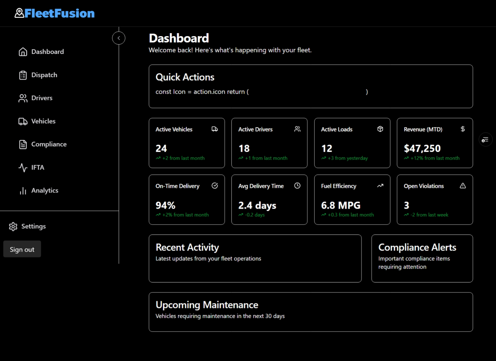

# Dashboard Enhancement Todo List

Based on the images, here's what needs to be done to transform the current dashboard into the
enhanced design:

## Layout and Structure Changes

1. Keep the side navigation with logo from the first image
2. Update the main dashboard layout to match the grid-style of the second image
3. Add the refresh icon and last updated timestamp (e.g., "Last updated: 2 minutes ago")
4. Implement the "Live" indicator beside the "Fleet Overview" title

## Header Modifications

1. Change title from "Dashboard" to "Fleet Overview"
2. Add subtitle: "Real-time insights into your fleet operations and performance"
3. Add company name ("C & J Express Inc.") and user profile icon to top-right corner
4. Add dark mode toggle button next to company name
5. Add notifications bell icon with counter (showing "3")

## Metrics Cards Enhancements

1. Redesign the metric cards with:
   - Icon on the right side of each card
   - Percentage indicators showing change trends
   - Progress bars where applicable

## Specific Metrics Updates

1. Update metrics with new values:
   - Active Vehicles: 24 → 10 (with +2.1% indicator)
   - Active Drivers: 18 → 12 (with +5.2% indicator)
   - Active Loads: 12 → 45 (with "Live" tag)
   - Revenue: $47,250 → $59k (with +12.5% indicator)

## Additional Data Points

1. Add secondary metrics to each card:
   - Maintenance due counts
   - Utilization rate (32.0%)
   - Load status breakdown (Completed: 32, In Transit: 5)
   - Per mile average ($2.38) with target ($2.50/mile)

## New Sections

1. Add "Total Miles" section (24.7k with +8.3% trend)
2. Add "Inspections" section (8 with 1 failed, 87.5% success rate)
3. Replace "Upcoming Maintenance" with enhanced version showing overdue counts
4. Add "Pending Loads" section (8 with urgent tag)

## Bottom Section Updates

1. Replace "Recent Activity" with "Recent Alerts" showing specific incidents
2. Add "Today's Schedule" section with morning/afternoon/evening breakdown
3. Convert "Quick Actions" to a more functional section with specific action buttons:
   - Create New Load
   - Schedule Maintenance
   - View Alerts

## Visual Improvements

1. Use consistent dark theme throughout
2. Implement color coding for status indicators (green for positive, red for negative, etc.)
3. Add appropriate icons for each metric and action
4. Improve overall spacing and alignment
