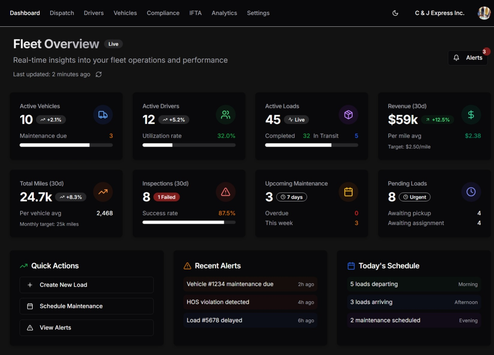

# Fleet Dashboard Audit

Here is a comprehensive audit of the **Dashboard** for [Fleet Management](app/(tenant)/[orgId]/dashboard/[userId]/page.tsx), based on your codebase, the provided screenshot, and best practices for your architecture:

---

## 1. **Page Purpose & Audience**

- **Purpose:**  
  The Fleet Management Dashboard provides a real-time overview of fleet operations, key metrics, quick actions, alerts, and schedules for fleet managers and Fleet Management.
- **Audience:**  
  Organization Management (and possibly other roles with dashboard access).

---

## 2. **Layout & Structure**

- **File:** [app/(tenant)/[orgId]/dashboard/[userId]/page.tsx](app/(tenant)/[orgId]/dashboard/[userId]/page.tsx)
- **Layout:**  
  Uses [app/(tenant)/[orgId]/dashboard/layout.tsx](app/(tenant)/[orgId]/dashboard/layout.tsx) for the main shell, which provides:
  - Responsive sidebar (desktop/mobile)
  - Suspense fallback with loading spinner
  - Main content area with padding

---

### 3. **Navigation**

The Fleet Dashboard navigation is composed of a top header and a sidebar, both implemented as shared components and designed for multi-tenant, RBAC-aware navigation:

- **Top Navigation (Page Header):**
  - Implemented in page-header.tsx.
  - Displays the FleetFusion logo and the `UserNav` component.
    - `UserNav` provides access to Clerk user/org options, profile, and theme toggle.
  - This header is used across desktop and mobile layouts.

- **Sidebar Navigation (MainNav):**
  - Implemented in main-nav.tsx.
  - Contains navigation links for Dashboard, Dispatch, Drivers, Vehicles, Compliance, IFTA, Analytics, and Settings.
  - Includes the `SignOutButton` at the bottom.
  - **Note:** Sidebar links should be dynamically generated based on the user's permissions and organization context, using RBAC rules from permissions.ts and route protection logic from middleware.ts.

- **Layout Integration:**
  - The main navigation logic is implemented in [`app/(tenant)/[orgId]/layout.tsx`](app/(tenant)/[orgId]/layout.tsx), which:
    - Renders the `PageHeader` at the top.
    - Renders the `MainNav` sidebar on desktop.
    - Uses the `useIsMobile` hook to conditionally render the `MobileNav` component for mobile devices.
  - The dashboard-specific layout [`app/(tenant)/[orgId]/dashboard/layout.tsx`](app/(tenant)/[orgId]/dashboard/layout.tsx) is currently a placeholder and should be updated to properly compose the shared navigation and content areas.

- **Mobile Navigation:**
  - Implemented in mobile-nav.tsx.
  - Uses a sheet/drawer UI for mobile.
  - **Note:** Mobile links must also be dynamically generated based on user permissions and organization, using the same RBAC and route logic as the sidebar.

- **Dynamic Links & RBAC:**
  - Both sidebar and mobile navigation links must be generated dynamically, reflecting the user's allowed routes per RBAC rules defined in permissions.ts and enforced in middleware.ts.
  - Only show navigation links the user is permitted to access, based on their role and organization context.

**Summary:**  
Navigation is modular and responsive, with the top bar (`PageHeader`) and sidebar (`MainNav`) in shared components, and mobile navigation (`MobileNav`) conditionally rendered via the main layout. All navigation links must be dynamically generated according to RBAC and organization context, referencing the permissions and middleware logic for secure, role-aware routing.

---

## 4. **Components & Features**

### **A. Page Header**
- **Title:** "Dashboard"
- **Subtitle:** "Welcome back! Here's what's happening with your fleet."

### **B. Quick Actions**
- **Component:** `QuickActions`
- **Features:**
  - Renders a grid of action buttons (e.g., New Load, Add Vehicle, Add Driver, Track Shipment, Generate Report, IFTA Report)
  - Each action has:
    - Icon (from lucide-react)
    - Title & description
    - Permission check (via `hasPermission`)
    - Navigation (`useRouter().push`)
    - Button variant (default/outline)
- **Improvements Needed:**
  - The current implementation is incomplete (see quick-actions.tsx); needs mapping over actions and permission filtering.
  - Should match the screenshot: "Create New Load", "Schedule Maintenance", "View Alerts" (possibly as a subset for Fleet Managments).

### **C. Key Metrics**
- **Component:** `DashboardMetrics`
- **Features:**
  - Grid of metric cards (Active Vehicles, Active Drivers, Active Loads, Revenue, On-Time Delivery, Avg Delivery Time, Fuel Efficiency, Open Violations)
  - Each card shows:
    - Title, value, change indicator, icon
    - Color-coded change (positive/negative/neutral)
    - Consistent card style (rounded, shadow, dark/light mode)
- **Data Source:**  
  - Currently uses static data; should fetch real KPIs via a fetcher (see below).

### **D. Dashboard Grid**
- **Recent Activity:**  
  - Card with Suspense fallback; should show recent fleet events (e.g., load status changes, driver check-ins).
- **Compliance Alerts:**  
  - Card with Suspense fallback; should show compliance-related warnings (e.g., expiring documents, violations).
- **Upcoming Maintenance:**  
  - Card with Suspense fallback; should show vehicles needing maintenance soon.

---

## 5. **Data Fetching & Server Actions**

- **Fetcher Location:**  
  - All dashboard data fetchers should be in kpiFetchers.ts or analyticsFetchers.ts.
  - Example: `getDashboardSummary`
- **Server Actions:**  
  - Mutations (e.g., refreshing dashboard, creating loads) should be in dashboardActions.ts.
  - Example: `refreshDashboardAction`
- **Best Practice:**  
  - Use React Server Components for data fetching by default.
  - Use Suspense for async loading states.
  - Use Zod for input validation in actions.

---

## 6. **Permissions & Role-Based Access**

- **Permission Checks:**  
  - Quick Actions and sensitive data should be filtered by user permissions (see `hasPermission`).
  - Only show actions the user is allowed to perform.

---

## 7. **Styling & Theming**

- **Tailwind CSS 4:**  
  - All components use Tailwind utility classes.
  - Colors use design tokens (e.g., `hsl(var(--token))`).
  - Dark mode supported via `darkMode: 'class'`.
- **Card Layout:**  
  - Consistent card style for all dashboard widgets.
  - Responsive grid: `md:grid-cols-2`, `lg:grid-cols-3` or `lg:grid-cols-4` for metrics.

---

## 8. **Loading & Skeleton States**

- **Suspense:**  
  - Used for all async data (metrics, activity, alerts, maintenance).
- **Skeletons:**  
  - Use `DashboardSkeleton` for loading placeholders.

---

## 9. **Missing/To-Do Features**

- **Recent Activity, Alerts, Maintenance:**  
  - Components for these cards are not yet implemented; Suspense fallback is present but no content.
  - Should be implemented as server components fetching real data (see fetchers above).
- **Live/Auto-Refresh:**  
  - Screenshot shows "Last updated: 2 minutes ago" and a refresh icon; not present in code.
  - Should be implemented using a server action and possibly polling or SWR.
- **Schedule Widget:**  
  - "Today's Schedule" card in screenshot is not present in code; should be added as a new component.

---

## 10. **Best Practices & Recommendations**

- **Server-first:**  
  - All dashboard data should be fetched server-side for performance and security.
- **Feature-driven:**  
  - Each dashboard widget should be its own feature module (e.g., `features/dashboard/recent-activity.tsx`).
- **Modularity:**  
  - All cards, actions, and widgets should be modular and reusable.
- **Testing:**  
  - Add unit/integration tests for fetchers and actions.
- **Documentation:**  
  - Document all components and flows in the code and in Developer-Documentation.md.

---

## 11. **Component/File Map**

| Widget/Section  | Component/File                                                                                       |
| --------------- | ---------------------------------------------------------------------------------------------------- |
| Group Layout    | [app/(tenant)/[orgId]/layout.tsx](app/(tenant)/[orgId]/layout.tsx)                                   |
| Page Layout     | [app/(tenant)/[orgId]/dashboard/layout.tsx](app/(tenant)/[orgId]/dashboard/layout.tsx)               |
| Dashboard Page  | [app/(tenant)/[orgId]/dashboard/[userId]/page.tsx](app/(tenant)/[orgId]/dashboard/[userId]/page.tsx) |
| Quick Actions   | quick-actions.tsx                                                                                    |
| Metrics Cards   | dashboard-metrics.tsx                                                                                |
| Skeleton Loader | dashboard-skeleton.tsx                                                                               |
| Data Fetchers   | kpiFetchers.ts, analyticsFetchers.ts                                                                 |
| Server Actions  | dashboardActions.ts                                                                                  |
| Permissions     | permissions.ts                                                                                       |
| Types           | auth.ts                                                                                              |

---

## 12. **Summary Table of Required Features**

| Feature              | Status  | Notes/Recommendations                                             |
| -------------------- | ------- | ----------------------------------------------------------------- |
| Top Nav              | Present | In the group level layout; ensure links and user/org switcher are correct  |
| Page Header          | Present | Good                                                              |
| Quick Actions        | Partial | Needs permission filtering, correct actions, and navigation logic |
| Metrics Cards        | Present | Static data; should fetch real KPIs from fetchers                 |
| Recent Activity      | Missing | Implement as server component, fetch recent events                |
| Compliance Alerts    | Missing | Implement as server component, fetch compliance warnings          |
| Upcoming Maintenance | Missing | Implement as server component, fetch maintenance data             |
| Today's Schedule     | Missing | Add as a new widget/component                                     |
| Skeletons/Loading    | Present | Good use of Suspense and skeletons                                |
| Live Refresh         | Missing | Add last-updated indicator and refresh action                     |
| Responsive Layout    | Present | Uses Tailwind grid and responsive classes                         |
| Dark Mode            | Present | Uses Tailwind and design tokens                                   |
| Permissions          | Partial | Ensure all actions and data are filtered by user permissions      |
| Documentation        | Partial | Add/expand inline and external documentation                      |

---

## 13. **Navigation Implementation Details and Additional Relevant Files**

The navigation system in FleetFusion is modular, RBAC-aware, and responsive, leveraging shared components and dynamic link generation:

- **Top Navigation (Page Header):**
  - Implemented in `components/shared/page-header.tsx`.
  - Contains the FleetFusion logo and the `UserNav` component (`components/shared/user-nav.tsx`), which provides Clerk user/org options, profile, and theme toggle.
  - Used across both desktop and mobile layouts.

- **Sidebar Navigation (MainNav):**
  - Implemented in `components/shared/main-nav.tsx`.
  - Renders navigation links for Dashboard, Dispatch, Drivers, Vehicles, Compliance, IFTA, Analytics, and Settings.
  - Includes the `SignOutButton` (`components/shared/sign-out-button.tsx`) at the bottom.
  - **Dynamic Links:** Sidebar links must be generated dynamically based on the user's permissions and organization context, using RBAC rules from `lib/auth/permissions.ts` and route protection logic from `middleware.ts`.

- **Mobile Navigation:**
  - Implemented in `components/shared/mobile-nav.tsx`.
  - Uses a sheet/drawer UI for mobile navigation.
  - **Dynamic Links:** Mobile links must also be generated dynamically using the same RBAC and route logic as the sidebar.

- **Layout Integration:**
  - The main navigation logic is implemented in `app/(tenant)/[orgId]/layout.tsx`, which:
    - Renders the `PageHeader` at the top.
    - Renders the `MainNav` sidebar on desktop.
    - Uses the `useIsMobile` hook to conditionally render the `MobileNav` component for mobile devices.
  - The dashboard-specific layout `app/(tenant)/[orgId]/dashboard/layout.tsx` should be updated to properly compose the shared navigation and content areas.

- **RBAC & Permissions:**
  - Both sidebar and mobile navigation links must be generated dynamically, reflecting the user's allowed routes per RBAC rules defined in `lib/auth/permissions.ts` and enforced in `middleware.ts`.
  - Only show navigation links the user is permitted to access, based on their role and organization context.

### **Additional Relevant Files**

- `components/shared/page-header.tsx` — Top navigation bar with logo and user/org menu.
- `components/shared/user-nav.tsx` — User/org menu, profile, theme toggle.
- `components/shared/main-nav.tsx` — Sidebar navigation, dynamic links, sign-out button.
- `components/shared/sign-out-button.tsx` — Sign out logic for Clerk.
- `components/shared/mobile-nav.tsx` — Mobile navigation drawer, dynamic links.
- `app/(tenant)/[orgId]/layout.tsx` — Main layout, handles nav rendering and mobile/desktop logic.
- `app/(tenant)/[orgId]/dashboard/layout.tsx` — Dashboard-specific layout (should compose shared nav).
- `lib/auth/permissions.ts` — RBAC logic, permission checks, role-based link filtering.
- `middleware.ts` — Route protection, organization context, RBAC enforcement.
- `hooks/use-mobile.tsx` — Device detection for responsive nav.

**Note:**
- Ensure all navigation links are permission-aware and context-sensitive.
- Refactor any hardcoded links in nav components to use dynamic generation based on user context and RBAC.
- Keep navigation logic DRY by centralizing link definitions and permission checks.

---

**In summary:**
The navigation system is robust and modular, but dynamic link generation and RBAC enforcement must be fully implemented in both sidebar and mobile nav. All navigation components should reference the user's permissions and organization context, using the shared logic in `lib/auth/permissions.ts` and `middleware.ts`. Review the above files to ensure all navigation and access control flows are complete and consistent.

---

## 14. **References**

- [app/(tenant)/[orgId]/dashboard/[userId]/page.tsx](app/(tenant)/[orgId]/dashboard/[userId]/page.tsx)
- quick-actions.tsx
- dashboard-metrics.tsx
- dashboard-skeleton.tsx
- kpiFetchers.ts
- dashboardActions.ts
- Developer-Documentation.md
- permissions.ts
- auth.ts
- [app/(tenant)/[orgId]/dashboard/layout.tsx](app/(tenant)/[orgId]/dashboard/layout.tsx)
- [app/(tenant)/[orgId]/layout.tsx](app/(tenant)/[orgId]/layout.tsx)
- [components/shared/page-header.tsx](components/shared/page-header.tsx)
- [components/shared/user-nav.tsx](components/shared/user-nav.tsx)
- [components/shared/main-nav.tsx](components/shared/main-nav.tsx)
- [components/shared/sign-out-button.tsx](components/shared/sign-out-button.tsx)

---

**In summary:**  
The Dashboard page is well-structured and follows modern Next.js and feature-driven best practices, but several widgets (activity, alerts, maintenance, schedule) are missing or incomplete. Data fetching should be server-first, and all actions should be permission-aware. The UI/UX should match the provided screenshot, including live refresh and schedule widgets. All logic should be modular, tested, and documented.