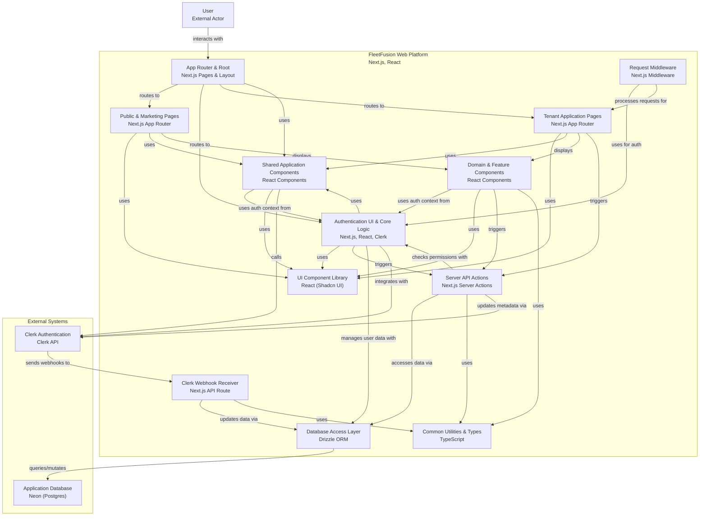

# Mermaid Code Visualization for FleetFusion Web Platform

This Mermaid diagram provides a comprehensive overview of the FleetFusion web platform architecture, focusing on the integration of Clerk for authentication, the multi-tenant architecture, and the database interactions with Neon (Postgres). It illustrates how various components interact, including user authentication, tenant management, and data access layers.

