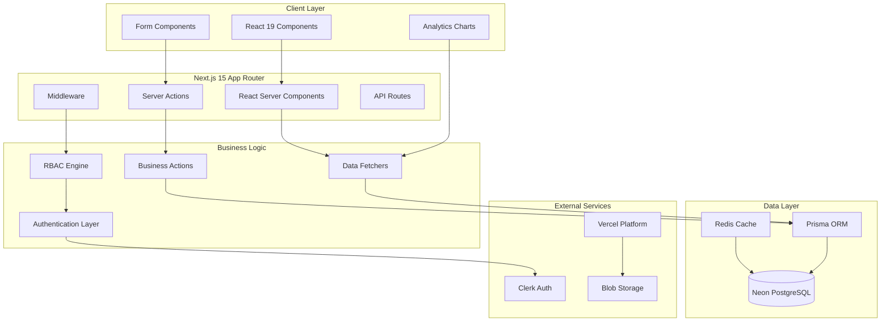

# FleetFusion Technical Architecture

## System Overview

FleetFusion is built as a modern, scalable multi-tenant SaaS platform using Next.js 15 with the App
Router pattern. The architecture follows domain-driven design principles with clear separation of
concerns and strong type safety throughout.

## Architecture Diagram



## Core Patterns

### 1. Server-First Architecture

**Principle**: Default to server-side rendering and data fetching

- Server Components for initial data loading
- Client Components only when interactivity is required
- Server Actions for all mutations
- Streaming for progressive loading

### 2. Feature-Driven Structure

```
features/
├── drivers/          # Driver management domain
├── vehicles/         # Vehicle management domain
├── dispatch/         # Load dispatch domain
├── compliance/       # DOT compliance domain
├── analytics/        # Reporting and analytics
└── admin/           # Administrative functions
```

Each feature contains:

- **Components**: UI components specific to the domain
- **Actions**: Server actions for mutations
- **Fetchers**: Data fetching functions
- **Types**: Domain-specific TypeScript types
- **Schemas**: Zod validation schemas

### 3. Multi-Tenant Data Isolation

```typescript
// Row-level security pattern
async function getDrivers(organizationId: string) {
  return await prisma.driver.findMany({
    where: {
      organizationId, // Tenant isolation
      isActive: true,
    },
  });
}
```

### 4. Type-Safe Server Actions

```typescript
'use server';

import { z } from 'zod';
import { revalidatePath } from 'next/cache';

const CreateDriverSchema = z.object({
  name: z.string().min(1),
  email: z.string().email(),
  licenseNumber: z.string().min(1),
  organizationId: z.string(),
});

export async function createDriver(
  data: z.infer<typeof CreateDriverSchema>
): Promise<ActionResult<Driver>> {
  try {
    const validated = CreateDriverSchema.parse(data);
    const driver = await prisma.driver.create({
      data: validated,
    });

    revalidatePath('/drivers');
    return { success: true, data: driver };
  } catch (error) {
    return {
      success: false,
      error: 'Failed to create driver',
    };
  }
}
```

## Data Architecture

### Database Schema

The database follows a multi-tenant design with organization-based isolation:

```sql
-- Core tenant table
CREATE TABLE organizations (
  id UUID PRIMARY KEY DEFAULT gen_random_uuid(),
  name VARCHAR(255) NOT NULL,
  slug VARCHAR(100) UNIQUE NOT NULL,
  created_at TIMESTAMP DEFAULT NOW()
);

-- All domain tables include organizationId
CREATE TABLE drivers (
  id UUID PRIMARY KEY DEFAULT gen_random_uuid(),
  organization_id UUID NOT NULL REFERENCES organizations(id),
  name VARCHAR(255) NOT NULL,
  email VARCHAR(255) UNIQUE NOT NULL,
  license_number VARCHAR(50) NOT NULL,
  -- ... other fields
);
```

### Data Flow

1. **Request** → Middleware (RBAC check)
2. **Server Component** → Fetcher (with org context)
3. **Fetcher** → Prisma (with tenant filter)
4. **Prisma** → PostgreSQL (row-level security)
5. **Response** → React component rendering

## Security Architecture

### 1. Authentication (Clerk)

```typescript
// Middleware authentication check
export default clerkMiddleware((auth, req) => {
  const { userId, orgId } = auth();

  if (!userId && !isPublicRoute(req)) {
    return redirectToSignIn();
  }

  // Continue with RBAC checks...
});
```

### 2. Role-Based Access Control

```typescript
// Permission definitions
export const SystemRoles = {
  ADMIN: 'admin',
  DISPATCHER: 'dispatcher',
  DRIVER: 'driver',
  COMPLIANCE_OFFICER: 'compliance_officer',
  VIEWER: 'viewer',
} as const;

// Permission matrix
export const RolePermissions = {
  [SystemRoles.ADMIN]: ['*'], // All permissions
  [SystemRoles.DISPATCHER]: ['drivers:read', 'vehicles:read', 'loads:manage'],
  [SystemRoles.DRIVER]: ['own_profile:read', 'own_loads:read'],
  // ... more roles
};
```

### 3. Multi-Tenant Isolation

- **Database Level**: Row-level security with organizationId
- **Application Level**: Middleware enforces tenant context
- **UI Level**: Components only show tenant-specific data

## Performance Optimizations

### 1. Caching Strategy

```typescript
// Server-side caching with Next.js
export async function getDrivers(orgId: string) {
  return unstable_cache(
    async () => {
      return await prisma.driver.findMany({
        where: { organizationId: orgId },
      });
    },
    [`drivers-${orgId}`],
    { revalidate: 300 } // 5 minutes
  )();
}
```

### 2. Database Optimizations

- Indexed columns for fast lookups
- Connection pooling with Prisma
- Query optimization with select fields
- Pagination for large datasets

### 3. Bundle Optimization

- Code splitting by route and feature
- Dynamic imports for heavy components
- Tree shaking for unused code
- Image optimization with Next.js

## Technology Stack

### Frontend

- **Next.js 15**: App Router with React Server Components
- **React 19**: Latest features with concurrent rendering
- **TypeScript 5**: Strict type checking
- **Tailwind CSS 4**: Utility-first styling
- **Radix UI**: Accessible component primitives

### Backend

- **Server Actions**: Type-safe mutations
- **Prisma ORM**: Type-safe database operations
- **Zod**: Runtime type validation
- **Edge Runtime**: Fast serverless functions

### Database & Storage

- **Neon PostgreSQL**: Serverless Postgres
- **Vercel Blob**: File storage
- **Redis**: Session and data caching

### Development Tools

- **TypeScript**: Full-stack type safety
- **ESLint/Prettier**: Code quality
- **Husky**: Git hooks
- **Vitest**: Unit testing

## Deployment Architecture

### Vercel Platform

- **Edge Functions**: Global distribution
- **Serverless Functions**: Auto-scaling backend
- **Edge Cache**: Performance optimization
- **Preview Deployments**: Branch-based testing

### Environment Strategy

- **Development**: Local with Neon dev database
- **Staging**: Preview deployments for testing
- **Production**: Production Neon database with read replicas

---

_This architecture supports the current scale while being designed for future growth to thousands of
organizations and millions of users._
