# FleetFusion ▸ AI-Assisted DevOps Automation Standards

## 1️⃣ Environment & Tooling

| Tool       | Version                 | Remarks                                |
| ---------- | ----------------------- | -------------------------------------- |
| Next.js    | 15                      | App Router · RSC first                 |
| React      | 19                      | Zero‑bundle hydration                  |
| TypeScript | 5.x                     | `strict` + `noUncheckedIndexedAccess`  |
| Clerk      | RBAC                    | Multi‑tenant · org + role claims       |
| Postgres   | Neon                    | Serverless, row‑level security         |
| CI/CD      | GitHub Actions → Vercel | Preview → Prod via tag                 |

---

## 2️⃣ Branching & Commit Rules

- **NEVER commit directly to `main`.**
- **All work must occur in a branch** named with these prefixes:
  - `feature/<scope>` ― new features
  - `fix/<scope>` ― bugfixes
  - `docs/<scope>` ― docs/README
  - `test/<scope>` ― tests
  - `refactor/<scope>` ― code quality
  - `config/<scope>` ― config/env setup
- **All PRs:** Title must be `[type]: description` (`feat:`, `fix:`, `docs:`, `test:`, `refactor:`, `config:`).
- **PR Descriptions:** Must include:
  - Linked issues using closing keywords (e.g., `Closes #42`)
  - Short summary of scope and impact
  - Checklist: [ ] Passes CI, [ ] Updates docs (if needed), [ ] Notifies project board/milestone
- **Labels:** PRs auto-labeled by branch prefix and must include one of: `Feature`, `Bug`, `Documentation`, `Testing`, `Code-Quality`, `Configuration`.
- **Milestones:** All PRs must be assigned to an active milestone if related to a release.

---

## 3️⃣ Issue Management & Templates

- **Labels:** Every issue must be labeled with:
  - Type (`Feature`, `Bug`, `Documentation`, `Testing`, `Code-Quality`, `Configuration`)
  - Priority (`Priority-High`, `Priority-Medium`, `Priority-Low`)
  - Assignment (`Codex`, `Copilot`)
  - Workflow (`Has-PR`, `Blocked`, `Technical-Debt`)
- **Templates:** Use or extend `.github/ISSUE_TEMPLATE/` for:
  - Bug report
  - Feature request
  - Docs/Chore
- **Dependencies:** Link related issues/PRs via GitHub keywords (`blocked by #X`, `closes #Y`).
- **Project Board:** All issues must be moved to the correct board column (`Todo`, `In Progress`, `Review`, `Done`) as soon as status changes.  
  **Reminder:** Update the project board and milestone on every status change.

---

## 4️⃣ Pull Request Automation

- **Auto-label PRs** based on branch prefix.
- **Auto-assign reviewers** (for solo dev, self-assignment is valid).
- **All PRs run CI:** Must pass `ci/test`, `ci/lint`, `ci/typecheck` before merge.
- **Auto-move** PRs/issues on the project board per status (see board flow below).
- **Merge Rule:** Only squash merge allowed, never rebase or merge commits.
- **No direct pushes to main.**
- **PR merges:** Only after human (your) review and CI passes.

---

## 5️⃣ Project Board & Milestone Flow

```mermaid
graph LR
  subgraph "Project Board"
    A[📋 Todo] -->|Start Work| B[🔄 In Progress]
    B -->|Create PR| C[👀 Review]
    C -->|Merge| D[✅ Done]
  end
  subgraph "Auto-Movement"
    E[New Issue] --> A
    F[Add Feature/Bug Label] --> B
    G[Has-PR Label] --> C
    H[Close Issue/PR] --> D
  end
```

- **Milestone closure:** Only after all assigned issues/PRs are closed and released.

---

## 6️⃣ Release & Deployment

- **Production deploys:** Only from tagged commits on `main`.
- **CI/CD:** Automated via GitHub Actions → Vercel.
- **Secrets:** All environment secrets must be managed via repository/environment settings (NEVER in code).

---

## 7️⃣ Automation & Workflow Suggestions

- **Issue templates:** Use `.github/ISSUE_TEMPLATE` for feature, bug, docs.
- **PR template:** Create `.github/pull_request_template.md` enforcing:
  - `[type]: description` title
  - Linked issues
  - Checklist (CI, docs, board, milestone)
- **Auto-label action:** Use `actions/labeler` to tag PRs by branch prefix.
- **Project automation:** Use GitHub Projects (beta/next) for auto-move on status update.
- **Branch protection:** Enable required status checks, require PR review, disable force-pushes.
- **Dependency tracking:** Always refer to issue/PR numbers in descriptions with closing/blocked keywords.
- **Reminder:** Update project board and milestones with every PR/issue update.

---

## 8️⃣ Secrets & Security

- **Required:** `GITHUB_TOKEN`, `VERCEL_TOKEN`, `CLERK_SECRET_KEY`, `NEON_API_KEY`
- **Never commit secrets.** Use GitHub Actions secrets and Vercel dashboard for env vars.

---

## 9️⃣ Summary — Non-Negotiables

1. **No direct commits to main.**
2. **All work on prefixed branches, PRs must follow `[type]: description`.**
3. **Labels, project, milestone, and automation must be maintained for every PR/issue.**
4. **PRs: squash merge only, after passing CI and review.**
5. **Update board and milestones with every status change.**
6. **All releases and deployments strictly follow CI flow.**

---

**Strictly follow these standards for all automation, PRs, issues, and releases. Deviations break project automation and release integrity.**
